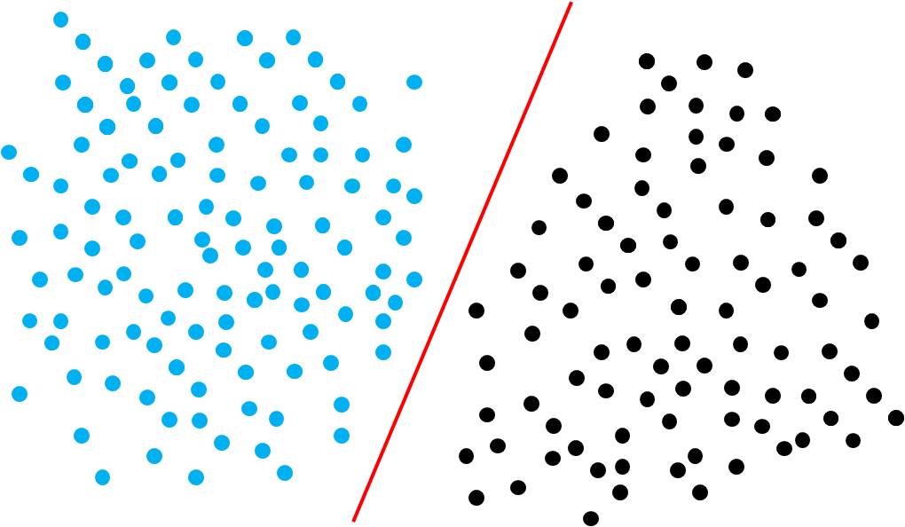
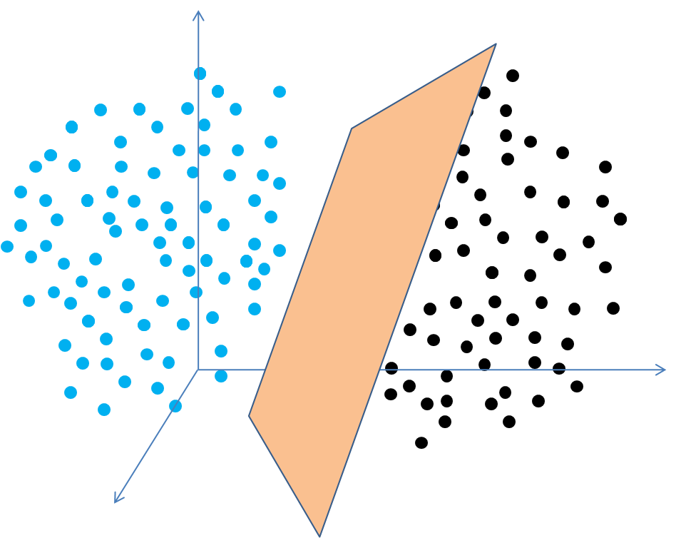
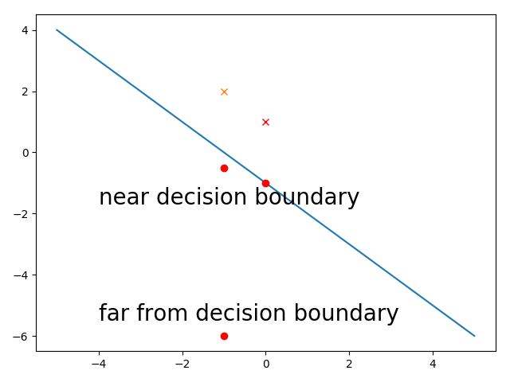
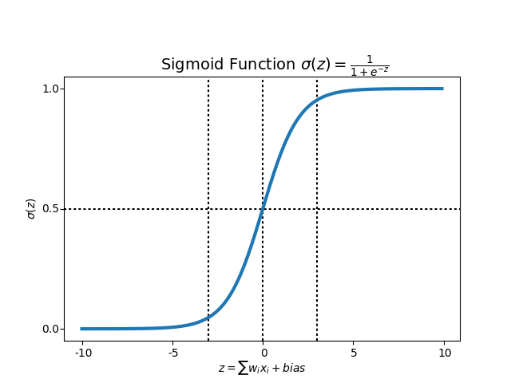
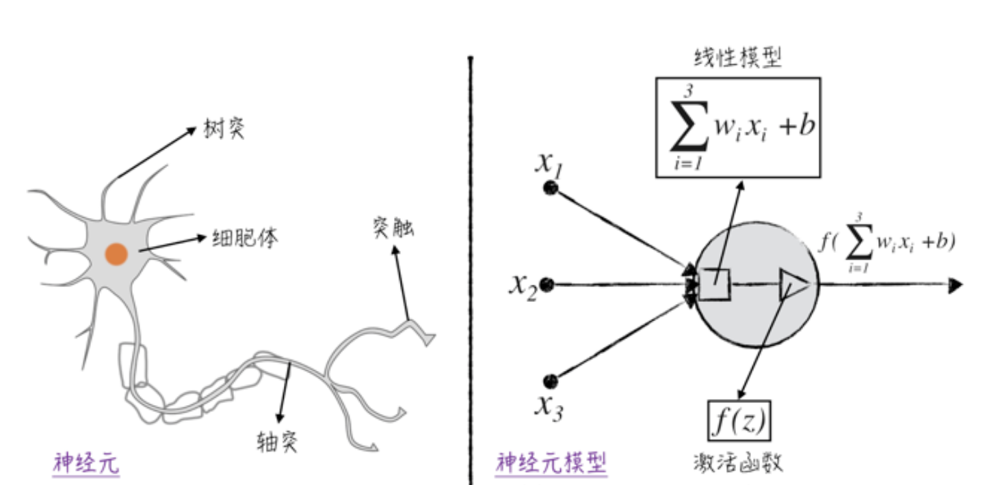
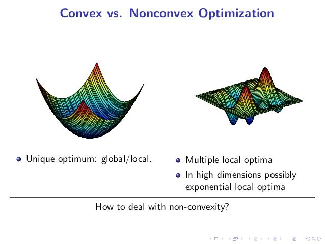
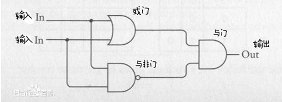
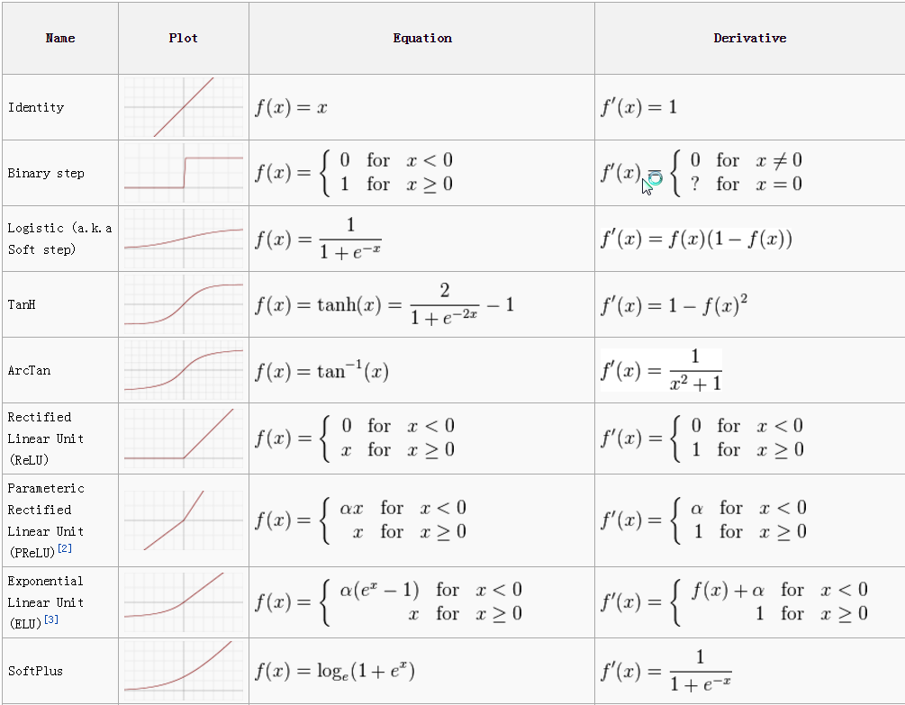

# 逻辑回归

## 逻辑回归模型

逻辑回归是最简单的分类算法之一，它只能解决线性可分的问题。什么是线性可分呢？就是把训练数据在坐标图中画出来，可以用一条直线把它们区分开，对于一维空间，用一个点就可以区分，对于二维空间，也就是特征数只有两个的，用直线就可以，而三维空间，是用一个平面，更高维的空间，我们用超平面。超过3维我们没法画出来了。

我们仅以二维空间来说明逻辑回归问题。我们的特征用 $$(x_1,x_2)$$ 表示，把训练集都画到二维坐标中，逻辑回归到目标就是找到一条直线，使得两个分类的点位于直线两侧，这条直线称为决策边界\(Decision Boundary\)。

在二维中间里，直线可以用下面到式子表示

$$
w_1x_1+w_2x_2+b=0
$$

我们的目的就是根据训练集，找到参数 $$(w_1,w_2,b)$$ ，其中w1和w2是权重weight，b是bias。

找到参数后，对于任意的x1,x2，如果w1x2+w2x2+b &gt; 0，我们的预测值为1，否则为0

$$
\begin{equation} y =\left\{ \begin{aligned} 1 , if\space\space {w_1}x_1+w_2x_2+b \geq 0 \\ 0,  if\space\space {w_1}x_1+w_2x_2+b < 0 \\ \end{aligned} \right. \end{equation}
$$

在w1,w2和b确定的情况下，如果w1x1+w2x2+b的绝对值越大，那么说明这个点离决策边界越远，说明对它的预测越准。比如决策边界为x+y+1=0，对于点\(-1,-0.5\)，它离决策边界很近，我们对它的分类预测的信心就比较小，而另一个点\(-1,-6\)，它离决策边界很远，我们认为对它的预测可信度比较高。因此，逻辑回归最终输出的一般是一个0-1之间的数值，越偏向0或者1，预测的可信度越高，我们用sigmoid函数把我们的输出固定在0-1的范围。

$$
sigmoid(x)=\frac{1}{1+e^{-x}}
$$

我们令

$$
z=w_1x_1+w_2x_2+b
$$

在w1和w2确定的情况下，一般z的绝对值比较大，说明距离决策边界比较远，逻辑回归最终的输出就是

$$
y=\sigma(z),其中\sigma表示sigmoid函数
$$

sigmoid函数的曲线如下，在z的绝对值比较大的时候，输出接近0或者1，在0点时输出为0.5，也就是假如一个点正好在决策边界上，那么它是0类或者1类的概率分别为50％，一般情况下我们预测是把它当成1类了。还是以上述的\(-1,-0.5\)和\(-1,-5\)为例，w1=1,w2=1,b=1，对两个输入的预测分别为0.3775和0.0067。

sigmoid函数是一种“激活函数“\(Activate Function\)。为什么称为激活函数，实际上是受了生物中的神经元启发。一个逻辑回归模型，其实就类似于一个神经元。

如图1所示，一个典型的神经元由4个部分组成。

* 树突：一个神经元有若干个树突，它们能接收来自其他神经元的信号，并将信号传递给细胞体。
* 细胞体：细胞体是神经元的核心，它把各个树突传递过来的信号加总起来，得到一个总的刺激信号。 
* 轴突：当细胞体内的刺激信号超过一定阈值之后，神经元的轴突会对外发送信号。
* 突触：该神经元发送的信号（若有）将由突触向其他神经元或人体内的其他组织（对神经信号做出反应的组织）传递。需要注意的是，神经元通常有多个突触，但它们传递的信号都是一样的。

实际上人工神经网络就是由多个逻辑回归单元构成的，后续会介绍。

上述都是以二维特征来说明逻辑回归，实际上维数会很多，所以逻辑回归的通用模型是

$$
y=\sigma(w_1x_1+w_2x_2+...+w_nx_n+b)
$$

我们需要根据训练集找到这些参数，然后用这些参数做预测。

那么我们如何找到这几个参数呢？方法就是随机给w1,w2,b设置一个初值，然后验证效果，如果效果不好，那就根据一定策略继续更新参数，继续验证，直到效果让人满意。那么如何验证效果好不好呢？与线性回归一样，需要有一个代价函数。

## 逻辑回归代价函数

在线性回归中，使用了均方差作为代价函数，在逻辑回归中，能不能使用MSE呢？

$$
J=\frac{1}{m}\sum_{i}^{m}(\hat y^i-y^i)^2 \\
其中\hat y^i=sigmoid(w_1x_1+w_2x_2+...+w_nx_n+b)
$$

其中 $$y^i$$ 是第i个真实分类， $$\hat y^i$$ 是第i个预测分类， $$y^i$$的取值为0和1，而 $$\hat y^i$$ 的取值范围是一个区间\(0,1\)，因为计算机精度有限，接近1或者0的时候都可以看成0或1，所以实际上是闭区间\[0,1\]。

假设我们的模型效果特别好，预测值与真实值十分接近，那么J的值会接近0，所以MSE能够刻画模型的效果。假如我们知道了一组参数，可以用MSE去验证这组参数的效果。但是如果效果不好，我们用梯度下降的方法更新参数，结果可能是陷在一个局部最优值了。Andrew Ng的课程里说MSE用于逻辑回归时不是凸函数，导致会有多个局部最优值。

我在自己实验的过程中发现，用MSE作为逻辑回归的代价函数，我们会陷入到特别平坦的一个平面，而这里的参数并没有将代价函数的值降到最小。

为什么会有这个问题呢？我们可以看一下MSE在逻辑回归中的导数，推导过程省略。

$$
\frac{\partial J}{\partial w_1}=\sum_{i=1}^{n}(\hat y^i-y^i)\hat y^i(1-\hat y^i)x^i_1 \\
\frac{\partial J}{\partial w_2}=\sum_{i=1}^{n}(\hat y^i-y^i)\hat y^i(1-\hat y^i)x^i_2 \\
\frac{\partial J}{\partial b}=\sum_{i=1}^{n}(\hat y^i-y^i)\hat y^i(1-\hat y^i) \\
$$

假如找到了一组参数，使得所有的预测值都无限接近0或者1，那么上面的三个导数肯定无限接近0，因为每个导数都有y\(1-y\)，所以找到这样的参数后，显然不是最优值，但是因为导数接近0，所以很难再移动了。

所以逻辑回归中不使用MSE，不使用MSE的原因不是因为MSE不能描述模型的效果，而是不好根据这个函数去求解参数。

我们使用另一种代价函数，叫做交叉墒。

$$
J=-\frac{1}{m}\sum_{i}^{m}((y^ilog(\hat y^i)+(1-y^i)log(1-\hat y^i))
$$

直观的理解一下，如果真实值是1，那么预测值越接近1，代价越小，如果预测值接近0，那么代价会特别大，对于真实值是0的，也同理。

有了代价函数，我们使用梯度下降就可以解决求出参数了。

与线性回归中的MSE不一样，交叉墒很难找到数学意义上的最优值。我们在进行梯度下降时，只要梯度接近0了，就认为已经找到最小值了，因为继续找，最小值的变化已经不大，而且可能存在多个最优值。我们可以形象的说明一下。

比如下面这个分类问题，其实用一个曲线x1+x2=0就能分开。这条直线还可以用100x1+100x2=0表示，也可以用100000x1+100000x2=0表示，w1和w2可以无限大，而对应的代价函数可以无限小，无限接近0。在数学上，其实我们拿到的参数并不是最优值，但是在计算机领域，其实只要差不多就行了，因为w1和w2越来越大，代价函数的大小与导数的大小，虽然没到0，但是计算机已经表示不出这个精度了。

对于输入\(1,1\)来说，不同的参数的预测值变化如下，到了20，用Python已经放不下了，直接就是1.0了，所以没必要去追求绝对的最优。

| w1 | w2 | y |
| :--- | :--- | :--- |
| 1 | 1 | 0.8807970779778823 |
| 2 | 2 | 0.9820137900379085 |
| 3 | 3 | 0.9975273768433653 |
| 4 | 4 | 0.9996646498695336 |
| 10 | 10 | 0.9999999979388463 |
| 20 | 20 | 1.0\(Python只能到这个精度\) |
| 100 | 100 | 1.0\(Python只能到这个精度\) |

## 非线性可分问题

线性回归只能解决线性可分的问题，而实际中遇到的问题基本是线性不可分的，那如何解决线性不可分的问题呢？

先来看一个线性可分的问题，我们用机器学习来学习一个门电路，比如一个与电路。因为电压不一定严格等于1或者0，所以门电路的输入电压可能接近0或者1。我们通过一个真正的与门电路得到了如下训练数据：

| $$x_1$$  | $$x_2$$  | $$y$$  |
| :--- | :--- | :--- |
| 0.001 | 0.01 | 0 |
| 1.01 | 1.1 | 1 |
| 0.1 | 0.99 | 0 |
| 0.96 | 0.15 | 0 |
| 0.13 | 0.02 | 0 |
| 1.02 | 1.001 | 1 |
| 0.92 | 0.01 | 0 |

我们把这些训练数据在坐标中画出来，发现它是线性可分的。

再来看一个异或门，训练集如下：

| $$x_1$$  | $$x_2$$  | $$y$$  |
| :--- | :--- | :--- |
| 0.001 | 0.01 | 1 |
| 1.01 | 1.1 | 1 |
| 0.1 | 0.99 | 0 |
| 0.96 | 0.15 | 0 |
| 0.13 | 0.02 | 1 |
| 1.02 | 1.001 | 1 |
| 0.92 | 0.01 | 0 |

异或门是线性不可分的，如何解决这个问题呢？

### 特征变换

就像用线性回归解决非线性问题一样，我们可以把特征变换一下，比如用求x1-x2的绝对值

| $$x_1$$  | $$x_2$$  | $$abs(x_1-x_2)$$  | $$y$$  |
| :--- | :--- | :--- | :--- |
| 0.001 | 0.01 | 0.009 | 1 |
| 1.01 | 1.1 | 0.09 | 1 |
| 0.1 | 0.99 | 0.89 | 0 |
| 0.96 | 0.15 | 0.81 | 0 |
| 0.13 | 0.02 | 0.11 | 1 |
| 1.02 | 1.001 | 0.019 | 1 |
| 0.92 | 0.01 | 0.91 | 0 |

### 核函数

核函数是一种通用的特征变换方法。

### 神经网络

逻辑回归只用一条直线切分数据集，如果一条切分不了，就没办法了。但是一条不行，我们用两条呢？

先来一条x-y+0.5=0，

| $$x_1$$  | $$x_2$$  | $$X_1$$  |
| :--- | :--- | :--- |
| 0 | 0 | 1 |
| 0 | 1 | 1 |
| 1 | 0 | 1 |
| 1 | 1 | 0 |
|  |  |  |

X1有什么具体含义呢？因为我们是用门电路来说明这个问题，所以这个是有特定的物理意义的，其实就是一个与非门。

再来一条

X2是或门。

X1和X2是我们新得到的两个特征，然后我们把它在坐标中画出来，发现它是线性可分的。

我们可以看到，实际中实现异或电路的时候，使用了几个简单的门电路组成的。

这里的几个简单的门电路都可以看作是线性回归单元，这样的一个单元在神经网络中被称为神经元。逻辑回归也可以被看作最简单的神经网络。

在神经网络中，一个重要的特征就是不可描述性，神经网络每一个神经元都产生一个新的特征给下一层神经元使用，但是这个特征的具体含义没法给出来，尤其是对于深度神经网络。每一层神经元，都可以看作是把输入集上划了多条直线\(或者超平面\)，每条直线输出一个新feature，继续作为下一层的输入。

