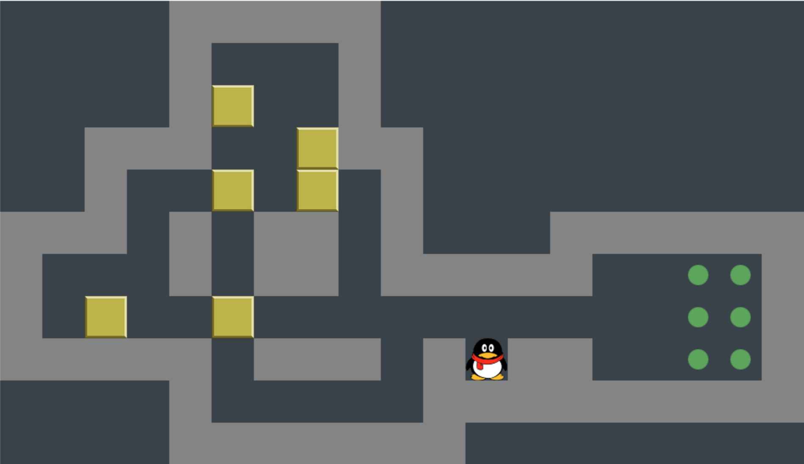
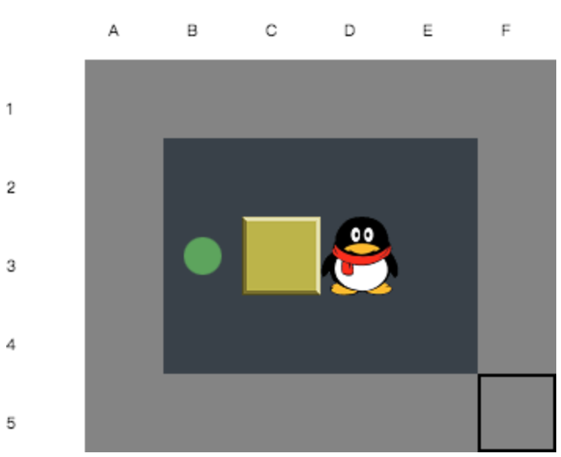
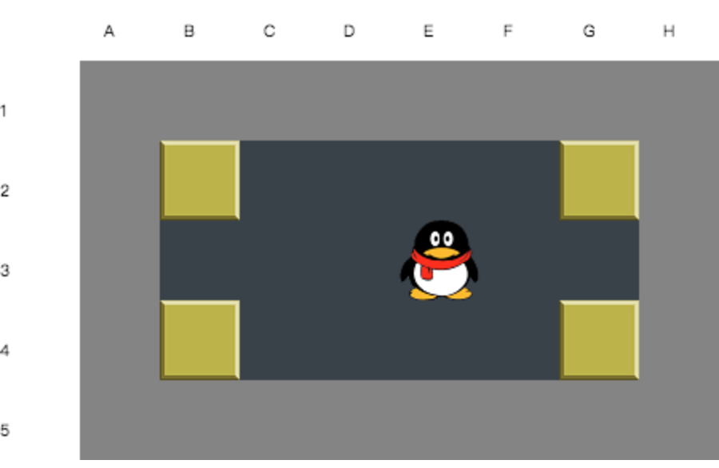
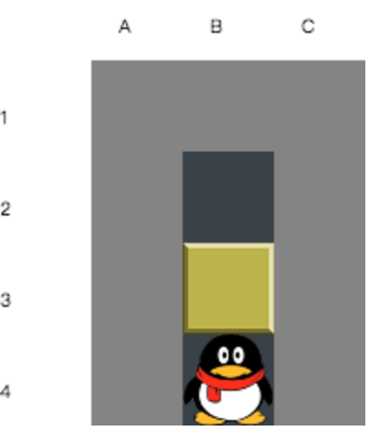

# 推箱子\(Sokoban\)

## 推箱子游戏

推箱子是一个很常见的小游戏，在功能机时代，几乎每个手机上都装了推箱子。我以前玩的时候有些关老是过不去，也没有网络查解法。后来上大学学了计算机，就写程序解。现在接触了点机器学习，就想用机器学习改进一下常规算法，主要有三个方面：

1. 用监督学习判断状态是否是死局\(SVM，神经网络\)
2. 用强化学习优化搜索策略\(Q-learning\)
3. 用监督学习自动识别地图\(逻辑回归，神经网络）



## 推箱子问题形式化

推箱子的地图就是一个矩阵，里面主要有如下对象，我们把一个图片形式的地图转化成字符形式，这样程序就容易处理。


| 对象 | 字符表示 | 图标 |
| :--- | :--- | :--- |
| PlayerOnly | @ |   |
| PlayerInGoal | + |   |
| BoxOnly | $ |   |
| BoxInGoal | \* |   |
| Wall | \# |   |
| Road | - |   |
| GoalOnly | . \(注：点） |   |

一个推箱子中的对象包含上述内容，因此我们要构造一个地图，用符号即可。

```text
##########
#--------#
#.$@-----#
#--------#
#.$------#
#--------#
##########
```

上述字符就对应着如下点推箱子问题：


因此推箱子要解决的问题，就是输入一个文本的地图文件，输出一连串步骤。如果用汉字表示就是类似“上上左下下上下“这样的，为了方便处理，我们用"uulddud"表示，上下左右分别对应udlr。

## 推箱子问题常规解法

推箱子问题是一个典型的搜索问题。最开始我们拿到一个初始状态，最终我们要达到一个终态，而终态就是所有的箱子都在目标中。

以最简单的深度优先算法\(DFS\)为例，我们从地图的第一个状态开始，让Player按“上下左右“的顺序依次尝试，如果向上移动可行，则进入一个新的状态，继续从新状态尝试上下左右，如果向上不行，则尝试向下。

<table>
  <thead>
    <tr>
      <th style="text-align:left">颜色</th>
      <th style="text-align:left">含义</th>
    </tr>
  </thead>
  <tbody>
    <tr>
      <td style="text-align:left">绿色</td>
      <td style="text-align:left">可以到达的状态，并且尚未进入死局</td>
    </tr>
    <tr>
      <td style="text-align:left">红色</td>
      <td style="text-align:left">
        <p>1.已经进入死局 ，比如把箱子推到了墙角</p>
        <p>2.重复状态，比如先向上走一步，但是没有推箱子，再向下走，就回到了已经走过的状态。<b>如果向上一步推了箱子，再回来，则不属于重复，这跟走迷宫不一样。</b>
        </p>
      </td>
    </tr>
    <tr>
      <td style="text-align:left">黄色</td>
      <td style="text-align:left">起始状态</td>
    </tr>
    <tr>
      <td style="text-align:left">紫色</td>
      <td style="text-align:left">成功状态，成功状态不止一个</td>
    </tr>
  </tbody>
</table>

对于较复杂的问题，使用DFS效率不够高，因为每次搜索的顺序都是固定的。要想提高效率，需要从两方面改进：

* 每次搜索子结点时，不是按照固定顺序，而是根据当前的一些状态，调整搜索顺序，例如可以随机选一个方向，或者向靠近箱子的方向移动，这就属于启发式算法。


比如下面这个地图，如果按上下左右固定顺序，那么搜索路径会特别长，而假设我们按照某种策略，例如先看上下左右哪个方向上有箱子，优先走有箱子的方向，那么一次就能成功。 但是这个策略一定是最好的吗？这个未必，所以这个策略是最难的。

 



* 提早剪枝，比如上图中左下方的绿色结点的四个子结点都是死局，那我们有没有办法提前判断出来这个是死局了呢？


一般我们如果检测到箱子到了墙的夹角处，那么肯定是死局。

 

但是有时候箱子不在夹角，已经是死局了。比如下面这个，还有更多的情况，如果把所有的情况都用代码写出来判断，会特别复杂。





搜索的过程需要一个队列，把刚遍历的结点的子结点全部放入队列，然后继续从队列里取出结点继续遍历。对于DFS，这个队列其实就是先进先出队列，对于BFS，就是栈，对于启发式算法，例如A\*算法，这个队列是优先级队列，根据结点的Cost排序，优先搜索Cost低的。这个队列的实现如下。


heapq是python提供的小根堆，如果存的对象不支持"&lt;"比较，需要实现“\_\_lt\_\_“函数，这里的node根据A\*算法的cost实现了"&lt;"的重载。


```python
#搜索队列，按照初始化时传入的type表现不同：
#dfs : 表现为先进先出队列
#bfs : 表现为先进后出的栈
#astar: 根据node的cost大小，表现为优先级队列
import heapq as heapq

class SearchQueue:
    
    def __init__(self, type):
        self.type = type
        self.queue = []
    
    def push(self, node):
        if self.type == 'dfs' or self.type == 'bfs':
            self.queue.append(node)
        if self.type == 'astar':
            heapq.heappush(self.queue, node)
            
    def pop(self):
        if self.type == 'dfs':
            return self.queue.pop(0)
        if self.type == 'bfs':
            return self.queue.pop()
        if self.type == 'astar':
            return heapq.heappop(self.queue)
            
    def isEmpty(self):
        if self is None or len(self) == 0:
            return True
        return False
```

使用A\*算法，有一个公式如下。

$$
F(state)=G(state)+H(state)
$$

对于每一个状态，F是从初始状态到目标状态的代价，对于推箱子，代价是步数，而G是初始状态到当前状态的代价，H是当前状态到目标状态的代价。在推箱子中，我们搜索到某个状态时，会记录下从初始状态到这走了多少步，所以G是已知的，但是H是未知的，所以我们需要给H一个启发式的算法。我们这里采用曼哈顿距离来估算剩余的步数，这样我们对于待搜索队列按F排序，优先搜索F小的状态。

```python
#Distance是预估的从当前状态到目标状态剩余的步数
# distance=人到最近的箱子的曼哈顿距离 + 每个箱子到最近目标的曼哈顿距离
    def distance(self):
        dis = 0
        #人到箱子的最小曼哈顿距离
        minPlayerToBox = 100000
        for p in self.state.boxes:
            min = self.manhattan(self.state.player, p)
            if min < minPlayerToBox:
                minPlayerToBox = min
        dis += minPlayerToBox

        #获取每个箱子到最近目标的曼哈顿距离
        for box in self.state.boxes:
            minBoxToGoal = 100000
            for goal in self.problem.goals:
                min = self.manhattan(box, goal)
                if min < minBoxToGoal:
                    minBoxToGoal = min
            dis += minBoxToGoal

        return dis

    @classmethod
    def manhattan(cls, p1, p2):
        return abs(p1.x - p2.x) + abs(p1.y-p2.y)
```


Position类，用于描述某个对象的位置。

```python
#位置
class Position:
    def __init__(self, x=0, y=0):
        self.x = x
        self.y = y
    def __hash__(self):
        return self.x * 100000 + self.y
    def __eq__(self, other):
        if other is None:
            return False
        if self.x == other.x and self.y == other.y:
            return True
        return False
    def __str__(self):
        return "{x:" + str(self.x) + ",y:" + str(self.y) + "}"
```


State类，描述某一个状态，因为对于一个地图来说，只有箱子和人的位置是变化的，所以状态只保存人和箱子的位置即可。

```python
#状态
class State:
    #boxes是一个Position的list，player是Position
    def __init__(self, boxes, player):
        self.boxes = boxes
        self.player = player
          
    #用于判断两个状态是否一致，在set里使用
    def __hash__(self):
        result = 17
        for box in self.boxes:
            result = 37 * result + box.__hash__()
        result = 37 * result + self.player.__hash__()
        return result
    
    def __eq__(self, other):
        if other is None:
            return False
        if self.__hash__() == other.__hash__():
            return True
        if self.boxes == other.boxes and self.player == other.player:
            return True
        return True   
```


## 用监督学习识别死局

### 问题转化

优化上述算法的一个很有用的方法就是提前识别死局，我们可以通过添加各种复杂的规则去判断是否是死局，比如我们写上100个规则来判断。但是这里我们换一种思路解决，大部分死局，人是能很容易看出来的，既然人能看出来，那用机器学习也应该能识别出来。还有一些死局，人不容易一眼看出来，机器是不是也能给看出来呢？

这个问题其实类似于图像识别，输入的是一个矩阵，之前我们用普通字符表示的，现在我们换成矩阵。

| 符合 | 数值 |
| :--- | :--- |
| \# |  |

另外，因为地图的长宽是不固定的，我们需要统一成纬度一样的，因此我们用增加路方式把矩阵统一格式化成10\*10的，我们目前只解决10\*10以内的问题。


最终我们构造的训练集是下面这样的。 $$x=\{x_0,x_1,x_2,...,x_{99}\}$$ ，标签 $$y\in\{0,1\}$$ ，其中0表示死局，1表示可解。

| 状态x | 标签y |
| :--- | :--- |
| $$\{x_0,x_1,x_2,...,x_{99}\}$$  | 1/0 |

### 获取训练集

机器学习需要获取训练数据，那么如何获取训练数据呢？我的方法是先用DFS把所有的状态都找出来，在这个过程中可以把部分可解和部分不可解状态找出来，还有第三种状态是未知的，再用A\*算法判断未知状态是否可解。



```python
#先用dfs遍历所有状态
(liveSet, deadSet, unknownSet) = dfs(Problem(initState))
#再用A*算法判断未知的状态
for state in unknownSet:
   if astart(Problem(state)) is not None:
      liveSet.add(state)
   else:
      deadSet.add(state)      
```




### 选择模型进行训练

分类模型一般分为线性模型和非线性的，最简单的逻辑回归，能解决线性可分的一些问题，SVM和神经网络是非线性模型，像决策树之类的模型虽然可以解决非线性问题，但是适合特征较少且特征区分明显的分类，我们此处的分类问题更像图片识别。

我们先来看一下如何衡量我们的学习效果。


