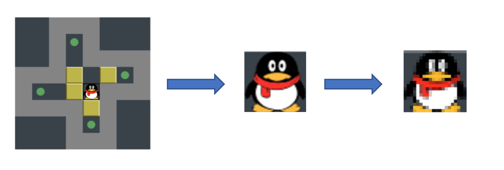
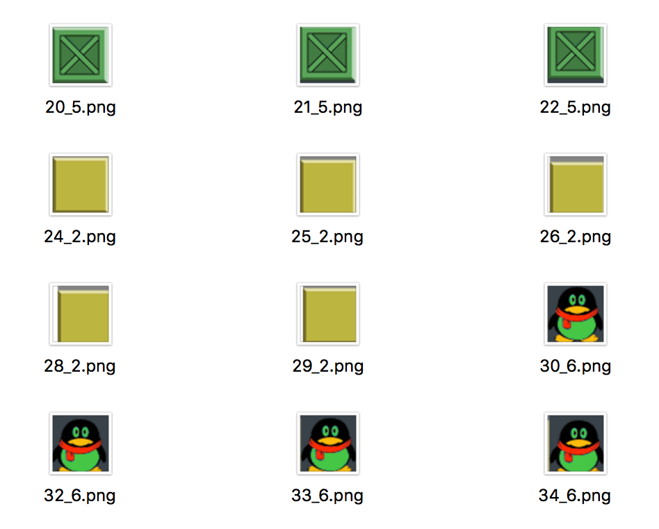
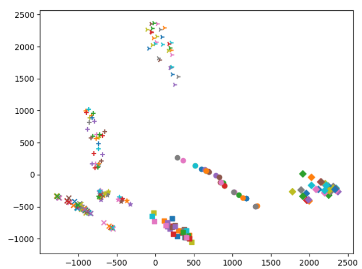
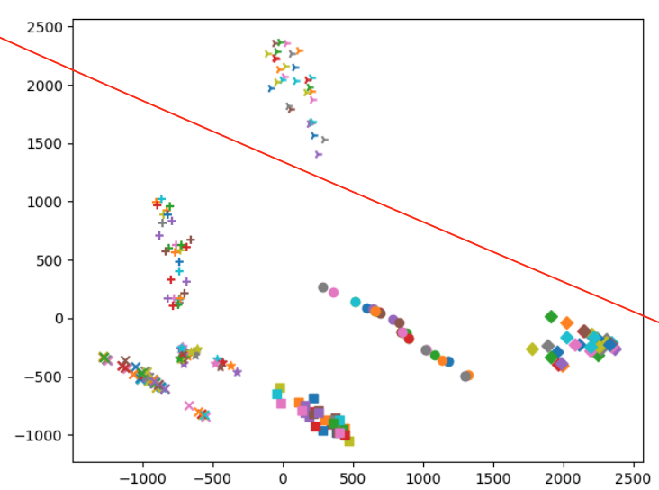
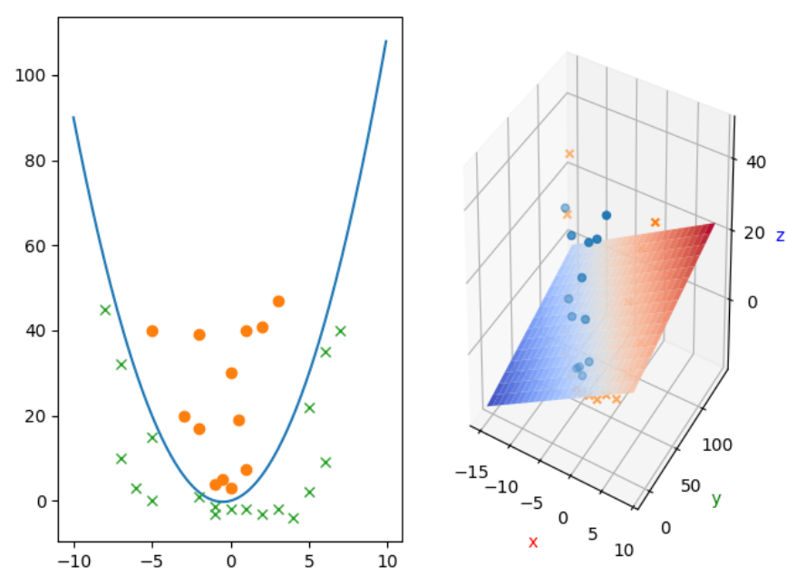
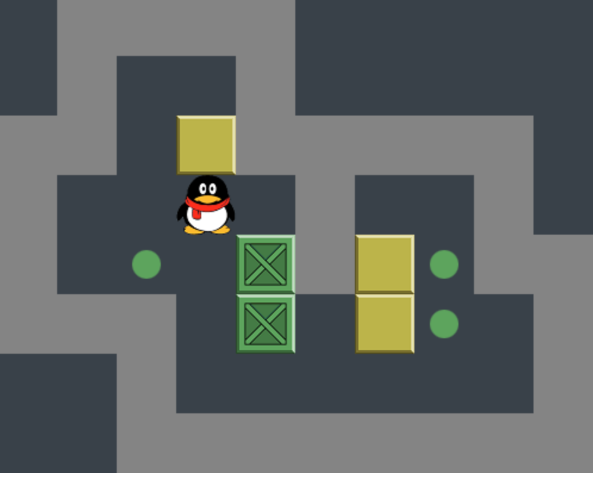
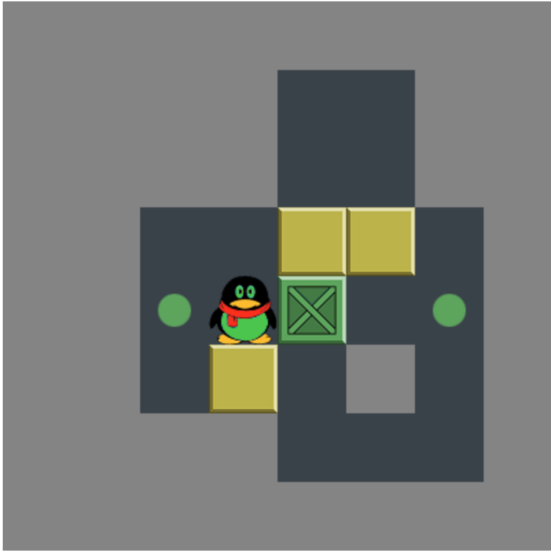
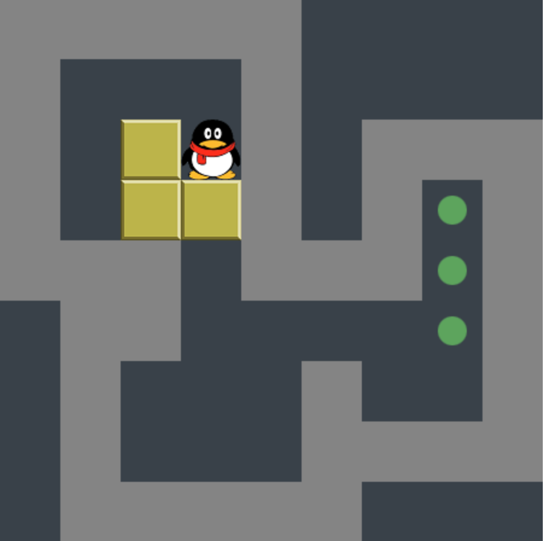
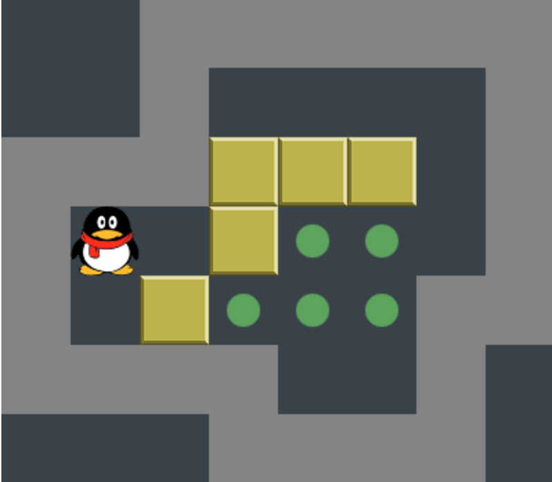
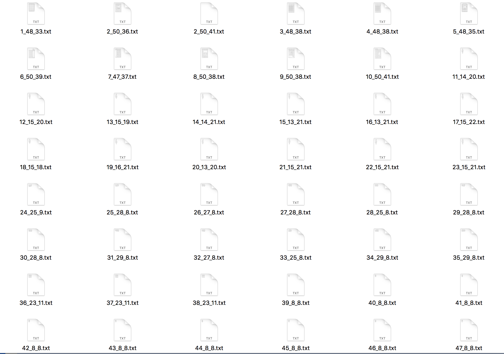

# 推箱子\(Sokoban\)

## 推箱子游戏

推箱子是一个很常见的小游戏，在功能机时代，几乎每个手机上都装了推箱子。我以前玩的时候有些关老是过不去，也没有网络查解法。后来上大学学了计算机，就写程序解。现在接触了点机器学习，就想用机器学习改进一下常规算法。

本文主要分为以下这些部分：

* 推箱子问题形式化描述
* 推箱子问题常规解法
* 使用监督学习\(LR,SVM\)识别推箱子地图
* 使用监督学习\(MLP, CNN, RNN）识别死局
* 使用强化学习\(MCTS\)学习搜索策略

| 缩写  | 全称 | 含义 |
| :--- | :--- | :--- |
| LR | Logistic Regression | 逻辑回归 |
| SVM | Support Vector Machine | 支持向量机 |
| MLP | Multi-Layer Perceptron | 多层感知机 |
| CNN | Convolutional Neural Networks | 卷积神经网络 |
| RNN | Recurrent Neural Network | 递归神经网络 |
| MCTS | Monte Carlo Tree Search | 蒙特卡洛树搜索 |


## 推箱子问题形式化

推箱子的地图就是一个矩阵，里面主要有如下对象，我们把一个图片形式的地图转化成字符形式，这样程序就容易处理。


| 对象 | 字符表示 | 图标 |
| :--- | :--- | :--- |
| PlayerOnly | @ |   |
| PlayerInGoal | + |   |
| BoxOnly | $ |   |
| BoxInGoal | \* |   |
| Wall | \# |   |
| Road | - |   |
| GoalOnly | . \(注：点） |   |

一个推箱子中的对象包含上述内容，因此我们要构造一个地图，用符号即可。

```text
##########
#--------#
#.$@-----#
#--------#
#.$------#
#--------#
##########
```

上述字符就对应着如下点推箱子问题：


因此推箱子要解决的问题，就是输入一个文本的地图文件，输出一连串步骤。如果用汉字表示就是类似“上上左下下上下“这样的，为了方便处理，我们用"uulddud"表示，上下左右分别对应udlr。

## 用逻辑回归识别地图

如果一个地图没有对应的符号文件，自己手动转换比较麻烦，可以用机器学习自动识别地图。识别固定格式的地图比较简单，使用简单的逻辑回归即可。


为了简化问题，输入一个图片的时候，同时也输入地图的大小，这样就能计算单个对象的像素大小，不需要先识别一个对象出来。如果要从一个地图图片中识别出一个对象的像素大小，光使用逻辑回归是不够的。


### 问题转化

输入一个地图，和地图的大小，自动输出符号表示的矩阵。

输入地图图片，和长宽，就能把一个个的对象用PIL切割出来，切割的小图像是NxN像素的图片，我们resize成固定大小的图片，大小为\(20,20\)，而图片的模式为RGB，所以就是一个维度为\(20,20,3\)的数组，展开后就是1200个像素值。



以上一个图片，转换成一个1200的向量X，

$$
X=(x_1,x_2,...,x_{1199},x_{1200})
$$

这样的话我们就对这个向量X分类即可，转换函数如下。



```python
from PIL import  Image
import numpy as np
from sklearn.externals import joblib
import sys

def convert(ImagePath, Width, Height):

    sokobanMap = Image.open(ImagePath)

    pixels = sokobanMap.size 
    a = pixels[0]/Width
    b = pixels[1]/Height
    singleObjectSize = max(a,b) #对象都是正方形的，取一个长一点的

    symbolMatrix = []

    for i in range(0, Height):
        symbolMatrix.append([])
        for j in range(0, Width):
            x1 = j * singleObjectSize
            y1 = i * singleObjectSize
            x2 = x1 + singleObjectSize
            y2 = y1 + singleObjectSize
            singleObject = sokobanMap.crop((x1, y1, x2, y2)).resize((20,20))
            data = np.asarray(singleObject)[:,:,:3].reshape(1200,) #仅取RGBA中的RGB

            symbol = recognizeObject(data)

            symbolMatrix[i].append(symbol)
    return np.array(symbolMatrix)


def recognizeObject(data):
    # to be implemented

symbols = convert(sys.argv[1],int(sys.argv[2]),int(sys.argv[3]))

s = ""
for row in symbols:
    for col in row:
        s = s + col
    print(s)
    s = ""
```



接下来就是实现这个recognizeObject函数了。

### 实现识别对象函数

接下来就用机器学习实现一个模型，用于识别地图里的对象。

#### 产生训练数据

监督学习需要训练数据，我们需要产生训练数据并且打标签，最终产生一个训练集，格式如下：

```text
x1 x2 x3 ... x1200 y
0 255 73 ... 9     1
9 75  33 ... 100   2
99 23 89 ... 39    0
.....
```

其中前边的1200个是输入向量x, y是标签。此处y一共七个值，与符号的对应关系如下：

```python
dict = {0:'-',1:'#',2:'$',3:'.',4:'@',5:'*',6:'+'}
```

只要用下面这个地图，就能产生我们所有的训练数据。


这个照片的像素是400x200，每个元素的像素是100x100，我们把这些元素都用PIL截取出来，为了处理在手动截地图时边缘截的不太精确的问题，在自动截取元素时，位置加上随机3个像素的偏差，并且在名字中加入标签。

```text
from PIL import Image
import random
im = Image.open("/Users/niuxinli/Desktop/3.png")

#标签已知
labels = [[1,0,4,5],
          [2,6,3,0]]
#名字从0开始，后面加上标签，例如0_5.png
name = 0
for i in range(0,2):
    y = i * 100
    for j in range(0,4):
        x1 = j * 100
        y1 = y
        x2 = x1 + 100
        y2 = y1 + 100
        tt = im.crop((x1, y1,x2,y2))
        tt.save("ImageData/" + str(name) + "_" + str(labels[i][j]) + ".png")
        name += 1
        #随机加一些位置偏差
        for xx in range(0,30):
            x1 = x1 + random.randint(-3,3)
            y1 = y1 + random.randint(-3,3)
            tt =im.crop((x1,y1,x1+100,y1+100))
            tt.save("ImageData/" + str(name)+"_"+str(labels[i][j]) + ".png")
            name += 1

```

产生的训练数据如下，有一张方正的，还有30张有偏差的，文件名中都有标签。



接下来用程序处理一下，这些图片都是100x100的RGBA图片，转换成numpy数组就是\(100,100,4\)纬度的ndarray，其中RGBA中的A是透明度，一般可以不使用，把这个纬度去掉后，就是\(100,100,3\)，再统一resize成20x20。

```python
import os
from PIL import Image
import numpy as np
from sklearn.decomposition import PCA
import matplotlib.pyplot as plt

trainingdata = np.zeros((248,1201))
i = 0

for parent, dirnames, filenames in os.walk("ImageData"):
    for filename in filenames:
        if filename.startswith("."):
            continue
        label = filename.split("_")[1].split(".")[0]

        filePath = os.path.join(parent, filename)
        image = Image.open(filePath)
        image = image.resize((20,20))
        data = np.asarray(image)[:,:,:3].reshape(1200,)
        data = np.append(data, label)
        trainingdata[i] = data
        i = i + 1
np.savetxt("MapTrainingData.csv", trainingdata, fmt='%d')


#数据降维到2维并展示出来
pca = PCA(n_components=2)
pca.fit(trainingdata[:,:1200])
X = pca.transform(trainingdata[:,:1200])
marker = {0:'x',1:'o',2:'D',3:'*',4:'4',5:'s',6:'+'}

for i in range(0,248):
    label = trainingdata[i][1200]
    m = marker[label]
    plt.scatter([X[i][0]],[X[i][1]],marker=m)
plt.show()


```

以上数据使用PCA\(Principle Component Analysis，主成分分析\)从1200维降到2维，展示在坐标上如下，可以看到同一类的基本聚在一起。



#### 训练模型

逻辑回归用于解决线性可分的分类问题，何为线性可分的？就是把数据在坐标系中画出来，可以用一条直线\(在三维坐标系中是平面，在更高维度的坐标系中是超平面\)区分出来。



**只要任何一个分类能用一条直线与其它分类分开，那就是线性可分的**。逻辑回归的目的就是找到这样一条直线。比如上面的数据，如果看成二分类问题，那么最上面的分类和其它分类是线性可分的。但是有些分类并不能找一条直线与其它的区分开来。那么我们这个问题是不是不能用逻辑回归呢？

答案是大概率是可以的。上面的图是从1200维压缩到2维的图，压缩到二维之后分类仍然这么明显，那么到了1200维说明不同分类相距更远，有很大的概率找到超平面能够分割这些点。我们用逻辑回归试一下，实在不行再用其他模型。


大部分分类问题都是线性不可分的，这时候可以使用一些非线性模型，例如决策树、神经网络等。也可以通过核函数把数据升维，升维后就变得线性可分了，可以使用逻辑回归了。SVM就是用的这种方法，不过SVM在求解最优值是还加了最大间隔约束。

比如下面这个在二维空间里只能用一条曲线划分，这条曲线是 $$y=x^2+x$$ ，如果我们把特征由二维的 $$(x_1,x_2)$$ 转换成三维 $$(x_1,x_1^2,x2)$$ ，那么在三维空间里就可以找到一个平面 $$z=x+y$$ 把这些点分割开。

  


使用sklearn提供的逻辑回归模型进行训练，并把训练好的模型保存起来。

```python
import numpy as np
from sklearn.model_selection import train_test_split
from sklearn.metrics import classification_report
from sklearn.linear_model import LogisticRegression
from sklearn.externals import joblib

#载入训练数据，并且按7:3分割训练集和验证集
traingset = np.loadtxt('MapTrainingData.csv',dtype='float32',delimiter=' ')
x = traingset[:,:1200]
y = traingset[:,1200:].T.reshape(traingset.shape[0])
train_x,test_x,train_y,test_y = train_test_split(x,y,test_size=0.3)

#建立模型，因为比较简单，使用默认参数
clf = LogisticRegression(verbose=True)

#对数据进行归一化，以便提高收敛速度
train_x = train_x / 255
test_x = test_x / 255

#训练
clf.fit(train_x, train_y)

#预测分析
pred_y = clf.predict(test_x)
print (classification_report(test_y, pred_y))

#保存模型
joblib.dump(clf, 'mapRecognize.pkl')
```

因为这个分类问题特别简单，所以训练结果非常好

```text
              precision    recall  f1-score   support
         0.0       1.00      1.00      1.00        18
         1.0       1.00      1.00      1.00         6
         2.0       1.00      1.00      1.00        11
         3.0       1.00      1.00      1.00        12
         4.0       1.00      1.00      1.00        11
         5.0       1.00      1.00      1.00        10
         6.0       1.00      1.00      1.00         7
   micro avg       1.00      1.00      1.00        75
   macro avg       1.00      1.00      1.00        75
weighted avg       1.00      1.00      1.00        75
```

以上结果说明对测试集的预测全是正确的，说明这个模型挺好的。

#### 应用模型

接下来把模型应用在前边的recognizeObject函数中.

```python
from PIL import  Image
import numpy as np
from sklearn.externals import joblib
import sys

def convert(ImagePath, Width, Height):

    sokobanMap = Image.open(ImagePath)

    pixels = sokobanMap.size #例如800x800
    a = pixels[0]/Width
    b = pixels[1]/Height
    singleObjectSize = max(a,b) #对象都是正方形的，取一个长一点的

    symbolMatrix = []

    for i in range(0, Height):
        symbolMatrix.append([])
        for j in range(0, Width):
            x1 = j * singleObjectSize
            y1 = i * singleObjectSize
            x2 = x1 + singleObjectSize
            y2 = y1 + singleObjectSize
            singleObject = sokobanMap.crop((x1, y1, x2, y2)).resize((20,20))
            data = np.asarray(singleObject)[:,:,:3].reshape(1200,) #仅取RGBA中的RGB

            symbol = recognizeObject(data)

            symbolMatrix[i].append(symbol)
    return np.array(symbolMatrix)


def recognizeObject(data):
    clf = joblib.load("mapRecognize.pkl")
    y = clf.predict(np.array([data])/255).astype('int16')
    dict = {0:'-',1:'#',2:'$',3:'.',4:'@',5:'*',6:'+'}
    return dict[y[0]]


symbols = convert(sys.argv[1],int(sys.argv[2]),int(sys.argv[3]))

s = ""
for row in symbols:
    for col in row:
        s = s + col
    print(s)
    s = ""
```

用下面的地图试了一下，截图的时候稍微偏了一点，带了点白边，仍然能正确识别。



```text
$ python ConvertImageToMatrix.py 3.png 10 8
-####-----
-#--#-----
##-$#####-
#--@-#--#-
#---*#$-##
###-*-$--#
--#------#
##########

```


## 推箱子常规解法

推箱子问题是一个典型的搜索问题。最开始我们拿到一个初始状态，最终我们要达到一个终态，而终态就是所有的箱子都在目标中。

以最简单的深度优先算法\(DFS\)为例，我们从地图的第一个状态开始，让Player按“上下左右“的顺序依次尝试，如果向上移动可行，则进入一个新的状态，继续从新状态尝试上下左右，如果向上不行，则尝试向下。

<table>
  <thead>
    <tr>
      <th style="text-align:left">颜色</th>
      <th style="text-align:left">含义</th>
    </tr>
  </thead>
  <tbody>
    <tr>
      <td style="text-align:left">绿色</td>
      <td style="text-align:left">可以到达的状态，并且尚未进入死局</td>
    </tr>
    <tr>
      <td style="text-align:left">红色</td>
      <td style="text-align:left">
        <p>1.已经进入死局 ，比如把箱子推到了墙角</p>
        <p>2.重复状态，比如先向上走一步，但是没有推箱子，再向下走，就回到了已经走过的状态。<b>如果向上一步推了箱子，再回来，则不属于重复，这跟走迷宫不一样。</b>
        </p>
      </td>
    </tr>
    <tr>
      <td style="text-align:left">黄色</td>
      <td style="text-align:left">起始状态</td>
    </tr>
    <tr>
      <td style="text-align:left">紫色</td>
      <td style="text-align:left">成功状态，成功状态不止一个</td>
    </tr>
  </tbody>
</table>

对于较复杂的问题，使用DFS效率不够高，因为每次搜索的顺序都是固定的。要想提高效率，需要从两方面改进：

### 改变状态的搜索顺序

* 每次搜索子结点时，不是按照固定顺序，而是根据当前的一些状态，调整搜索顺序，例如可以随机选一个方向，或者向靠近箱子的方向移动，这就属于启发式算法。


比如下面这个地图，如果按上下左右固定顺序，那么搜索路径会特别长，而假设我们按照某种策略，例如先看上下左右哪个方向上有箱子，优先走有箱子的方向，那么一次就能成功。 但是这个策略一定是最好的吗？这个未必，所以这个策略是最难的。

 



搜索的过程需要一个队列，把刚遍历的结点的子结点全部放入队列，然后继续从队列里取出结点继续遍历。对于DFS，这个队列其实就是先进后出的栈，对于BFS，就是先进先出的队列，对于启发式算法，例如A\*算法，这个队列是优先级队列，根据结点的Cost排序，优先搜索Cost低的。这个队列的实现如下。


heapq是python提供的小根堆，如果存的对象不支持"&lt;"比较，需要实现“\_\_lt\_\_“函数，这里的node根据A\*算法的cost实现了"&lt;"的重载。

在后续的实现后，除了dfs和bfs算法，都是传入的astar，具体的启发方式需要在搜索结点Node中实现


```python
#搜索队列，按照初始化时传入的type表现不同：
#dfs : 表现为先进先出队列
#bfs : 表现为先进后出的栈
#astar: 根据node的cost大小，表现为优先级队列
import heapq as heapq

class SearchQueue:
    
    def __init__(self, type):
        self.type = type
        self.queue = []
    
    def push(self, node):
        if self.type == 'dfs' or self.type == 'bfs':
            self.queue.append(node)
        if self.type == 'astar':
            heapq.heappush(self.queue, node)
            
    def pop(self):
        if self.type == 'dfs':
            return self.queue.pop(0)
        if self.type == 'bfs':
            return self.queue.pop()
        if self.type == 'astar':
            return heapq.heappop(self.queue)
            
    def isEmpty(self):
        if self is None or len(self) == 0:
            return True
        return False
```

#### 

#### A\*算法

使用A\*算法，有一个公式如下，F\(state\)表示当前结点的cost，cost小的在优先级队列最前边，优先搜索F\(state\)小的，这样就能趋向得到一个cost小的解。

$$
F(state)=G(state)+H(state)
$$

对于每一个状态，F是从**初始状态**到**目标状态**的代价，对于推箱子，代价是**步数**，而G是初始状态到当前状态的代价，H是当前状态到目标状态的代价。在推箱子中，我们搜索到某个状态时，会记录下从初始状态到这走了多少步，所以G是已知的，但是H是未知的，所以我们需要给H一个启发式的算法。我们这里采用曼哈顿距离来估算剩余的步数，这样我们对于待搜索队列按F排序，优先搜索F小的状态。

我们此处一个H的实现就是计算人到每个箱子的曼哈顿距离加上每个箱子到最近的目标的曼哈顿距离，实现的代码如下\(Node类的部分代码\):


曼哈顿距离（Manhattan Distance）是由十九世纪的赫尔曼·闵可夫斯基所创词汇 ，是种使用在几何度量空间的几何学用语，用以标明两个点在标准坐标系上的绝对轴距总和。曼哈顿距离的命名原因是从规划为方型建筑区块的城市（如[曼哈顿](https://baike.baidu.com/item/%E6%9B%BC%E5%93%88%E9%A1%BF/635)）间，最短的行车路径而来（忽略曼哈顿的单向车道以及只存在于3、14大道的斜向车道）。任何往东三区块、往北六区块的的路径一定最少要走九区块，没有其他捷径。

 




```python
#Distance是预估的从当前状态到目标状态剩余的步数
# distance=人到最近的箱子的曼哈顿距离 + 每个箱子到最近目标的曼哈顿距离
    def distance(self):
        dis = 0
        #人到箱子的最小曼哈顿距离
        minPlayerToBox = 100000
        for p in self.state.boxes:
            min = self.manhattan(self.state.player, p)
            if min < minPlayerToBox:
                minPlayerToBox = min
        dis += minPlayerToBox

        #获取每个箱子到最近目标的曼哈顿距离
        for box in self.state.boxes:
            minBoxToGoal = 100000
            for goal in self.problem.goals:
                min = self.manhattan(box, goal)
                if min < minBoxToGoal:
                    minBoxToGoal = min
            dis += minBoxToGoal

        return dis

    @classmethod
    def manhattan(cls, p1, p2):
        return abs(p1.x - p2.x) + abs(p1.y-p2.y)
```



我们在比较两个搜索结点的搜索顺序时，比较的方法如下：



```python
def __lt__(self, other):
      if self.cost + self.distance() < other.cost + other.distance():
        return True
    return False
```




#### 改进的启发式算法

我们使用的A\*算法的代价函数F\(state\) = G\(state\) + H\(state\)，其中G\(state\)是当前的步数，这样优化的其实并不是搜索速度，而是优化的最短路径。我们稍微改进一下，获得一个新的启发是算法，F\(state\) = H\(state\)，代价只跟剩余的估算步数相关，那么这个启发式算法优化的是速度，具体可以看比较。

```python
def __lt__(self, other):
    if ALGORITHM == 'astar':
        if self.cost + self.distance() < other.cost + other.distance():
            return True
        else:
            return False
    if ALGORITHM == 'heuristic':
        if self.distance() < other.distance():
            return True
        else:
            return False
    return False
```

#### 

### 提早剪枝

比如上图中左下方的绿色结点的四个子结点都是死局，那我们有没有办法提前判断出来这个是死局了呢？

一般我们如果检测到箱子到了墙的夹角处，那么肯定是死局。我在代码里明确对以下8种死局做了判断。


但是有时候箱子不在夹角，已经是死局了。比如下面这个，还有更多的情况，如果把所有的情况都用代码写出来判断，会特别复杂。


 

后续会对这个情况使用机器学习优化，目前常规解法就对上述8种情况做了判断。


### 搜索方法性能比较

主要从3个方面比较了各种方法。一是解的步数，步数越少说明这个解越优；二是搜索的状态数，这个能反应搜索速度，此处我没有用绝对时间衡量是因为用的Python写的，可能有些地方实现的不太好，但是使用启发式的算法单结点的搜索时间肯定大于普通的bfs和dfs；三是重复的状态数，其实这个没什么意义，就是搜索的时候发现已经搜过了，不再继续搜，总的状态数多，这个数也多。

#### 案例1



| 方法 | 步数 | 搜索的状态 | 重复搜索的状态 |
| :--- | :--- | :--- | :--- |
| dfs | 230 | 20866 | 11327 |
| bfs | 120 | 22652 | 12361 |
| random | 124 | 22563 | 12305 |
| astar | 120 | 22656 | 12364 |
| heuristic | 138 | 17754 | 9446 |

#### 案例2



| 方法 | 步数 | 搜索的状态数 | 重复搜索的状态数 |
| :--- | :--- | :--- | :--- |
| dfs | 124 | 2887 | 1647 |
| bfs | 86 | 12994 | 7569 |
| random | 94 | 12812 | 7450 |
| astar | 90 | 12790 | 7408 |
| heuristic | 130 | 3481 | 1846 |
| cnn | 98 | 2130 | 1159 |

#### 案例3



```text
--######
--#----#
###$$$-#
#@-$..-#
#-$...##
####--#-
---####-
```

| 方法 | 步数 | 搜索的状态数 | 重复的状态数 |
| :--- | :--- | :--- | :--- |
| dfs | 71 | 13254 | 7423 |
| bfs | 34 | 17720 | 9759 |
| random | 34 | 20254 | 11227 |
| astar | 34 | 13316 | 6894 |
| heuristic | 45 | 7751 | 3965 |
|  |  |  |  |

综合上述几个案例，我们可以得到一些结论。

dfs因为是沿着一条线走到底，所以它产生的结果步数较多，但是搜索状态少。

bfs是从中心均匀向外发散，所以它倾向找到最短的路径。

随机搜索效果有时好有时不好。

对于本文中定义的A\*算法，因为代价函数趋于最短路径优化，所以结果步数较少，效果与bfs差不多。

而对于修改了代价函数的启发式算法，综合起来明显比其它几个要好，主要是搜索状态数少。

## 用监督学习识别死局

### 问题转化

优化上述算法的一个很有用的方法就是提前识别死局，我们可以通过添加各种复杂的规则去判断是否是死局，比如我们写上100个规则来判断。但是这里我们换一种思路解决，大部分死局，人是能很容易看出来的，既然人能看出来，那用机器学习也应该能识别出来。还有一些死局，人不容易一眼看出来，机器是不是也能给看出来呢？

这个问题其实类似于图像识别，输入的是一个矩阵，之前我们用普通字符表示的，现在我们把地图换成数字矩阵。我们可以训练一个机器学习算法，识别地图的某个状态是否可解，这样我们在搜索的时候可以优先搜索可解状态的，减少搜索空间。


| 对象 | 数值 |
| :--- | :--- |
| 路\(-\) | 0 |
| 墙\(\#\) | 1 |
| 只有箱子\($\) | 2 |
| 只有目标\(.\) | 3 |
| 只有人\(@\) | 4 |
| 箱子在目标里\(\*\) | 5 |
| 人在目标里\(+\) | 6 |

另外，因为地图的长宽是不固定的，我们需要统一成维度一样的，因此我们用增加路的方式把矩阵扩展成10x10的，目前我们只解决10x10以内的地图。例如以下地图：


对应的符号表示为

```text
######
#----#
#.$@-#
#----#
######
```

因为不够10x10，所以我们把它扩展成10x10

```text
######----
#----#----
#.$@-#----
#----#----
######----
----------
----------
----------
----------
----------
```

转换成数字矩阵

```text
1111110000
1000010000
1324010000
1000010000
1111110000
0000000000
0000000000
0000000000
0000000000
0000000000
```

接着我们再把它逐行展开成1维的

```text
11111100001000010000...0000
```

最后，我们要给这个状态一个标签，0表示不可解，已经进入死局，1表示可解。

最终我们构造的训练集是下面这样的。 $$x=\{x_0,x_1,x_2,...,x_{99}\}$$ ，标签 $$y\in\{0,1\}$$ ，其中0表示死局，1表示可解。

| 状态x | 标签y |
| :--- | :--- |
| $$\{x_0,x_1,x_2,...,x_{99}\}$$  | 1/0 |


### 获取训练集

机器学习需要获取训练数据，那么如何获取训练数据呢？我的方法是先用DFS把所有的状态都找出来，在这个过程中可以把部分可解和部分不可解状态找出来，还有第三种状态是未知的，再用A\*算法判断未知状态是否可解。



```python
#先用dfs遍历所有状态
(liveSet, deadSet, unknownSet) = dfs(Problem(initState))
#再用启发式算法判断未知的状态
#这时的算法就不是只有一个终态了，只要unknown的状态能够到达一个livestate，它就属于livestate
#因此，这个过程会比寻找成功状态要快
for state in unknownSet:
   if astar(Problem(state)) is not None:
      liveSet.add(state)
   else:
      deadSet.add(state)      
```




为什么所有的状态遍历完了还会有未知状态呢？

因为遍历只是把结点遍历了，但是结点与结点之间的关系并没有遍历完。以下图为例，A为起始状态，F为终态：

我们进行DFS遍历，顺序是A,B,E,F,C,D,G，在遍历过程中我们获取了如下路径：

A-&gt;B-&gt;E-&gt;F, A-&gt;C, A-&gt;D-&gt;F，A-&gt;D-&gt;G, 

但是A-&gt;C-&gt;E-&gt;F这样的关系没被获取。因为遍历C的子结点时E已经被遍历过了，所以跳过，而C有子结点，还不能判断为不可解状态。

所以遍历一次不能确定C是否可解。

所以我们让liveset = {A, B, D, E, F}， deadset = {G}, unknownset = {C}，以C为起点，找到任意一条通往liveset里任意结点的路径，即可人为C是可解的，并且我们不断把新的可解状态加入liveset，这样就找的更快了。



### 选择模型进行训练

分类模型一般分为线性模型和非线性的，最简单的逻辑回归，能解决线性可分的一些问题，SVM和神经网络是非线性模型，像决策树之类的模型虽然可以解决非线性问题，但是适合特征较少且特征区分明显的分类，我们此处的分类问题更像图片识别。

对于这个问题，使用逻辑回归肯定是不行的，因为很明显不是线性的。


为什么会出现这个问题呢？我的第一个想法就是训练集太少，我从一个地图获取很多个数据集，就好比我要做一个模型识别一张图片是不是有人脸，但是训练集里图片只有几个人的，但是每个人照片有很多张，就对着几个人用连拍拍了几万张照片，那这样会产生的后果就是**过拟合\(overfit\)**。


而此处出现过拟合的原因就是数据集太少，而且数据集里的数据太相似。所以需要更多数据集。

### 继续获取训练集并且训练

上面训练后使用训练集进行验证，效果很好，但是使用未见过的地图时，效果不好。这是因为使用的地图太少，泛化能力太弱。必须获取更多的地图数据。

但是原来获取训练集的方法是遍历一个地图所有的状态，并且判断状态是否可解，这个效率特别低，因为随着地图扩大，或者箱子个数增多，状态空间指数增长，所以不能在依赖这个方法。

所以我到网上下了地图数据，然后选择10x10以内的。一共有30000多个，原来是另一种格式的，被我转换成普通格式。文件名第一个是序号，第二和第三个是大小。



即便是8x8的地图，如果箱子多了，状态也特别多，有的时候搜一个小时也搜不出一个解。所以我不再遍历所有状态，只是找到一个解，顺便找到这个解对应路径上的可解状态和不可解状态，然后从其余搜索过的未知状态找出100个左右的死状态，所以一个地图的解不会太多。

| 训练集\(可解/不可解\) | 测试集\(可解/不可解\) |
| :--- | :--- |
| 340307\(45472/294835\) | 43221\(6306/36915\) |

我把地图分成两份，测试集跟训练集的地图都不一样，用于验证真正的训练效果。直接用神经网络，其中40％的数据用于交叉验证。

```python
clf = MLPClassifier(activation='relu', max_iter=300, 
                alpha=0.001,verbose=True, 
                hidden_layer_sizes=(100,))
train_x,test_x,train_y,test_y = train_test_split(x, y, test_size=0.4)
```

先用了一个简单的，隐藏层为一层100个神经元的，训练集上的效果如下。



```text
              precision    recall  f1-score   support
           0       0.98      0.99      0.98    117805
           1       0.91      0.88      0.90     18318
   micro avg       0.97      0.97      0.97    136123
   macro avg       0.95      0.93      0.94    136123
weighted avg       0.97      0.97      0.97    136123
```



在交叉验证集上的效果已经可以了，但是对于没见过的地图仍然无能为力。



```text
              precision    recall  f1-score   support
           0       0.88      0.80      0.84     14747
           1       0.25      0.39      0.30      2542
   micro avg       0.74      0.74      0.74     17289
   macro avg       0.57      0.59      0.57     17289
weighted avg       0.79      0.74      0.76     17289
```



在进行测试时，发现大部分状态都被识别成了死状态，因为训练集中死状态的比例占了90％，所以我以为是比例不均匀造成的，就又生成了一份比例一样的训练集，还是不行。


### 使用卷积神经网络训练

卷积神经网络一般用在图像识别上，而且讲卷积神经网络的课程或者博客都结合图像识别做的讲解。如果用在我的推箱子上能不能有好的效果呢？

为了快速验证，我用一个识别minst手写数字的CNN训练程序做了一下修改做测试，使用的框架是Keras+Tensorflow。

我首先用了1D卷积，这样训练速度很快，训练20个epoch。

```text
_________________________________________________________________
Layer (type)                 Output Shape              Param #   
=================================================================
conv1d_1 (Conv1D)            (None, 10, 32)            992       
_________________________________________________________________
activation_1 (Activation)    (None, 10, 32)            0         
_________________________________________________________________
conv1d_2 (Conv1D)            (None, 8, 32)             3104      
_________________________________________________________________
activation_2 (Activation)    (None, 8, 32)             0         
_________________________________________________________________
max_pooling1d_1 (MaxPooling1 (None, 4, 32)             0         
_________________________________________________________________
dropout_1 (Dropout)          (None, 4, 32)             0         
_________________________________________________________________
flatten_1 (Flatten)          (None, 128)               0         
_________________________________________________________________
dense_1 (Dense)              (None, 128)               16512     
_________________________________________________________________
activation_3 (Activation)    (None, 128)               0         
_________________________________________________________________
dropout_2 (Dropout)          (None, 128)               0         
_________________________________________________________________
dense_2 (Dense)              (None, 2)                 258       
_________________________________________________________________
activation_4 (Activation)    (None, 2)                 0         
=================================================================
Total params: 20,866
Trainable params: 20,866
Non-trainable params: 0
_________________________________________________________________
```




```text
Test score: 0.10649697322896888
Test accuracy: 0.9550259691615584
Test score: 0.1003064905811598
Test accuracy: 0.956906621221954
[0.1003064905811598, 0.956906621221954, 0.06035959131500766]
              precision    recall  f1-score   support
           0       0.96      0.99      0.98    117817
           1       0.90      0.76      0.83     18306
   micro avg       0.96      0.96      0.96    136123
   macro avg       0.93      0.87      0.90    136123
weighted avg       0.96      0.96      0.96    136123
```



一个简单的CNN模型就效果比全连接神经网络好这么多。于是我又做了如下优化：

* 把1D卷积改成2D卷积，图像识别一般都是2D卷积。
* 去掉池化，虽然在图像识别里一般都会用池化减小纬度，但是在图像里损失一些像素并不影响识别，但是推箱子里一个像素就是一个对象，而且本身纬度只有10x10，所以不需要池化。
* 在全连接网络中去掉dropout，还是因为我们的纬度较小，参数也少。


```text
_________________________________________________________________
Layer (type)                 Output Shape              Param #   
=================================================================
conv2d_1 (Conv2D)            (None, 10, 10, 32)        320       
_________________________________________________________________
activation_1 (Activation)    (None, 10, 10, 32)        0         
_________________________________________________________________
conv2d_2 (Conv2D)            (None, 8, 8, 32)          9248      
_________________________________________________________________
activation_2 (Activation)    (None, 8, 8, 32)          0         
_________________________________________________________________
max_pooling2d_1 (MaxPooling2 (None, 8, 8, 32)          0         
_________________________________________________________________
dropout_1 (Dropout)          (None, 8, 8, 32)          0         
_________________________________________________________________
flatten_1 (Flatten)          (None, 2048)              0         
_________________________________________________________________
dense_1 (Dense)              (None, 128)               262272    
_________________________________________________________________
activation_3 (Activation)    (None, 128)               0         
_________________________________________________________________
dense_2 (Dense)              (None, 2)                 258       
_________________________________________________________________
activation_4 (Activation)    (None, 2)                 0         
=================================================================
Total params: 272,098
Trainable params: 272,098
Non-trainable params: 0
_________________________________________________________________
```

训练效果如下

```text
#交叉验证结果
Test score: 0.01990483771861479
Test accuracy: 0.993307523342859

#未见过的地图测试结果
Test score: 0.013585374612414056
Test accuracy: 0.9955775291464337
              precision    recall  f1-score   support
           0       1.00      1.00      1.00    117817
           1       0.98      0.99      0.98     18306
   micro avg       1.00      1.00      1.00    136123
   macro avg       0.99      0.99      0.99    136123
weighted avg       1.00      1.00      1.00    136123
```


#### 使用训练出的模型优化搜索算法

现在我们已经得到了效果很好的模型，可以用在搜索算法上。我的策略是识别死局于启发式算法结合，如果死局的概率都小于0.2，则比较曼哈顿距离，如果大于0.2，则优先搜索死局概率小的。

另外，虽然使用的2D卷积识别效果更好，但是有20万个参数，识别一次也太浪费时间，所以把1D的模型也加上了，它只有2万个参数。



```python
global model2D
model2D =load_model("sokoban2D.h5")
global model1D
model1D =load_model("sokoban1D.h5")
```






```python
def __lt__(self, other):
    if ALGORITHM == "astar":
        if self.cost + self.distance() < other.cost + other.distance():
            return True
        else:
            return False
    if ALGORITHM == "heuristic":
        if self.distance() < other.distance():
            return True
        else:
            return False
    if ALGORITHM == "cnn1d" or ALGORITHM == "cnn2d":
        a = self.probablityOfDead()
        b = other.probablityOfDead()
        if a < 0.2 and b < 0.2:
            if self.distance() < other.distance():
                return True
            else:
                return False
        if a < b:
            return True
        else:
            return False
    return False
```






```python
def probablityOfDead(self):
    # floor 0 wall 1 box 2 goal 3 play 4 box in goal 5 player in goal 6
    x = np.zeros((10,10), dtype='int16')
    for i in range(0, 10):
        for j in range(0, 10):
            p = Position(i, j)
            v = 0
            if p in self.problem.walls:
                v = 1
            else:
                if p in self.state.boxes and p in self.problem.goals:
                    v = 5
                if p in self.state.boxes and p not in self.problem.goals:
                    v = 2
                if p == self.state.player and p in self.problem.goals:
                    v = 6
                if p == self.state.player and p not in self.problem.goals:
                    v = 4
            x[i][j] = v
    x = x.astype('float32')
    x /= 6
    x = x.reshape(1,10,10,1)
    y = None
    if ALGORITHM == "cnn1d":
        y = model1D.predict(x)
    if ALGORITHM == "cnn2d":
        y = model2D.predict(x)
    return y[0][0]
```




使用从来没见过的地图进行算法性能的比较。

案例1


