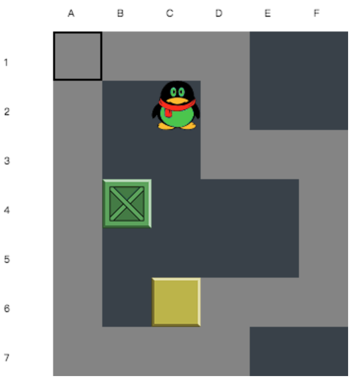
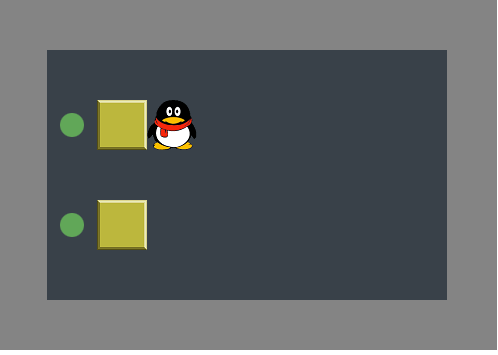
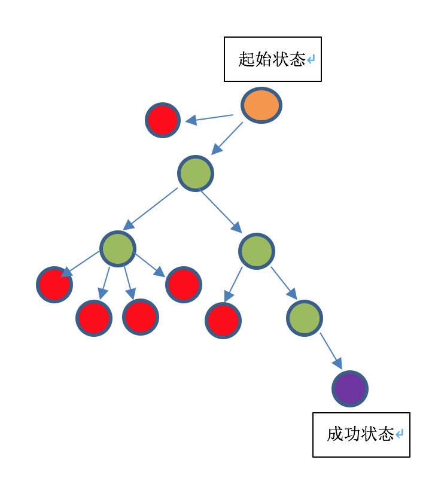

# 推箱子\(Sokoban\)

## 推箱子游戏介绍

推箱子是一个很常见点小游戏，在功能机时代，几乎每个手机上都装了推箱子。

## 推箱子中的对象




| 对象 | 字符表示 | 图标 |
| :--- | :--- | :--- |
| PlayerOnly | @ |   |
| PlayerInGoal | + |   |
| BoxOnly | $ |   |
| BoxInGoal | \* |   |
| Wall | \# |   |
| Road | - |   |
| GoalOnly | . \(注：点） |   |

一个推箱子中的对象包含上述内容，因此我们要构造一个地图，用符号即可。

```text
##########
#--------#
#.$@-----#
#--------#
#.$------#
#--------#
##########
```

上述字符就对应着如下点推箱子问题：




## 推箱子问题常规解法

推箱子问题是一个典型的搜索问题。最开始我们拿到一个初始状态，最终我们要达到一个终态，而终态就是所有的箱子都在目标中。

以最简单的深度优先算法\(DFS\)为例，我们从地图的第一个状态开始，让Player按“上下左右“的顺序依次尝试，如果向上移动可行，则进入一个新的状态，继续从新状态尝试上下左右，如果向上不行，则尝试向下。

<table>
  <thead>
    <tr>
      <th style="text-align:left">颜色</th>
      <th style="text-align:left">含义</th>
    </tr>
  </thead>
  <tbody>
    <tr>
      <td style="text-align:left">绿色</td>
      <td style="text-align:left">可以到达的状态，并且尚未进入死局</td>
    </tr>
    <tr>
      <td style="text-align:left">红色</td>
      <td style="text-align:left">
        <p>1.已经进入死局 ，比如把箱子推到了墙角</p>
        <p>2.重复状态，比如先向上走一步，但是没有推箱子，再向下走，就回到了已经走过的状态。<b>如果向上一步推了箱子，再回来，则不属于重复，这跟走迷宫不一样。</b>
        </p>
      </td>
    </tr>
    <tr>
      <td style="text-align:left">黄色</td>
      <td style="text-align:left">起始状态</td>
    </tr>
    <tr>
      <td style="text-align:left">紫色</td>
      <td style="text-align:left">成功状态，成功状态不止一个</td>
    </tr>
  </tbody>
</table>

对于较复杂的问题，使用DFS效率不够高，因为每次搜索的顺序都是固定的。


