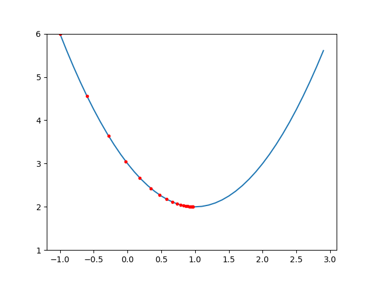
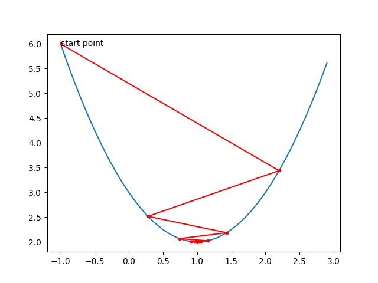

# 深度学习由浅入深

## 机器学习概述

本文主要介绍

* 线性回归
* 逻辑回归
* 支持向量机
* 神经网络\(全连接神经网络，多层感知机\)
* 卷积神经网络
* 递归神经网络

在线性回归中，会更多的介绍一些数学原理，以便理解很多机器学习的概念，在后面的分类问题中不再过多阐述数学原理，更多的介绍算法与应用。

## 线性回归

线性回归不属于分类问题，但是线性回归除了输出值是连续的，与分类问题也差不多，里面的一些概念与算法与分类问题一样。有一些概念在线性回归中更容易理解。比如下面的房价预测问题，就是一个线性回归问题。

| $$x_1$$ 房屋面积\(平方米\) | $$x_2$$ 卧室个数\(个\) | $$y$$ 房价\(元\) |
| :--- | :--- | :--- |
| 78 | 2 | 40100 |
| 123 | 3 | 50024 |
| 50 | 1 | 35000 |
| ... | ... | ... |

线性回归的问题就是根据已知的训练集 $$(x_1,x_2,...,x_n)$$ 以及对应的输出y，找到一个函数

$$
y=w_1x_1+w_2x_2+...+w_nx_n+b
$$

我们的目标就是找到 $$(w_1,w_2,...,w_n,b)$$ 这些参数。

那对于类似于下面的问题，明显是一个二次函数，没法用一次表达式表示怎么办？

| x | y |
| :--- | :--- |
| 0 | 0 |
| -1 | 1 |
| 2 | 4 |
| -2 | 4 |
| ... | ... |

事实上，我们最终选用的特征并不一定是最原始的特征，我们新增一个特征 $$x^2$$ ，那么新的训练集就成了

| $$x_1(x)$$  | $$x_2(x^2)$$  | $$y$$  |
| :--- | :--- | :--- |
| 0 | 0 | 0 |
| -1 | 1 | 1 |
| 2 | 4 | 4 |
| ... | ... | ... |

问题又转化成了 $$y=w_1x_1+w_2x_2+b$$ 。

在实际问题中，是没法一眼看出是什么模型的，尤其是特征值比较多的时候，我们根本无法在坐标系中画出来，只能靠想象。所以我们通常选用更复杂的模型，比如上述问题我们继续增加特征 $$x^4,x^3$$ ，这样我们就是求解 $$y=w_1x^4+w_2x^3+w_3x^2+w_4x+b$$ ，但最终如果我们的学习效果比较好，可能得到的一个函数是 $$y=0.0000001x^4+0.000002x^3+1.000002x^2+0.0000001x+0.00000001$$ ，虽然我们并不知道真正的函数，但是我们找到了一个特别近似的，继续学习可能会让参数更接近真实值。机器学习就是这样的，只能无限逼近真相。

以下我们就用一个直线拟合的问题说明线性回归是如何求解的，为什么用直线拟合这个简单的问题是因为比较容易推导和作图。

### 线性拟合

曲线拟合是一个很常见的问题，在高中就有介绍，比如常见的“最小二乘法“。我们以下面的数据为训练集，用机器学习的方法解决这个问题。

| x | y |
| :--- | :--- |
| 1 | 3.1 |
| 2 | 5.02 |
| 3 | 6.92 |
| 4 | 9.12 |


### 模型选择

对于上述问题，我们可以选用一个最简单的线性模型 $$y=wx+b$$ 。我们的目标就是找到比较近似真实值的w和b。怎么找呢？那就是先随机猜测w和b，然后根据训练集验证效果，如果效果不好，就根据效果改进w和b，直到满意为止。

```text
w = random()
b = random()
效果 = 验证(w,b,训练数据)
while(效果不满意) {
    update(w,b)
    效果 = 验证(w,b,训练数据)
}
```

验证的效果好坏怎么表示呢？如果效果不好，怎么更新w和b能让效果变好呢？

效果好不好我们用代价函数来表示，代价函数越小，效果越好。而更新w和b就是让代价函数变小，其实就是找到让代价函数最小的w和b。

### 代价函数

机器学习就是找到让代价函数最小的参数值，不管是回归和分类。不同的模型使用的代价函数不一样，在线性回归中，代价函数一般是预测值与真实值的差值的平方均值，如下：

$$
J=\frac{1}{m}\sum_{i}^{m}(y'_i-y_i)^2
$$

其中m是训练集数据量。

代价函数就是真实值与预测值差距平方的平均值，可以用图直观的看到。


其中m是训练集个数， $$y'$$ 是根据当前参数得到的预测值， $$y$$ 是真实值，如果我们把w和b替换进去，就是

$$
J=\frac{1}{m}\sum_{i}^{m}(wx_i+b-y_i)^2
$$


需要注意的一点，虽然看上去像是J是x和y的函数，但是x和y是训练集数据，都是已知的，所以此处J是w和b的函数。


我之所以只用了四个训练数据，是因为这样比较容易把训练数据都替换到代价函数里。

对于上述问题，代价函数其实就是

$$
J=\frac{(1w+b-3.1)^2+(2w+b-5.02)^2+(3w+b-6.92)^2+(4w+b-9.12)^2}{4} \\ 
\
\\=7.5w^2+5wb+b^2-35.19w-12.04b+41.4678
$$

所以现在的问题就成了如何找到\(w,b\) ,使得J能取得最小值。

### 公式解法求最小值

连续可导函数有一个性质，就是在极值点导数为0。假如我们知道一个函数是可导的，并且只有一个最小值，那么我们找到导数为0的点，就是最小值的点。

例如 $$f(x)=x^2-2x+3$$ ,导数为 $$f'(x)=2x-2$$ ,那么很明显在 $$x＝1$$ 处取得最小值。

同样对于多元函数，在极值点，所有变量的偏导数都为0。

$$
\begin{equation}
\left\{
\begin{aligned}
\frac{\partial J}{\partial w} = 0 & \\
\frac{\partial J}{\partial b}=0
\end{aligned}
\right.
\end{equation}
$$

而J对w和b对偏导数分别为

$$
\begin{equation}
\left\{
\begin{aligned}
\frac{\partial J}{\partial w} = 15w+5b-35.19 & \\
\frac{\partial J}{\partial b} = 5w+2b-12.04 & \\
\end{aligned}
\right.
\end{equation}
$$

让上述两个式子都为0，就得到一个二元一次方程，解的到w和b分别为1.996和1.05。

对于这类线性回归，有一个公式能直接得到最优解，原理与上述解方程对原理一致。

$$
W=(X^TX)^{-1}X^TY
$$

虽然能得到最优解，但是需要对矩阵求逆，而这个矩阵对大小与训练集个数相同，假如训练集大小为100万，那么就要对100万大小对矩阵求逆，运算量太大，所以不实用，可以在验证算法准确性的时候用于验证，具体推导过程不在这里赘述。

### 梯度下降求最小值

梯度下降对原理也是基于函数在极值点导数为0，找到导数为0的点就可以了。那怎么找呢？

我们先随机猜测一个值 $$x_0$$ ，检查 $$f'(x_0)$$ ，如果小于0，说明在这个点处于下降趋势，最小值在右侧，把 $$x_0$$ 加上一个值 $$\delta$$ 继续验证 $$f'(x_0+\delta)$$，假如大于0，在这个点处于上升趋势，最小值在左侧，那就在 $$x_0$$ 减去一个值 $$\delta$$继续验证 $$f'(x_0-\delta)$$。离最小值越近，我们要增加或减少对值应该越小，因为这样才能无限逼近最小值，所以更新的值与导数有关，更新策略如下：

$$
x_{new}=x_{old}-\alpha f'(x)
$$


梯度下降对多元函数同样适用，比如上述J\(w,b\)，更新的策略如下：

$$
w_{new}=w_{old}-\alpha \frac{\partial J}{\partial w_{old}} \\
\
b_{new}=b_{old}-\alpha \frac{\partial J}{\partial b_{old}} \\
$$


梯度下降的算法很简单，我们用Python可以很容易的实现

```python
import random

def gradient_descent(J, dw, db, alpha, iteration):
    w = random.random()
    b = random.random()
    for i in range(1, iteration+1):
        w = w - alpha * dw(w, b)
        b = b - alpha * db(w, b)

        print("迭代次数:%d"%(i))
        print("w, b:", w, b)
        print("dw, db:", dw(w, b), db(w, b))
        print("J:", J(w, b))
        print("")
    return w, b, J(w, b)


def J(w, b):
    return 7.5*w*w + 5*w*b + b*b -35.19*w -12.08*b + 41.4678
def dw(w, b):
    return 15*w + 5*b - 35.19
def db(w, b):
    return 2*b + 5*w - 12.08


#学习率为0.1，迭代次数200次
gradient_descent(J, dw, db, 0.1, 200)
```

学习率为0.1，迭代200次的结果如下，已经基本达到最优值

```text
迭代次数:1
w, b: 2.5894785534546605 0.6994693583411142
dw, db: 7.149525093525483 2.266331483955531
J: 1.7305155905553136
迭代次数:2
w, b: 1.874526044102112 0.8303124646218353
dw, db: -2.9205470153591406 -1.0467448502457692
J: 0.29854359783086437
......
......
迭代次数:199
w, b: 1.9960727164023144 1.0497869910121038
dw, db: 2.5701095239583083e-05 -6.243596422095266e-05
J: 0.006180007584156044
迭代次数:200
w, b: 1.9960701462927906 1.0497945196632879
dw, db: 2.4792708302356914e-05 -6.0229209472240086e-05
J: 0.006180007057523085
```

至此，我们的模型就求解出来了。

### 超参数\(hyper param\)

机器学习的目标就是设定一个模型，并且找到模型的参数。而为了找到这些参数，我们还需要设置一些其它参数，例如梯度下降中的学习率，这些参数被称为是超参数。超参数在机器学习中特别重要，我们以学习率为例说明。

以下四幅图分别时使用梯度下降求 $$f(x)=x^2-2x+3$$ 时，初值一样， $$\alpha$$ 的值不一样，迭代20次的收敛情况。

$$x_0=-1,\alpha=0.1$$ 时，我们可以看到经过20次迭代已经基本接近最小值了，所以对此目标函数学习率0.1比较合适。




$$x_0=-1,\alpha=0.01$$ 时，经过20次迭代，离极值点还很远。这样就需要更多的迭代次数，但是最终会收敛到极值点。


$$x_0=-1,\alpha=0.8$$ 时，前几次修正猜测值是直接跨过了极值点，不过整个趋势是螺旋下降的，最终也能收敛。



 $$x_0=-1,\alpha=1.5$$ 时，出现了螺旋上升的情况，步子太大无法收敛。 


  
事实上，当我们选取 $$x_0=-1, \alpha=1$$ 时，猜测值会在-1和3之间来回跳。所以 $$\alpha$$值的选择特别重要，选的太小则收敛慢，选的太大可能不收敛，实际应用中通常选一个0－1之间的小数，并且观察迭代结果不断调整。

### 过拟合与欠拟合\(Overfit and Underfit\)

假如我们针对上面的问题，选择一个复杂的模型，比如 $$y=w_1x^3+w_2x^2+w_3x+b$$ ，我们可以找到一条完美的曲线经过所有的点。


但是我们用这个模型去预测新的数据时，发现预测效果很差，这就是过拟合。确定是否过拟合，仅靠训练集是不够的，所以我们需要在训练集中拿出一部分数据，不参与训练，只用于验证模型。如果训练集效果特别好，而测试集表现不好，那一般就是过拟合了。

假如我们选一个简单的模型， $$y=wx$$ ，那么我们怎么训练都不会得到满意的效果，即使是在训练集上，表现也不会好，这就是欠拟合。


在分类问题中也有欠拟合与过拟合。

### 正规化\(Regularization\)

假如我们用了复杂的模型，在训练集上把代价函数减小到0，得到了一个看似完美的模型，这种就是经验风险最小化，因为充分利用了已知的数据。但是这样容易引入结构风险，就是模型太复杂，表达能力太强，可能导致过拟合。为了平衡结构风险和经验风险，我们可以使用正规化，在其它地方也叫惩罚项。比如在前面所述的代价函数上加上所有参数的平方

$$
J_{norm\_l_2}=J+\frac{\lambda}{2}\sum_{i}^{n}w_i^2
$$

这个也称为L2 Penalty，而如果加的是系数的和而不是平方和，则称为L1 Penalty。而 $$\lambda$$ 又是一个类似于学习率的超参数，可以调节惩罚，调节过拟合与欠拟合。

以曲线拟合为例，假如我们发现有过拟合，曲线太弯，那么我们可以增大$$\lambda$$ ，这样训练过程中为了减小损失函数，权重就小，权重小了，曲线就直了。反之发生欠拟合时，可以减小$$\lambda$$ 。

### 特征缩放\(Feature Scaling\)

特征缩放特别重要，能够加快收敛速度，为什么呢？

假设有一个线性回归的模型为 $$y=w_1x_1+w_2x_2+b$$ ，而 $$x_1$$ 的取值范围很小，也就是\(0,1\)，而 $$x_2$$ 的取值范围很大，从1000到10000。其中一条训练数据为\(0.5,3000\)，输出为3，那么这条数据在整个代价函数中的贡献就是 $$(0.5w_1+3000w_2+b-3)^2$$ ，展开后 $$w_1$$ 的系数为0.25，而 $$w_2$$ 的系数为9000000，总的代价函数是每条数据代价函数的和除以个数，最后获得的代价函数可能是 $$J=0.3w_1^2+3948294829849w_2^2+700b....$$ 

这个函数有什么问题吗？问题很大。在用梯度下降求解时，如果学习率很大，那么在$$w_1$$ 方向上能收敛，但是在 $$w_2$$ 方向上可能会发散，因为导数值太大了。所以不得不迁就 $$w_2$$ ，使用一个小的学习率，这样在$$w_1$$ 方向上收敛的特别慢。


我们分别对 $$y=x_1^2+x_2^2$$ 和 $$y=x_1^2+1000x_2^2$$ 使用梯度下降算法求最小值，初值随机。前者在学习率为0.1的情况下迭代100次就挺好了，后者稍微大一点，在 $$x_2$$ 方向上就没法收敛，在学习率为0.008的情况下，迭代1000次， $$x_1$$ 方向上仍然离极值点较远。

所以我们在训练前把各个特征都统一成一个范围，这样各个方向就能步调一致。在用模型预测时，输入数据也要做同样的处理。

常用的有均值缩放，公式为

$$
x'=\frac{x-mean}{max-min}
$$

就是减去均值并且除以范围。

还有归一化，例如我们见的像素值范围是0-255，那么我们把所有值都除以255。

### TensorFlow实现

Tensorflow是目前最流行的机器学习框架，我们用它来实现线性回归，仅针对上述一元函数的情况。

```python
import tensorflow as tf

#训练数据
x = [[1],
     [2],
     [3],
     [4]]
y = [[3.1],
     [5.02],
     [6.92],
     [9.12]]


#######训练模型###########

#X,Y是占位符，一个是特征值x,一个是输出值y,都是nx1的矩阵，n是可变的，所以是[None,1]
X = tf.placeholder(tf.float32, [None, 1], name='X')
Y = tf.placeholder(tf.float32, [None, 1])

#W和b是变量，随机赋值, Y_是预测值
W = tf.get_variable("W", [1], initializer=tf.random_normal_initializer())
b = tf.get_variable("b", [1], initializer=tf.random_normal_initializer())
Y_ = X * W + b

#Y_ - Y是大小为nx1的矩阵，*是位置相乘，结果还是nx1，reduce_mean求均值
cost = tf.reduce_mean((Y_ - Y)*(Y_ - Y))


#训练过程是对cost使用梯度下降求最小值，学习率为0.1
train_step = tf.train.GradientDescentOptimizer(0.1).minimize(cost)

sess = tf.InteractiveSession()

#日志文件用于在TensorBoard上展示
loss_summary = tf.summary.scalar('loss', cost)
test_writer = tf.summary.FileWriter('/Users/niuxinli/tensorlog')
test_writer.add_graph(sess.graph)

#开始训练，100是迭代次数
tf.global_variables_initializer().run()

for epoch in range(100):

    summary, _ = sess.run([loss_summary, train_step], feed_dict={X: x, Y: y})
    test_writer.add_summary(summary, epoch)
    print("iteration:", epoch, ", cost:", sess.run(cost, feed_dict={Y: y, X: x}))

print("w:", sess.run(W))
print("b:", sess.run(b))
```

这其中有两个超参数，学习率和迭代次数，我们固定迭代次数为100，学习率为0.1的时候，结果如下：

```text
iteration: 0 , cost: 33.09105
iteration: 1 , cost: 14.871416
iteration: 2 , cost: 6.690502
iteration: 3 , cost: 3.0168247
......
iteration: 97 , cost: 0.0062399227
iteration: 98 , cost: 0.0062364247
iteration: 99 , cost: 0.0062331166
w: [1.9899361]
b: [1.0678285]
```

而我们设置学习率为0.12的时候，不能收敛，发散了。

```text
iteration: 0 , cost: 44.45536
iteration: 1 , cost: 44.807224
iteration: 2 , cost: 45.162735
......
iteration: 96 , cost: 96.710754
iteration: 97 , cost: 97.50014
iteration: 98 , cost: 98.295975
iteration: 99 , cost: 99.098305
w: [-1.2570491]
b: [-0.08367181]
```

 把学习率为0.01，0.1和0.12时迭代次数与代价函数的曲线画出来，如下


0.1的时候收敛的特别快，0.01时收敛的比较慢，但最终也收敛了，而0.12就不行了，所以学习率的选择挺重要。

Tensorflow可以把模型中数据流动的graph画出来，其中被红色圈出来的是线性回归的模型，先用W与X执行Mul操作，再与b执行add操作，其余的数据流动是为了解这个模型。


### 通用矩阵解法

此处将会推导线性回归的通用解法，而且使用矩阵运算。

假设有n个特征，也就是输入数据是 $$(x_1,x_2,...,x_n)$$ ，那么整个输入集就是一个mxn的矩阵，其中m是训练集大小。

$$
A=\begin{bmatrix}
x_1^1&x_2^1&...&x_n^1\\
x_1^2&x_2^2&...&x_n^2\\
...&...&...&... \\
x_1^m&x_2^m&...&x_n^m
\end{bmatrix}
$$

而权重W是一个nx1对列向量

$$
W=\begin{bmatrix}
w_1\\
w_2\\
... \\
w_n
\end{bmatrix}
$$

bias可以看作一个所有值都相等的列向量，大小为nx1

$$
B=\begin{bmatrix}
b\\
b\\
... \\
b
\end{bmatrix}
$$

那么就有Y=XW + B，注意这里是矩阵运算，所以Y也是一个nx1列向量

$$
Y=\begin{bmatrix}
y_1\\
y_2\\
... \\
y_n
\end{bmatrix}
$$

我们的代价函数如下，注意这里除数是2m，其实也差不多，只是为了求导的时候把2次方的长度去掉。

$$
J = \frac{1}{2m}\sum_{i}^{m}(w_1x_1^i+w_2x_2^i+...+w_nx_n^i+b-y^i)^2
$$

其中 $$x_1^i$$ 表示第一条训练数据的第一个特征值，依次类推。

我们分别对w1,w2,...,wn,b求导，结果如下：

$$
\frac{\partial J}{\partial w_1} = \frac{1}{m}\sum_{i}^{m}(w_1x_1^i+w_2x_2^i+...+w_nx_n^i+b-y^i)x_1^i\\
\frac{\partial J}{\partial w_2} = \frac{1}{m}\sum_{i}^{m}(w_1x_1^i+w_2x_2^i+...+w_nx_n^i+b-y^i)x_2^i\\
...\\
\frac{\partial J}{\partial w_n} = \frac{1}{m}\sum_{i}^{m}(w_1x_1^i+w_2x_2^i+...+w_nx_n^i+b-y^i)x_n^i\\
\frac{\partial J}{\partial b} = \frac{1}{m}\sum_{i}^{m}(w_1x_1^i+w_2x_2^i+...+w_nx_n^i+b-y^i)\\
$$

我们可以看到，对于 $$\frac{\partial J}{\partial w_j}$$ ，如果用矩阵运算，它正好等于

$$
\frac{\partial J}{\partial w_j} =\frac{1}{m}( X(j)^T . (XW+B-Y))
$$

其中X\(j\)表示X的第J列，T表示转置，所以 $$X(j)^T$$ 是1xm的向量，而 $$ XW+B-Y$$ 是mx1的列向量，使用矩阵乘法就得到了一个值。

如果我们把对w对导数看作是一个列向量

$$
\frac{\partial J}{\partial W}=\begin{bmatrix}
\frac{\partial J}{\partial w_1}\\
\frac{\partial J}{\partial w_2}\\
... \\
\frac{\partial J}{\partial w_n}
\end{bmatrix}
$$

那么

$$
\frac{\partial J}{\partial W}=\frac{1}{m}(X^T(XW+B-Y))
$$

而且

$$
\frac{\partial J}{\partial b}=\frac{1}{m}(XW+B-Y)
$$

那我们的算法就很简单了

```text
W = 随机nx1矩阵
B = 相同随机nx1矩阵
alpha = 0.1 #学习率
iteration = 200 #迭代次数

for i in range(0,200):
   delta = XW+b-Y
   dW = (X'delta)/m
   dB = (delta)/m
   W = W - alpha*dW
   B = B - alpha*dB
   cost = (delta' * delta)/2m
```


## 逻辑回归

逻辑回归是最简单的分类算法之一，它只能解决线性可分的问题。什么是线性可分呢？就是把训练数据在坐标图中画出来，可以用一条直线把它们区分开。\(对于二维空间，也就是特征数只有两个的，用直线就可以，而三维空间，是用一个平面，更高维的空间，我们用超平面，我们只以二维空间来说明）


那么逻辑回归的目标就是找到这样一条直线，能把训练集划分成两部分。假设我们的特征都用 $$(x_1,x_2)$$ 表示，那么这个坐标系中的直线就是

$$
w_1x_1+w_2x_2+b=0
$$

我们的目的就是根据训练集，找到参数 $$(w_1,w_2,b)$$ ，其中w1和w2是权重weight，b是bias。

那么我们如何找到这几个参数呢？方法就是随机给w1,w2,b设置一个初值，然后验证效果，如果效果不好，那就根据一定策略继续更新参数，继续验证，直到效果让人满意。

如何确定效果好不好呢？因为训练集的实际分类值是已知的，我们


神经网络


对于下面这一组训练数据，很明显我们可以用三条直线把数据划分开。

