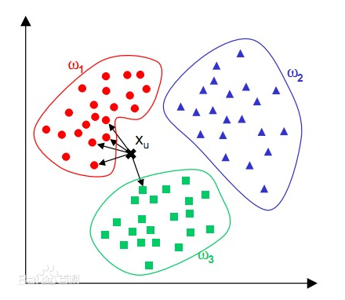

# 第一个机器学习算法

机器学习要解决的一大类问题就是分类\(Classcification\)。分类要解决的问题是针对某一个具体的对象，提取一些能够区分对象的特征\(feature\)，然后预测这个对象属于哪个类别，这里的类别是离散的，例如银行根据客户的投资情况，对客户对风险等级进行分类。这里的投资情况，便是客户的feature，具体一点，可以是客户的股票总金额，银行理财总金额，定期总金额，为了进一步了解客户的抗风险能力，还可以加入客户的年收入，客户的年龄等。

用格式化的方法描述，特征就是一组向量， $$\bf{x} =(x_1,x_2,x_3,...,x_m)$$ ，比如在对客户风险等级进行分类的问题中，可以选取如下的特征：

| 特征 | 年龄x1 | 年收入x2 | 负债x3 | 股票总额x4 | 理财总额x5 | 定期总额x6 |
| :--- | :--- | :--- | :--- | :--- | :--- | :--- |
| 客户1 | 49 | 80万 | 20万 | 70万 | 20万 | 10万 |
| 客户2 | 30 | 40 | 200万 | 5万 | 20万 | 2万 |

用向量表示，客户1的特征就是 $$x=(49,80,20,70,20,10)$$ ，客户2的特征是 $$x=(30,40,200,5,20,2)$$ 。

至于类别，就是一个离散的集合，例如此例中客户的风险等级分为三级，{高级，中级，低级}，高级就是那些承受风险能力强且愿意冒风险的客户，低级属于承受风险能力低且保守的客户，而中级介于两者之间。在转化成具体的机器学习问题是，我们一般用整数在做类别，例如客户的风险等级的集合为{1,2,3}，分别代表低中高三个等级。

假设我们的特征值个数为n，那么x就是一个n维的实数向量，这里的机器学习问题就变成了寻找下面的一个函数f\(x\)

$$
y=f(x), x\in \mathbb{R}^n,y \in \{1,2,3\}
$$

机器学习需要根据已经打标签的数据集进行训练，从这些数据中得到上述的函数，并且对新的未标记的数据进行预测。

| 年龄 | 年收入 | 负债 | 股票 | 理财 | 定期 | **风险等级** |
| :--- | :--- | :--- | :--- | :--- | :--- | :---: |
| 25 | 10 | 3 | 1 | 0 | 2 | 1 |
| 35 | 40 | 200 | 40 | 5 | 0 | 2 |
| 35 | 30 | 20 | 0 | 40 | 30 | 1 |
| 40 | 60 | 50 | 0 | 300 | 20 | 2 |
| 32 | 40 | 10 | 60 | 10 | 0 | 3 |
| 45 | 50 | 0 | 100 | 10 | 10 | 3 |
| 20 | 5 | 1 | 0 | 0 | 0 | 1 |
| 50 | 100 | 20 | 0 | 0 | 200 | 1 |
| 48 | 70 | 0 | 10 | 5 | 150 | 2 |
| 28 | 40 | 200 | 0 | 0 | 0 | 1 |

以上这些已知风险等级的数据被称为训练集\(Training Set\)，我们根据这个训练集得到y=f\(x\)的过程就是机器学习的过程。本节内容将介绍如何用最简单的机器学习进行风险等级的预测。

KNN算法依据的原理就是“物以类聚，人以群分“。如果要判断一个对象属于哪一类，那么最好的办法就是看离它近的对象都是什么类别。



KNN算法没有学习的过程，直接用训练集就能预测。对于一个输入，KNN找到离这个输入最近的K个对象，然后找到哪个类别的最多，就认为输入的类别是哪一个。

如果特征值只有两个或三个，我们可以把每个输入作为一个点在坐标系中画出来，特征大于3个时很难做数据可视化，但是距离的概念仍然适用。

二维平面上点 $$a(x_1,y_1)$$ 与 $$b(x_2,y_2)$$ 间的欧氏距离:

$$
D=\sqrt{(x_1-x_2)^2+(y_1-y_2)^2)}
$$

三维空间中点 $$a(x_1,y_1,z_1)$$ 与 $$b(x_2,y_2,z_2)$$ 点欧氏距离。

$$
D=\sqrt{(x_1-x_2)^2+(y_1-y_2)^2)+(z_1-z_2)^2}
$$

n维空间中点 $$a(a_1,a_2,a_3,...,a_n)$$ 与 $$b(b_1,b_2,b_3,...,b_n)$$ 的欧氏距离为

$$
D=\sqrt{(a_1-b_1)^2+(a_2-b_2)^2+...+(a_n-b_n)^2}
$$


```python
#输入
#1.训练集 train_x = [ [x1,x2,x3,...,xn],
#                    [x1,x2,x3,...,xn],
#                    ...
#                    [x1,x2,x3,...,xn]]
#      train_x的大小为m

#2.训练集标签 train_y = [y1, y2, y3,...,ym], train_y的大小为m

#3.K 
#4.要预测的数据 x = [x1,x2,x3,...,xn]

#输出
#标签y (y属于train_y中的一个)

def knn(train_x, train_y, k, x, distance_method=1):

    #计算x与train_x中每个点的距离
    D = []
    if distance_method == 1:
        D = distance_usingloop(train_x, x)
    else:
        D = distance(train_x, x)

    #找到前k个最近的点
    first_k = np.argpartition(D, k)
    first_k = first_k[0:k]

    # 统计前k个点，出现最多的分类是什么
    nearest_k = []
    for i in range(0, k):
        nearest_k.append(train_y[first_k[i]])

    label = Counter(nearest_k).most_common()[0][0]

    return label


# 用循环计算距离
def distance_usingloop(train_x, x):
    D = []
    for i in range(0,len(train_x)):
        distance = 0
        for j in range(0, len(x)):
            distance = distance + (train_x[i][j] - x[j]) ** 2
        D.append(sqrt(distance))
    return D


# 用矩阵运算
def distance(train_x, x):
    D = np.sqrt(np.sum((train_x - x) ** 2, axis=1))
    return D
```


