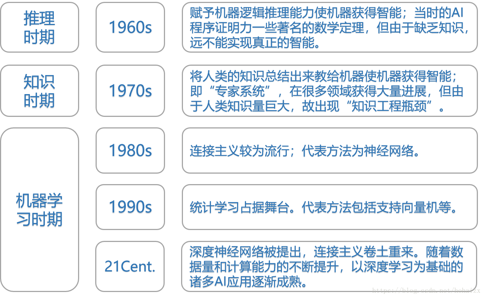
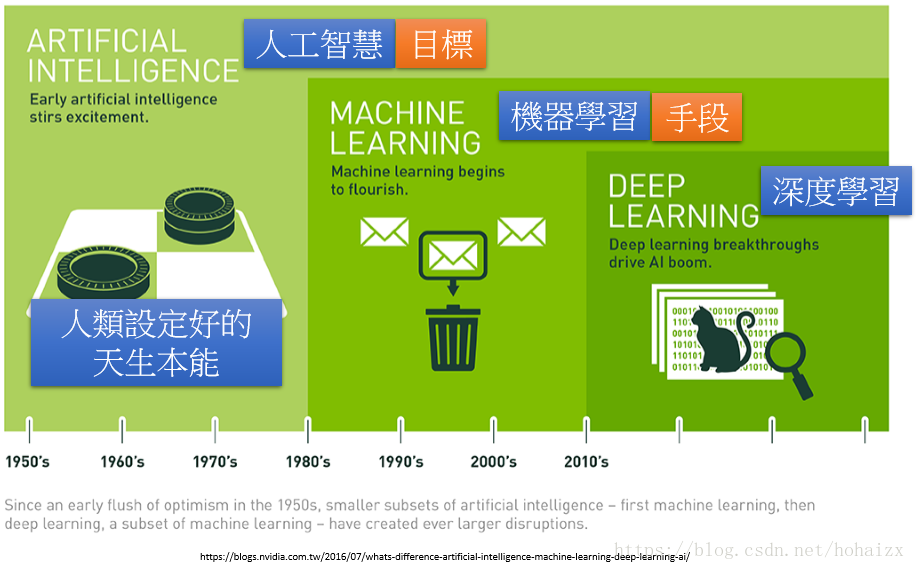
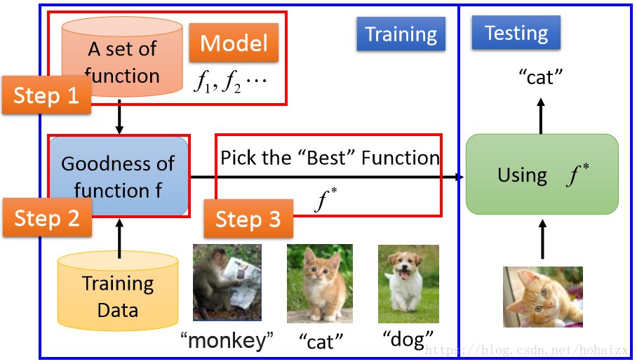
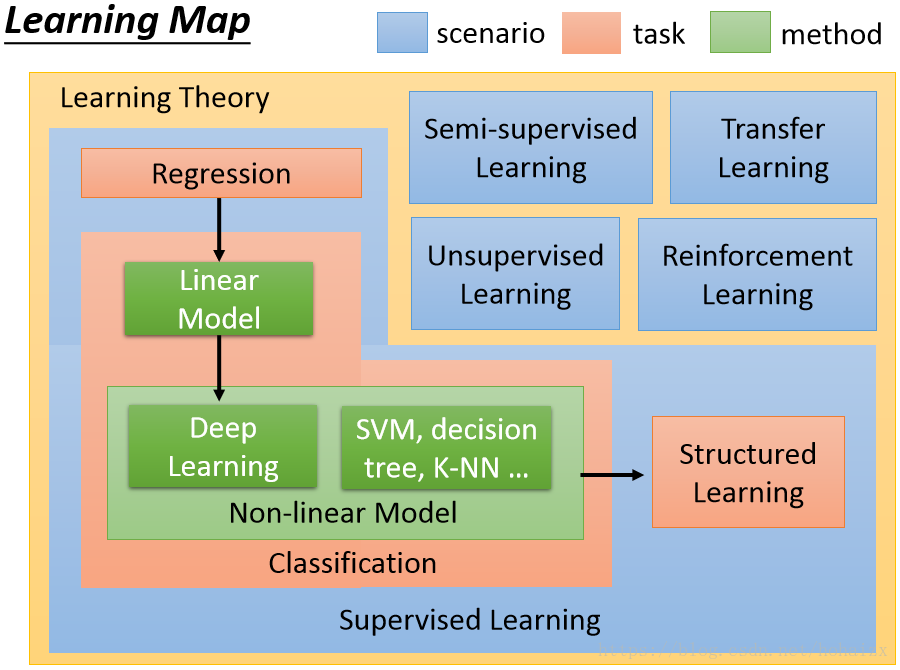

# 机器学习与人工智能

## 发展历程 

人类一直试图让机器具有智能，也就是人工智能（Artificial Intelligence）。从上世纪50年代，人工智能的发展经历了“推理期”，通过赋予机器逻辑推理能力使机器获得智能，当时的AI程序能够证明一些著名的数学定理，但由于机器缺乏知识，远不能实现真正的智能。因此，70年代，人工智能的发展进入“知识期”，即将人类的知识总结出来教给机器，使机器获得智能。在这一时期，大量的专家系统问世，在很多领域取得大量成果，但由于人类知识量巨大，故出现“知识工程瓶颈”。

无论是“推理期”还是“知识期”，机器都是按照人类设定的规则和总结的知识运作，永远无法超越其创造者，其次人力成本太高。于是，一些学者就想到，如果机器能够自我学习问题不就迎刃而解了吗！机器学习（Machine Learning）方法应运而生，人工智能进入“机器学习时期”。“机器学习时期”也分为三个阶段，80年代，连接主义较为流行，代表工作有感知机（Perceptron）和神经网络（Neural Network）。90年代，统计学习方法开始占据主流舞台，代表性方法有支持向量机（Support Vector Machine），进入21世纪，深度神经网络被提出，连接主义卷土从来，随着数据量和计算能力的不断提升，以深度学习（Deep Learning）为基础的诸多AI应用逐渐成熟。

所以，人工智能是追求目标，机器学习是实现手段，深度学习是其中一种方法。

## 机器学习

机器学习是一类算法的总称，这些算法企图从大量历史数据中挖掘出其中隐含的规律，并用于预测或者分类，更具体的说，机器学习可以看作是寻找一个函数，输入是样本数据，输出是期望的结果，只是这个函数过于复杂，以至于不太方便形式化表达。需要注意的是，机器学习的目标是使学到的函数很好地适用于“新样本”，而不仅仅是在训练样本上表现很好。学到的函数适用于新样本的能力，称为泛化（Generalization）能力。

## 机器学习步骤 

通常学习一个好的函数，分为以下三步： 1、选择一个合适的模型，这通常需要依据实际问题而定，针对不同的问题和任务需要选取恰当的模型，模型就是一组函数的集合。 2、判断一个函数的好坏，这需要确定一个衡量标准，也就是我们通常说的损失函数（Loss Function），损失函数的确定也需要依据具体问题而定，如回归问题一般采用欧式距离，分类问题一般采用交叉熵代价函数。 3、找出“最好”的函数，如何从众多函数中最快的找出“最好”的那一个，这一步是最大的难点，做到又快又准往往不是一件容易的事情。常用的方法有梯度下降算法，最小二乘法等和其他一些技巧（tricks）。

学习得到“最好”的函数后，需要在新样本上进行测试，只有在新样本上表现很好，才算是一个“好”的函数。

## 机器学习路线图

机器学习是一个庞大的家族体系，涉及众多算法，任务和学习理论，下图是机器学习的学习路线图。

图中蓝色代表不同的学习理论，橙色代表任务，绿色代表方法。 

1、按任务类型分，机器学习模型可以分为回归模型、分类模型和结构化学习模型。回归模型又叫预测模型，输出是一个不能枚举的数值；分类模型又分为二分类模型和多分类模型，常见的二分类问题有垃圾邮件过滤，常见的多分类问题有文档自动归类；结构化学习模型的输出不再是一个固定长度的值，如图片语义分析，输出是图片的文字描述。

 2、从方法的角度分，可以分为线性模型和非线性模型，线性模型较为简单，但作用不可忽视，线性模型是非线性模型的基础，很多非线性模型都是在线性模型的基础上变换而来的。非线性模型又可以分为传统机器学习模型，如SVM，KNN，决策树等，和深度学习模型。

3、按照学习理论分，机器学习模型可以分为有监督学习，半监督学习，无监督学习，迁移学习和强化学习。当训练样本带有标签时是有监督学习；训练样本部分有标签，部分无标签时是半监督学习；训练样本全部无标签时是无监督学习。迁移学习就是就是把已经训练好的模型参数迁移到新的模型上以帮助新模型训练。强化学习是一个学习最优策略（policy），可以让本体（agent）在特定环境（environment）中，根据当前状态（state），做出行动（action），从而获得最大回报（reward）。强化学习和有监督学习最大的不同是，每次的决定没有对与错，而是希望获得最多的累计奖励。

