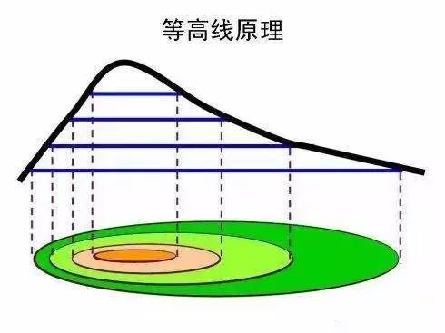

# Matplotlib学习


## 等高图\(Contour\)

我们要可视化的数据一般是多维的，因为高维的无法画出，一般就到三维，但是三维有时候也不方便观察。比如下面的 $$z=x^2+0.1y^2$$ 。


有时候为了方便，我们就把三维的图映射到平面上，就相当于拿一个与xy平面平行的平面，每次向上挪一点，然后把平面与原来的曲面相交的点竖直落到二维平面上。原理如下：



我们以 $$z=x^2+0.1y^2$$ 为例说明如何画出它的等高图。

画高度为0.5的等高线，也就是平面 $$z=0.5$$ 与 曲面$$z=x^2+0.1y^2$$ 的相交线，落到平面上就是一条圆锥曲线 $$0.5=x^2+0.1y^2$$ 。标准方程是 $$2x^2+0.2y^2=1$$ ，代码如下：

```python
import numpy as np
import matplotlib.pyplot as plt
#标准椭圆的画法
plt.xlabel("x")
plt.ylabel("y")
t = np.arange(-4, 4, 0.1)

x = 2 * np.sin(t)
y = 0.2 * np.cos(t)
plt.plot(x, y)

plt.show()

```

对应的图如下


继续画 $$x^2+0.1y^2=1$$ 

```python
import numpy as np
import matplotlib.pyplot as plt

plt.xlabel("x")
plt.ylabel("y")
t = np.arange(-4, 4, 0.1)

x = 2 * np.sin(t)
y = 0.2 * np.cos(t)
plt.plot(x, y)

x = 1 * np.sin(t)
y = 0.1 * np.cos(t)
plt.plot(x, y)

plt.show()

```


再一次画出高度为1.5,2,2.5,...的二维曲线


这样我们就得到了一个等高图。可以想象一下我们从上往下看。

这样的画法太麻烦，matplotlib提供了画等高图的方法。


