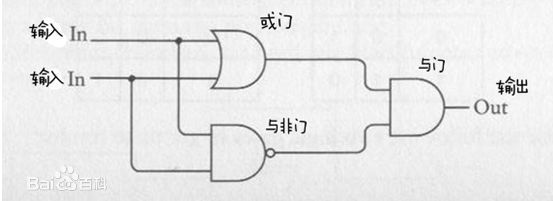

# 逻辑回归\(Logislic Regression\)

## 逻辑回归的概念理解

前边介绍了监督学习主要解决的问题有两类：一类是回归\(Regression\)，一类是分类\(Classification\)。逻辑回归虽然名字里有回归，但是属于分类，它是最简单的一种分类方法，而且是神经网络的基础。逻辑回归与线性回归有着相似的模型，但是它们的输出是不一样的。

线性回归模型

$$y = \mathbf{w}^T\mathbf{x} + b$$, $$y \in R$$ 

逻辑回归模型

  $$\begin{equation} y =\left\{ \begin{aligned} 1 , if\space \mathbf{w}^T\mathbf{x}+b \geq 0 \\ 0,  if\space \mathbf{w}^T\mathbf{x}+b < 0 \\ \end{aligned} \right. \end{equation}$$ 

其中 $$\mathbf{x}$$ 是一个n维向量 $$(x_1,x_2,...,x_n)$$ ， $$\mathbf{w}$$ 也是一个n维向量 $$(w_1,w_2,...,w_n)$$ 。

前边介绍线性回归的时候，我们使用了“学习时间与考试成绩“的例子，根据学习时长，估算学习成绩。现在我们把这个问题变一下：学习时长与是否及格的关系。我们现在有以下数据：

| 学习时长x（小时） | 考试是否及格 |
| :--- | :--- |
| 3 | 否 |
| 4 | 否 |
| 8 | 是 |
| 12 | 是 |
| 5 | 否 |
| 6 | 是 |
| 7 | 是 |

通过这些数据，我们可以发现在 $$x \geq 6$$ 时，考试能够及格，我们可以通过猜测得到一个逻辑回归模型，

$$\begin{equation} y =\left\{ \begin{aligned} 1 , if\space x－6 \geq 0 \\ 0,  if\space x－6 < 0 \\ \end{aligned} \right. \end{equation}$$ 

当我们输入x，如果输出为1，表示能通过考试，否则无法通过考试。这里的w和b分别是1和-6。我们在坐标轴上把这些点画出来，x表示不通过，o表示通过，那么我们可以画一条直线把两类点分隔开，这条线就是x-6=0。

 

接下来我们用更多的特征来预测是否通过考试，引入一个学生IQ分数，下面是得到的数据集。

| 学习时长x1\(小时\) | 学生IQ x2\(分数\) | 是否通过考试 |
| :--- | :--- | :--- |
| 4 | 180 | 是 |
| 1 | 190 | 否 |
| 8 | 110 | 是 |
| 9 | 110 | 是 |
| 12 | 95 | 是 |
| 5 | 140 | 是 |
| 6 | 100 | 是 |
| 4 | 100 | 否 |
| 5 | 95 | 否 |
| 3 | 90 | 否 |
| 2 | 160 | 否 |

当我们引入两个影响考试是否通过的特征时，模型就不那么容易看出来了。能看出来的就是智商高的学生学习时间短一点也可以通过考试，而智商低的学生需要花更多的时间来学习才能通过考试，但是智商再高如果学习时间过短也不能通过考试。如果我们把x1和x2在坐标系中画出来，如下所示：

 

我们可以明显看出通过与不通过的点处于两个不同的区域，假如我们在这之间画一条线，未通过考试的点都在线的左下方，通过的都在线的右上方。我们随意画一条线划分两个区域，这条线用数学表达式表示就是

$$60x_1+x_2-430 = 0$$ 

而左下方的点都符合 $$60x_1+x_2-430 < 0$$ ，右上方的都符合 $$60x_1+x_2-430 \geq 0$$ ，所以我们就得到了这个逻辑回归的模型。

为了模型更精确，我们把学习时间分为老师授课时间和学生自学时间，现在我们有3个特征用于预测考试能否通过，假设已经获取了如下数据：

| 老师授课时长x1\(小时\) | 学生自学时长x2\(小时\) | 学生IQ分数x3 | 是否通过考试 |
| :--- | :--- | :--- | :--- |
| 2 | 2 | 180 | 是 |
| 1 | 5 | 140 | 是 |
| 2 | 3 | 100 | 是 |
| 3 | 1 | 120 | 是 |
| 4 | 1 | 100 | 是 |
| 1 | 3 | 100 | 否 |
| 0 | 5 | 100 | 否 |
| 0 | 5 | 180 | 是 |
| 3 | 1 | 100 | 否 |
| 4 | 0 | 120 | 否 |
| 4 | 1 | 90 | 否 |
| 4 | 2 | 90 | 是 |

现在不能用二维坐标系来画这些点了，需要在三维坐标里画，然后我们能找到一个平面，把这些点分成两部分。

（三维图）

假如特征列变得更多，我们就没法在三维空间里画出来了，但是可以想象一下，这时候我们可以找一个超平面\(hyper\)来分类。这些点或者线或者平面被称之为决策边界\(Decision Boundry\)，而逻辑回归的目标就是找到一个决策边界。

以上列举的问题我们都能比较容易的找到一个线性的决策边界\(直线或者面\)，假设现在要实现一个类似的“异或门“分类器，输入为两个电信号，如果电信号相同，则输出高电平\(1\)，否则输出低电平\(0\)，以下是拿到的一些数据：

| 输入1\(x1\) | 输入2\(x2\) | 输出\(y\) |
| :--- | :--- | :--- |
| 0.011 | 0.002 | 1 |
| 0.001 | 1.002 | 0 |
| 0.015 | 0.11 | 1 |
| 0.887 | 1.002 | 1 |
| 1.102 | 0.982 | 1 |
| 0.015 | 1.021 | 0 |
| 0.017 | 1.032 | 0 |
| 0.996 | 1.101 | 1 |
| 1.112 | 0.008 | 0 |
| 0.995 | 0.101 | 0 |

我们把这些点在二维坐标上表示出来，

 

这个图能找到一个直线把不同分类的点分成两部分吗？答案是不能。我们一般说的逻辑回归指的是线性逻辑回归，也就是我们能找到一个线性的决策边界，这一类能找到线性决策边界的数据集，我们称之为线性可分。而对于异或来说我们只能找到曲线来分割两类数据，比如下面的这个椭圆曲线可以把两类数据分开。

我们可以画一条曲线来把这两类数据分开，比如 $$(x_1-x_2)^2-1/2=0$$ ，这个式子是观察数据特征得到的，展开后就是 $$x_1^2-2x_1x_2+x_2^2-0.5=0$$ ，我们得到了一个非线性的决策边界，如上图所示。

假如我们做如下映射：

$$(x_1,x_2)$$  -&gt; $$(x_1^2, 2x_1x_2,x_2^2)$$ 

把原来的两个特征变成了三个特征，换一个变量 $$(\hat{x}_1,\hat{x}_2,\hat{x}_3)$$ ，那么这个问题就变得线性可分了，至于新的特征，不需要关心它的具体含义。

\(三维图\)

假如原来的数据集线性不可分,那么我们可以采用的方法之一就是把数据的维度增加,如果在二维空间不可分,那到了三维空间可能就是可分的,这种方法是支持向量机\(SVM, Supporting Vector Machine\)使用的方法,在进行训练前,需要通过核函数\(Kernels\)把数据集转换成线性可分的.

对于线性不可分的问题，我们还可以用另一种思路来解决。对于异或门，在电路实现的时候实际上需要多个简单的门电路。 

