# Python基础

## Python的安装

### Python编程环境

编写Python有多种方法，我们选的Python开发环境是Anaconda+Jupyter Notebook。

Anaconda是一个开源的Python发行版本，其包含了conda、Python等180多个科学包及其依赖项。我们之所以用Anaconda就是因为里面包含了所有我们用到的包，并且还带了Jupyter Notebook。


Jupyter Notebook 是一个 Web 应用程序，便于创建和共享文学化程序文档，支持实时代码、数学方程、可视化和 Markdown，其用途包括数据清理和转换、数值模拟、统计建模、机器学习等等。目前，数据挖掘领域中最热门的比赛 Kaggle 里的资料都是 Jupyter 格式。对于机器学习新手来说，学会使用 Jupyter Notebook 非常重要。

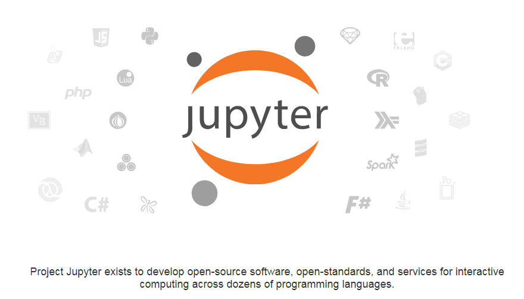

### Anaconda安装

本节分别介绍在Windows、Mac OS和Linux中安装Anaconda以及配置和使用Jupyter Notebook。

#### Windows下安装

到Anaconda官网下载Anaconda，选择Windows版本，当前最新的版本为5.3.1,Python版本为3.7，根据系统是32位还是64位选择不同的链接下载


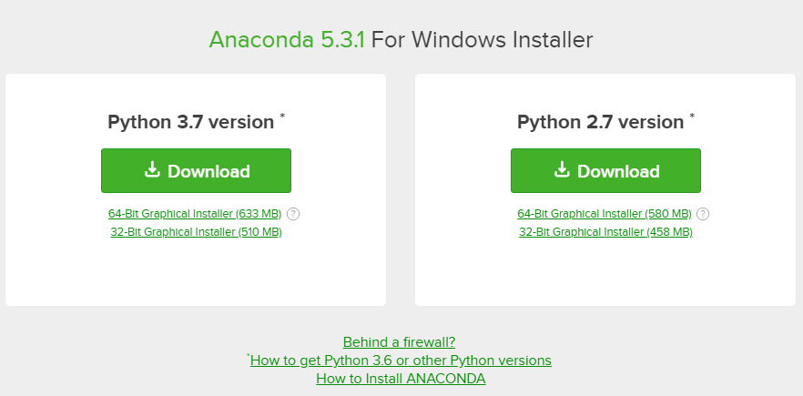

下载完成后双击运行

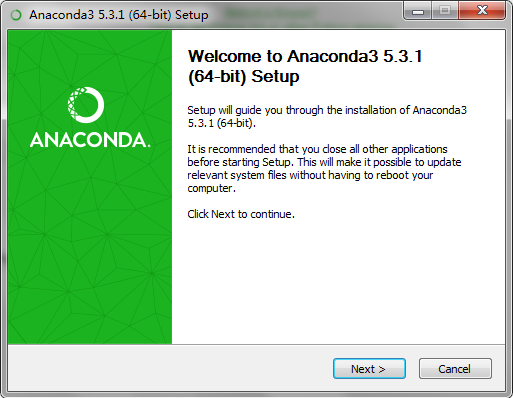


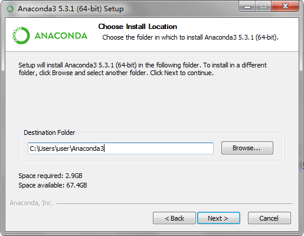

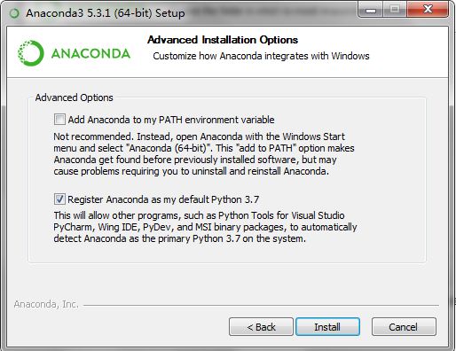


安装时间较长，需要耐心等待。


安装完后，启动Anaconda Navigator，这个是Anaconda的总入口。


在Anaconda Navigator首页，我们可以看到左边有四个按钮，第一个是首页，第二个是环境。第三个和第四个是一些学习资料和社区的链接。右边最上边有一行Applications on base\(root\)，这里的下拉框表示一个环境，而下面的这些应用，都是基于此环境的。

何为环境呢？环境就是某个版本的Python解释器加一堆第三方包。主要是为了在一个系统上开发不同版本的Python应用。例如：

环境1： Python 2.7, 第三方包有matplotlib 2.0.1, NumPy 1.0.5等

环境2：Python 3.7, 第三方包有matplotlib 2.0.1, Numpy 1.0.7等

环境3：Python 3.7, 第三方包有matplotlib 3.0.2, Numpy 1.10.1等

我们点击Environments就能看到当前所有的环境以及该环境下的包，目前只有一个环境。

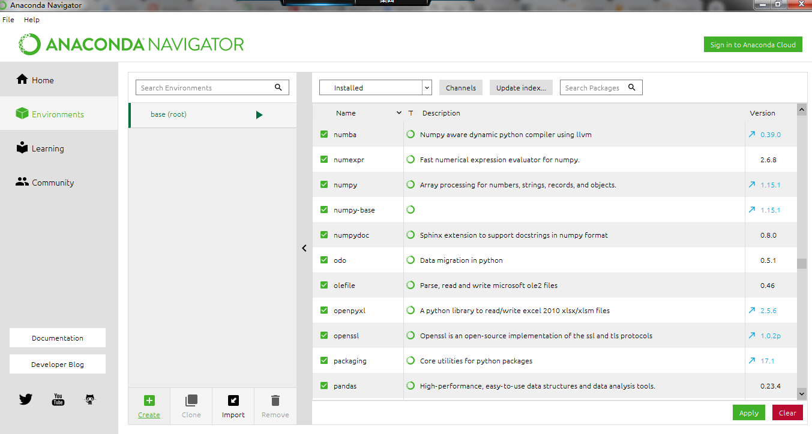

可以通过点击create按钮创建一个新环境，我们只需要一个环境就够了，所以不再具体介绍如何创建新环境。

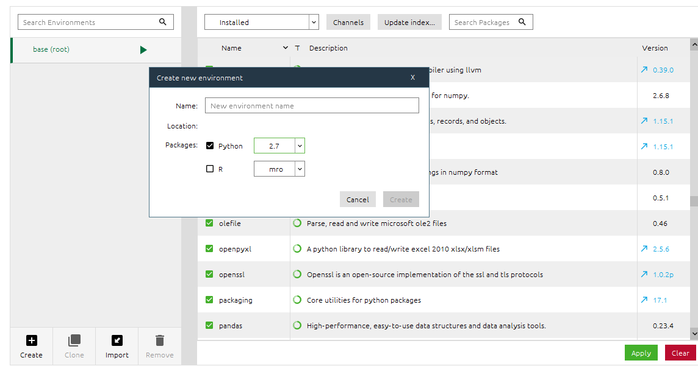

通过右侧的包管理，我们可以安装、升级以及删除第三方包。比如现在环境中是没有TensorFlow的，我在类别这选NotInstalled，并且在搜索框输入Tensor，就把所有的相关的包列出来了，勾选全部然后点Apply即可安装。

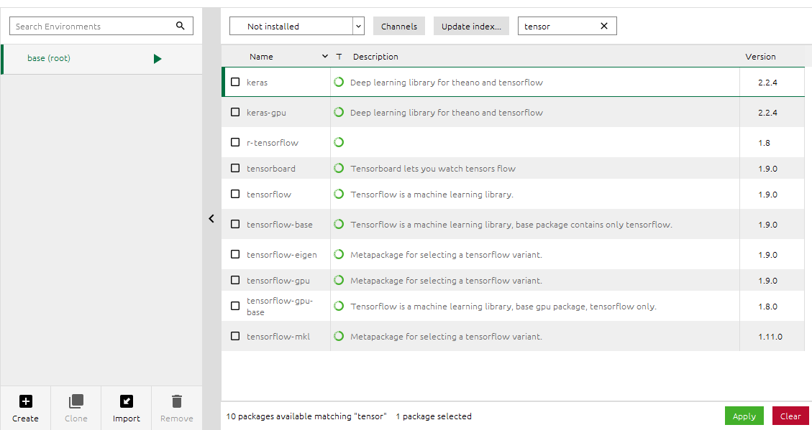

### 第一个Python程序

在Anaconda Navigator中启动Jupyter Notebook，会自动打开一个网页，这个网页就是Jupyter Notebook。


打开的首页显示的是Jupyter Notebook的根目录，一般就是用户目录。点击右上方的"New"，出现一个下拉框，选择Notebook，新建一个Notebook。

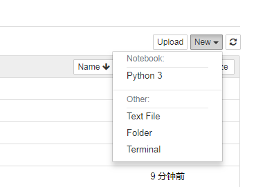

这时浏览器会打开一个新页面。

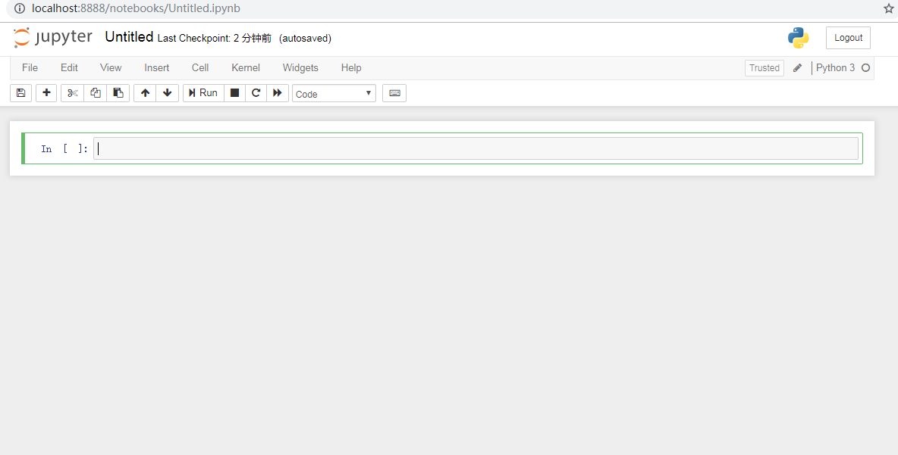

在输入框中输入print \("Hello,World"\)，然后按Alt+Enter或者图中的Run按钮，我们的Python程序就执行起来了。

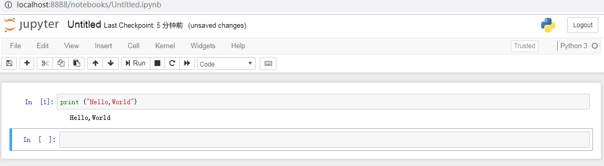

在Jupyter Notebook中，我们还可以画图形，对数据进行可视化，例如

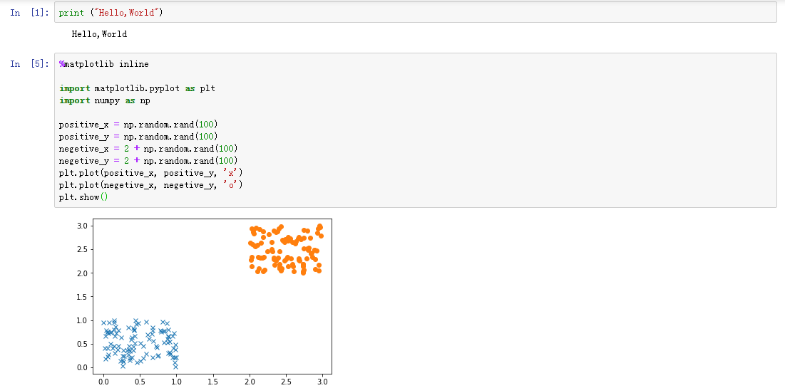

## 函数的参数

Python的函数参数特别灵活，有位置参数，默认参数，可变参数，关键字参数等。

### 位置参数

位置参数就是最普通的参数，比如要计算两个数的和，函数定义如下，有两个参数，使用的时候必须全部传入，而且要按函数定义中的顺序传入。

```python
#定义
def add(a, b):
  return a + b
#使用
sum = add(1, 2)
```

### 默认参数

假设有一个函数是打印温度，有两个参数，一个是数值，一个是温度单位，温度单位传入C表示摄氏度，F表示华氏度。

```python
#定义
def print_temperature(num, type):
   if type == 'C':
      print (num,'摄氏度')
   if type == 'F':
      print (num,'华氏度')
#使用
print_temperature(23,'C')
```

假设这个使用这个函数的场景大部分是摄氏度的情况，我们可以省略一个参数，而在函数定义中指定一个默认值。

```python
#定义
def print_temperature(num, type='C'):
   if type == 'C':
      print (num,'摄氏度')
   if type == 'F':
      print (num,'华氏度')
#使用
print_temperature(23) #打印 '23摄氏度'
print_temperature(23,'C') #打印 '23摄氏度'
print_temperature(70,'F') #打印 '70华氏度'
```


在定义函数的时候，如果要使用默认参数，那么默认参数后面不能再出现没有默认值的参数了，这时候会有编译错误，因为如果允许这样，python解释器就不知道参数的对应关系了。具体可以参见下例。


```python
#错误的默认参数定义
#如果允许这样定义，那么只传一个参数的时候编译器没法知道对应关系
def print_temperature(type='C', num):
   if type == 'C':
      print (num,'摄氏度')
   if type == 'F':
      print (num,'华氏度')

#运行报错
    def print_temperature(type='C', num):
                         ^
SyntaxError: non-default argument follows default argument
```

如果是用IDE编写代码，那么这种错误直接能在IDE中显示出来，因为这属于语法错误，也就是编译时错误。

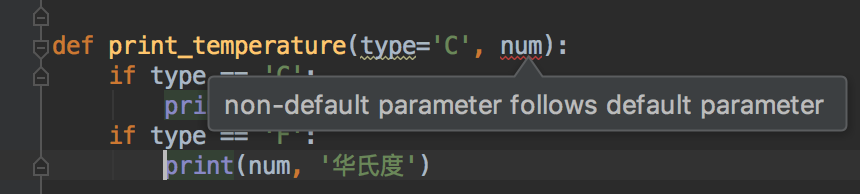

### 可变参数

前面定义了一个计算两个数的和的函数add，假如要实现三个数相加，需要重新定义一个add\(a, b, c\)，四个相加要定义add\(a, b, c, d\)。如果要实现一个任意个数相加的函数呢？这时候需要使用可变参数。


注意，一个函数只能有一个可变参数，否则就是语法错误。


```python
#可变参数定义
def sum(*args):
    count = len(args)
    sum = 0
    for i in range(0, count):
        sum = sum + args[i]
    return sum
#使用
x = sum(1,2,3) #1,2,3被封装成一个tuple放入args中
```

以上函数定义允许不传参数，假如我们要求至少传入两个参数，那么就使用位置参数和可变参数结合。

```python
#至少传入两个参数
def sum(a, b, *args):
   sum = a + b
   count = len(args)
   for i in range(0, count):
     sum = sum + args[i]
   return sum
```


在语法上，并没有强制位置参数和默认参数必须在可变参数之前，但是假如在可变参数后面有位置参数和默认参数，那么它们都会被转换成keyword参数，也就是调用的时候必须写上参数名，因此建议不要这样做。


```python
#可变参数后有位置参数和默认参数
#不建议这样使用
def sum(*args, x, y=1):
    count = len(args)
    sum = 0
    for i in range(0, count):
        sum = sum + args[i]
    sum = sum + x + y
    return sum

#错误使用
sum(1,2,3)
#报错信息
    sum(1,2,3)
TypeError: sum() missing 1 required keyword-only argument: 'x'

#正确使用
sum(1,2,x=3) #y=1默认参数
sum(1,2,x=3,y=4) #修改了默认参数
```

### 关键字参数

关键字参数允许你传入0个或任意个含参数名的参数，这些关键字参数在函数内部自动组装为一个dict。


一个函数只能有一个关键字参数，而且必须放到最后！


```python
#定义含有关键字参数的函数
#kwargs对于函数来说就是一个dict
def print_personal_info(name, age, **kwargs):
    print ("name,", name)
    print ("age,", age)
    if 'gender' in kwargs:
        print ("gender,", kwargs["gender"])
    if 'height' in kwargs:
        print("height,", kwargs["height"])

#使用关键字参数
print_personal_info("niuxinli", 29, gender='male')
```

### 参数的顺序

即使语法没有强制要求定义函数的时候按位置参数，默认参数，可变参数，关键字参数来传，但是我们一般都按这个顺序来传，否则容易出问题。


## NumPy学习

NumPy\(Numerical Python\) 是 Python 语言的一个扩展程序库，支持大量的维度数组与矩阵运算，此外也针对数组运算提供大量的数学函数库。NumPy 的前身 Numeric 最早是由 Jim Hugunin 与其它协作者共同开发，2005 年，Travis Oliphant 在 Numeric 中结合了另一个同性质的程序库 Numarray 的特色，并加入了其它扩展而开发了 NumPy。NumPy 为开放源代码并且由许多协作者共同维护开发。

NumPy 是一个运行速度非常快的数学库，主要用于数组计算，包含：

* 一个强大的N维数组对象 ndarray
* 广播功能函数 
* 整合 C/C++/Fortran 代码的工具
* 线性代数、傅里叶变换、随机数生成等功能

NumPy 通常与 SciPy（Scientific Python）和 Matplotlib（绘图库）一起使用， 这种组合广泛用于替代 MatLab，是一个强大的科学计算环境，有助于我们通过 Python 学习数据科学或者机器学习。

SciPy 是一个开源的 Python 算法库和数学工具包。

SciPy 包含的模块有最优化、线性代数、积分、插值、特殊函数、快速傅里叶变换、信号处理和图像处理、常微分方程求解和其他科学与工程中常用的计算。

Matplotlib 是 Python 编程语言及其数值数学扩展包 NumPy 的可视化操作界面。它为利用通用的图形用户界面工具包，如 Tkinter, wxPython, Qt 或 GTK+ 向应用程序嵌入式绘图提供了应用程序接口（API）。

### Narray对象

Ndarray是NumPy中最基础的对象，它是multidemensional array的意思。它可以用来表示多维数组，与TensorFlow中的Tensor\(张量\)对应。它的纬度用shape来表示。

```python
#标量:0维张量，相当于一个数
a = np.array(1)

#向量:1维张量
b = np.array([1,2,3])

#矩阵:2维张量
c = np.array([[1,2,3],
              [4,5,6]])

#张量:3维张量
d = np.array([[[1,2,3],
               [4,5,6]],
              [[7,8,9],
               [10,11,12]]])
print (np.shape(a),np.shape(b),np.shape(c),np.shape(d))
#结果：() (3,) (2, 3) (2, 2, 3)
```

与Python中原生的list或者tuple不同，主要体现在以下这些方面。

1.ndarray里的数据类型都是一样的，在机器学习中我们一般存浮点数。即使你可以以不同数值赋值，numpy会自动转换类型。而list和tuple可以存储多种类型的数据。

```python
import numpy as np

a = [1,'test', 1.2]
b = np.array([1,'test',3]) #都被转换成了numpy.str_类型

print (type(a[0]), type(a[1]))
print (b[0])
print (type(b[0]), type(b[1]))

#运行结果
<class 'int'> <class 'str'>
1
<class 'numpy.str_'> <class 'numpy.str_'>

```

2. ndarray为复杂计算提供了特别好的支持。虽然使用list完全可以做任何数学运算，但是numpy提供了方便的函数用于简化语法，相比于复杂的循环，出错的概率更小。

```python
import numpy as np
import math as math

#求矩阵中每个元素的平方根
a = [[1,4,9],
     [16,25,36]]

#循环求解
b = [[0,0,0],
     [0,0,0]]
for i in range(0,len(a)):
    for j in range(0,len(a[i])):
        b[i][j] = math.sqrt(a[i][j])
       
#转换成ndarray求解
c = np.array(a)
d = np.sqrt(c)
```

3. ndarray结合numpy提供的代数运算，性能会远好于普通的list。

```python
import numpy as np

#使用numpy做矩阵乘法
a = np.random.rand(100,300)
b = np.random.rand(300,500)

%timeit np.dot(a,b) #注：此用法只能在jupyter notebook中使用

#使用list与循环做矩阵乘法
def multiply_matrix(a, b):
    result = []
    for i in range(0,len(a)):
        result.append([])
        for j in range(0,len(b[0])):
            tmp = 0
            for k in range(0,len(b)):
                tmp = tmp + a[i][k] * b[k][j]
            result[i].append(tmp)
    return result

c = a.tolist()
d = b.tolist()

%timeit multiply_matrix(c,d) #注：此用法只能在jupyter notebook中使用

#结果
330 µs ± 24.5 µs per loop (mean ± std. dev. of 7 runs, 1000 loops each)
2.46 s ± 57.9 ms per loop (mean ± std. dev. of 7 runs, 1 loop each)
```


%timeit 是jupyter提供的一个magic command，可以测试语句的性能，它会跑多次给一个平均值，所以跑的时候感觉很慢。


4. 事实上，很多与科学计算相关的Python包都支持原生的list，但是在真正运算之前，都会先转换成ndarray，比如上面矩阵乘法的例子。在TensorFlow中，底层的数据结构也是ndarray。因此numpy是Python中做科学运算的事实的标准包。

```python
import numpy as np
#第一个会先把list转换成ndarray
x = np.dot([[1,2,3]],[[4],[5],[6]])
y = np.dot(np.array([[1,2,3]]), np.array([[4],[5],[6]]))
```


### 基本操作

#### 属性

```python
a = np.array([[1,2,3],
              [4,5,6]])
#维数
print (a.ndim) #结果:2

#形状 
print (a.shape) #结果:(2, 3)

#所有元素个数
print (a.size) #结果: 6

#元素类型
print (a.dtype) #结果: int64

#元素大小(字节)
print (a.itemsize) #结果: 8

#数据(打印数据存储的地址，一般不用)
print (a.data)  #结果: <memory at 0x120e5d120> (注：不固定)
```

#### 创建ndarray

在实际应用中，我们一般读取文件中的数据\(例如csv文件\)初始化一个ndarray。


另外，还有下面这些比较有用的初始化方法。

通过list初始化一个ndarray。

```python
import numpy as np
a = np.array([1,2,3])
b = np.array([[3,4,5],
              [7,8,9]])
c = np.array([1,2,3,4]).reshape(2,2)
```

通过序列初始化，包括arange和linspace，前者指定步长，后者指定序列个数

```python
import numpya as np
#从1开始，步长为1，最大为5，不包括5
a = np.arange(1,5,1) # [1,2,3,4]
#从0开始，步长为0.1,最大为0.5，不包括0.5
a = np.arange(0,0.5,0.1) #[0,0.1,0.2,0.3,0.4]
#从0-5产生3个数
a = np.linspace(0,5,3) #[0,2.5,5]
```

可以产生全0或者全1的数组。

```python
import numpy as np

a = np.zeros(3)
b = np.zeros((3,5),dtype='int16')
c = np.ones((3,4,5))
```

随机初始化

```python
import numpy as np

a = np.random.rand(3,2) #0-1之间
c = 100 + np.random.rand(3,4,5) #100-101之间
```


### 广播原则\(Broadcasting Rule\)

ndarray一个非常重要的特性就是广播原则，广播原则允许不同形状\(shape\)的ndarray进行运算， 对数组的算术运算通常在相应的元素上进行。

我们在使用整数与一个ndarray相加的时候，就用到了广播原则。例如下面的3被自动扩展成\[3,3,3\]。

```python
import numpy as np
a = np.array([1,2,3])
b = a + 3
print (b) #结果为[4,5,6]
```

当我们对ndarray做普通的元素操作，而不是线性代数中的矩阵运算时，如果两个ndarray的形状一样，那么就相当于对它们相同位置的元素做操作。

```python
import numpy as np
a = np.array([1,2,3])
b = np.array([2,4,6])
print (a + b) #输出[3,6,9]
print (a * b) #输出[2,8,18]
print (a / b) #输出[0.5,0.5,0.5]
```

但是当两个数组的shape不一样时，就会触发广播原则。


**广播的规则:**

* 让所有输入数组都向其中形状最长的数组看齐，形状中不足的部分都通过在前面加 1 补齐。
* 输出数组的形状是输入数组形状的各个维度上的最大值。
* 如果输入数组的某个维度和输出数组的对应维度的长度相同或者其长度为 1 时，这个数组能够用来计算，否则出错。
* 当输入数组的某个维度的长度为 1 时，沿着此维度运算时都用此维度上的第一组值。

**简单理解：**对两个数组，分别比较他们的每一个维度（若其中一个数组没有当前维度则忽略），满足：

* 数组拥有相同形状。
* 当前维度的值相等。
* 当前维度的值有一个是 1。

若条件不满足，抛出 **"ValueError: frames are not aligned"** 异常。

广播原则示例

计算三维空间中某个集合中所有的点与某个特定的点的距离。

```python
import numpy as np
#三个点
train_set = np.array([[1,2,3],
                      [2,3,4],
                      [3,3,3]])
#求上述三个点到这个点的距离
y = np.array([1,1,1])

#计算(x1-y1, x2-y2, x3-y3) , 此处使用了广播
#结果为
#tmp = [[0,1,2],
#       [1,2,3],
#       [2,2,2]]
tmp = train_set - y

#计算((x1-y1)^2, (x2-y2)^2 , (x3-y3)^2) , **2是针对每个元素的
#结果为
#tmp = [[0,1,4],
#       [1,4,9],
#       [4,4,4]]
tmp = tmp ** 2 

#计算每一行的和
#结果为
#tmp = [5,14,12]
tmp = np.sum(tmp, axis=1)

#计算每个点的距离，开方
#结果为
#distance = [2.23606798 3.74165739 3.46410162]
distance = np.sqrt(tmp)
print (distance)      
```

### NumPy与线性代数

一方面我们可以使用普通的加减乘除、开方等操作直接操作ndarray，避免使用循环。例如将两个ndarray位置对应的元素相乘，返回一个新的ndarray。

```python
import numpy as np
#2x3
a = np.array([[1,2,3],
              [4,5,6]])
#1x3
b = np.array([5,5,5])

#2x3
c = np.array([[2,2,2],
              [3,3,3]])
#3x2
d = np.array([[1,1],
              [2,2],
              [3,3]])

print (a * b) # shape不同，可使用广播
#结果
#[[ 5 10 15]
# [20 25 30]]

print (a * c) #shape相同，不使用广播
#结果
#[[ 2  4  6]
# [12 15 18]]

print (a * d) #shape不同，且不能使用广播
#错误：ValueError: operands could not be broadcast together with shapes (2,3) (3,2) 
```

上述代码中a的形状是2x3，而d的形状是3x2，如果我们把它俩当成矩阵的话，使用普通的"\*"不起作用了，因为普通的运算符直接作用在ndarray上时并不是矩阵的运算符，要做矩阵运算必须使用numpy提供的线性代数功能。


在线性代数中一个mxn的矩阵的写法如下

 

写成ndarray时，或者打印出来时，是这样的

A = \[ \[ a11,  a12, ..., a1n\],

         \[ a21, a22, ..., a2n\],

            ...      ...          ...

         \[am1, am2, ..., amn\] \] 


numpy里最常用的方法就是dot方法，它主要有两个参数，针对参数类型的不同，表现可能不一样。以下介绍dot方法使用的四种情况。

```python
import numpy as np

#矩阵转置
a = np.array([[1,2,3],
              [3,4,5]])
print (a.T)     

# 1.如果是两个数，则相当于普通乘法
np.dot(3,4) #结果为12
#---------------------------------------------------------------

# 2.如果是两个vector，即shape为 (n,)，则结果为内积(inner product)
x = np.array([1,2,3])
y = np.array([3,4,5])
print (np.dot(x,y)) #结果为26
print (np.shape(x)) #结果为(3,)
#---------------------------------------------------------------

#3 .如果是两个2D的矩阵，即shape为(m,n)和(n,m)的，则为矩阵乘法
x = np.array([[1],
              [2],
              [3]])
y = np.array([[1,2,3]])
print (np.shape(x),np.shape(y)) #结果为 (3, 1) (1, 3)
print (np.dot(x,y))
#结果为
#[[1 2 3]
# [2 4 6]
# [3 6 9]]
print (np.dot(y,x))
#结果为
#[[14]]

x = np.array([[2,2],
              [3,3],
              [4,4]])
y = np.array([[1,2],
              [2,1]])
print (np.dot(x,y))
#结果是
#[[ 6  6]
# [ 9  9]
# [12 12]]
#---------------------------------------------------------------

# 4.特殊情况，(3,)可以和(3,1)相乘
x = np.array([[1],
              [2],              
              [3]])
y = np.array([1,2,3])
print (np.dot(y,x))
#结果为[14]

```


上述第四种情况，x是\(3,1\)，而y是\(3,\)，虽然没有出错，但是这样不推荐，有可能导致难以发现的bug。所以建议1xn的矩阵务必写成下面这样：

A = np.array\(\[ \[1,2,3\] \]\)


numpy还提供了其它的矩阵运算，这时候需要引入numpy.linalg。

```python
import numpy.linalg as alg
a = np.array([[1,2,3],
              [3,2,9],
              [4,9,1]])
print (alg.inv(a)) #求逆矩阵
print (alg.svd(a)) #奇异值分解
```


