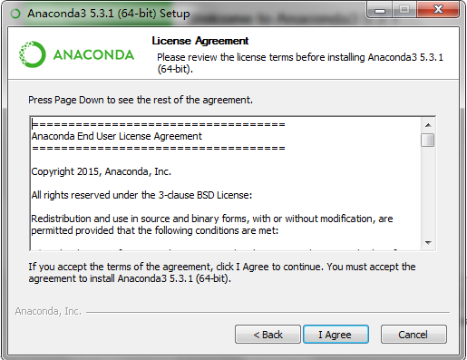
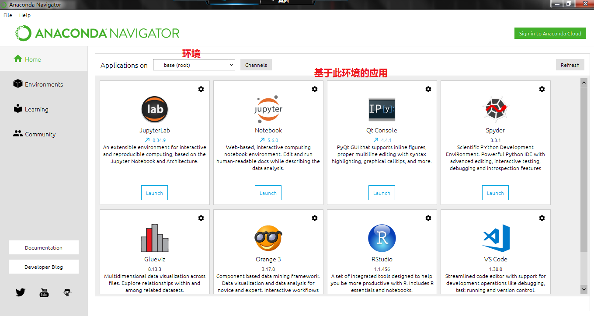
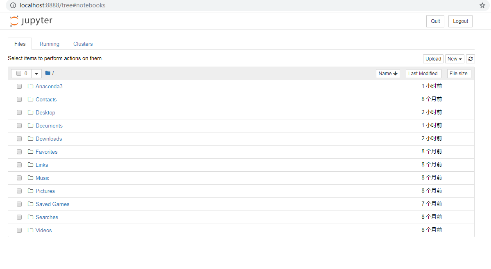

# Python基础

## Python的安装

### Python编程环境

编写Python有多种方法，我们选的Python开发环境是Anaconda+Jupyter Notebook。

Anaconda是一个开源的Python发行版本，其包含了conda、Python等180多个科学包及其依赖项。我们之所以用Anaconda就是因为里面包含了所有我们用到的包，并且还带了Jupyter Notebook。


Jupyter Notebook 是一个 Web 应用程序，便于创建和共享文学化程序文档，支持实时代码、数学方程、可视化和 Markdown，其用途包括数据清理和转换、数值模拟、统计建模、机器学习等等。目前，数据挖掘领域中最热门的比赛 Kaggle 里的资料都是 Jupyter 格式。对于机器学习新手来说，学会使用 Jupyter Notebook 非常重要。


### Anaconda安装

本节分别介绍在Windows、Mac OS和Linux中安装Anaconda以及配置和使用Jupyter Notebook。

#### Windows下安装

到Anaconda官网下载Anaconda，选择Windows版本，当前最新的版本为5.3.1,Python版本为3.7，根据系统是32位还是64位选择不同的链接下载


下载完成后双击运行





安装时间较长，需要耐心等待。


安装完后，启动Anaconda Navigator，这个是Anaconda的总入口。



在Anaconda Navigator首页，我们可以看到左边有四个按钮，第一个是首页，第二个是环境。第三个和第四个是一些学习资料和社区的链接。右边最上边有一行Applications on base\(root\)，这里的下拉框表示一个环境，而下面的这些应用，都是基于此环境的。

何为环境呢？环境就是某个版本的Python解释器加一堆第三方包。主要是为了在一个系统上开发不同版本的Python应用。例如：

环境1： Python 2.7, 第三方包有matplotlib 2.0.1, NumPy 1.0.5等

环境2：Python 3.7, 第三方包有matplotlib 2.0.1, Numpy 1.0.7等

环境3：Python 3.7, 第三方包有matplotlib 3.0.2, Numpy 1.10.1等

我们点击Environments就能看到当前所有的环境以及该环境下的包，目前只有一个环境。


可以通过点击create按钮创建一个新环境，我们只需要一个环境就够了，所以不再具体介绍如何创建新环境。


通过右侧的包管理，我们可以安装、升级以及删除第三方包。比如现在环境中是没有TensorFlow的，我在类别这选NotInstalled，并且在搜索框输入Tensor，就把所有的相关的包列出来了，勾选全部然后点Apply即可安装。


### 第一个Python程序

在Anaconda Navigator中启动Jupyter Notebook，会自动打开一个网页，这个网页就是Jupyter Notebook。



打开的首页显示的是Jupyter Notebook的根目录，一般就是用户目录。点击右上方的"New"，出现一个下拉框，选择Notebook，新建一个Notebook。


这时浏览器会打开一个新页面。


在输入框中输入print \("Hello,World"\)，然后按Alt+Enter或者图中的Run按钮，我们的Python程序就执行起来了。


在Jupyter Notebook中，我们还可以画图形，对数据进行可视化，例如


## 函数的参数

Python的函数参数特别灵活，有位置参数，默认参数，可变参数，关键字参数等。

### 位置参数

位置参数就是最普通的参数，比如要计算两个数的和，函数定义如下，有两个参数，使用的时候必须全部传入，而且要按函数定义中的顺序传入。

```python
#定义
def add(a, b):
  return a + b
#使用
sum = add(1, 2)
```

### 默认参数

假设有一个函数是打印温度，有两个参数，一个是数值，一个是温度单位，温度单位传入C表示摄氏度，F表示华氏度。

```python
#定义
def print_temperature(num, type):
   if type == 'C':
      print (num,'摄氏度')
   if type == 'F':
      print (num,'华氏度')
#使用
print_temperature(23,'C')
```

假设这个使用这个函数的场景大部分是摄氏度的情况，我们可以省略一个参数，而在函数定义中指定一个默认值。

```python
#定义
def print_temperature(num, type='C'):
   if type == 'C':
      print (num,'摄氏度')
   if type == 'F':
      print (num,'华氏度')
#使用
print_temperature(23) #打印 '23摄氏度'
print_temperature(23,'C') #打印 '23摄氏度'
print_temperature(70,'F') #打印 '70华氏度'
```


在定义函数的时候，如果要使用默认参数，那么默认参数后面不能再出现没有默认值的参数了，这时候会有编译错误，因为如果允许这样，python解释器就不知道参数的对应关系了。具体可以参见下例。


```python
#错误的默认参数定义
#如果允许这样定义，那么只传一个参数的时候编译器没法知道对应关系
def print_temperature(type='C', num):
   if type == 'C':
      print (num,'摄氏度')
   if type == 'F':
      print (num,'华氏度')

#运行报错
    def print_temperature(type='C', num):
                         ^
SyntaxError: non-default argument follows default argument
```

如果是用IDE编写代码，那么这种错误直接能在IDE中显示出来，因为这属于语法错误，也就是编译时错误。


### 可变参数

前面定义了一个计算两个数的和的函数add，假如要实现三个数相加，需要重新定义一个add\(a, b, c\)，四个相加要定义add\(a, b, c, d\)。如果要实现一个任意个数相加的函数呢？这时候需要使用可变参数。


注意，一个函数只能有一个可变参数，否则就是语法错误。


```python
#可变参数定义
def sum(*args):
    count = len(args)
    sum = 0
    for i in range(0, count):
        sum = sum + args[i]
    return sum
#使用
x = sum(1,2,3) #1,2,3被封装成一个tuple放入args中
```

以上函数定义允许不传参数，假如我们要求至少传入两个参数，那么就使用位置参数和可变参数结合。

```python
#至少传入两个参数
def sum(a, b, *args):
   sum = a + b
   count = len(args)
   for i in range(0, count):
     sum = sum + args[i]
   return sum
```


在语法上，并没有强制位置参数和默认参数必须在可变参数之前，但是假如在可变参数后面有位置参数和默认参数，那么它们都会被转换成keyword参数，也就是调用的时候必须写上参数名，因此建议不要这样做。


```python
#可变参数后有位置参数和默认参数
#不建议这样使用
def sum(*args, x, y=1):
    count = len(args)
    sum = 0
    for i in range(0, count):
        sum = sum + args[i]
    sum = sum + x + y
    return sum

#错误使用
sum(1,2,3)
#报错信息
    sum(1,2,3)
TypeError: sum() missing 1 required keyword-only argument: 'x'

#正确使用
sum(1,2,x=3) #y=1默认参数
sum(1,2,x=3,y=4) #修改了默认参数
```

### 关键字参数

关键字参数允许你传入0个或任意个含参数名的参数，这些关键字参数在函数内部自动组装为一个dict。


一个函数只能有一个关键字参数，而且必须放到最后！


```python
#定义含有关键字参数的函数
#kwargs对于函数来说就是一个dict
def print_personal_info(name, age, **kwargs):
    print ("name,", name)
    print ("age,", age)
    if 'gender' in kwargs:
        print ("gender,", kwargs["gender"])
    if 'height' in kwargs:
        print("height,", kwargs["height"])

#使用关键字参数
print_personal_info("niuxinli", 29, gender='male')
```

### 参数的顺序

即使语法没有强制要求定义函数的时候按位置参数，默认参数，可变参数，关键字参数来传，但是我们一般都按这个顺序来传，否则容易出问题。

