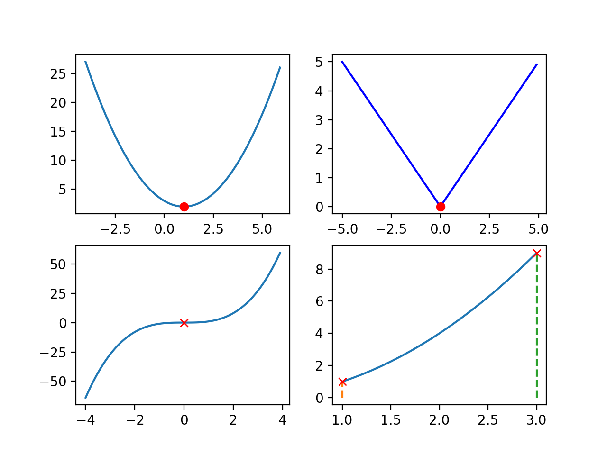

# 梯度下降算法

梯度下降\(Gradient Descent\)是一种求函数最小值\(极小值\)的算法，它广泛用于机器学习算法中，可以说是机器学习的基础之一。

## 数学基础


### **函数的极值**

极值是指一个函数局部的最小值\(或最大值\)。对于一元函数，它的准确数学定义是：假设 $$f(x)$$ 在区间 $$(a,b)$$ 内有定义， $$x_0$$ 是区间内的一个点，如果存在正数 $$\delta>0$$ ，使得对于任意 $$x\in(x_0-\delta,x_0+\delta)$$ ，均有 $$f(x)>f(x_0)$$ \(或 $$f(x)>f(x_0)$$ \)，则称 $$f(x_0)$$ 是 $$f(x)$$ 的极小值\(或极大值\), $$x_0$$ 称为函数的极小值点\(或者极大值点）

图1上面两个图中实心圆点分别是这两个函数点极小值，而下面点两个则不是，对于最后一个函数，我们一般不把区间端点纳入极值点考虑范围内。



### **极值的性质**

对于函数 $$f(x)$$ ，如果 $$x_0$$ 是它的一个极值点，则 $$f(x)$$在 $$x_0$$ 处不可导或者 $$f'(x_0)=0$$ 。如果可导，若 $$f''(x_0)>0$$ 时取得极小值，若 $$f''(x_0)<0$$ 则取得极大值。

对于可导函数，极值点大导数为0是它的必要条件，但不是充分条件，例如图1左下角的函数是 $$f(x)=x^3$$ ，它在0处的导数为0，却不是极值。同样，在不可导的点处也不一定产生极值。

### **凹函数**

在机器学习算法中使用梯度下降求函数最小值的方法就是找到导数为0的点。但是对于可导函数，导数为0，并不意味着这是最小值或者最大值。原因如下：

\(1\)函数可能有多个极值点，例如 $$sin(x)$$ 有多个极小值与极大值

\(2\)导数为0不代表是极值点，例如 $$f(x)=x^3$$ ，在0处导数为0但是不是极值

因此我们在机器学习中求损失函数最小值的时候，都使用的是凹函数，它有且只有一个极小值点。形象的描述一下就是一个碗状开口向上的函数，它的数学定义如下：

对于一个函数 $$f(x)$$ 如果在区间 $$I$$ 上连续，且对于任意的 $$x1,x2$$ ，都有 $$f((x_1+x_2)/2)\leq(f(x_1)+f(x_2))/2$$ ，则称 $$f(x)$$ 在区间 $$I$$ 上是凹函数，如果把小于等于号换成小于号，则称严格凹函数。


后续用梯度下降算法求最小值的时候，默认目标函数都是凹函数。


注意：不同的教材中对凹函数和凸函数的定义可能相反，本文中的凹函数指的是开口向上有极小值的函数。


## 梯度下降算法

梯度下降算法就是利用凹函数的性质来求函数的最小值。需要注意一点的是我们要区分“理论“与“工程“，对于数学理论，我们要有严谨的定义与证明，对于特殊情况都要覆盖。而对于工程问题，要具体问题具体分析，而且工程上不一定需要求出精确值，只需要满足需要的精度即可。

梯度下降的目的就是找到 $$f'(x)=0$$ 的点，如何找到这个点呢？对于普通的函数，我们一眼可以看出来，例如 $$f(x)=(x-1)^2$$ ，但是实际工程上的函数比这个要复杂的多，没法很容易多看出来。梯度下降算法就是采用“设定随机初值-&gt;验证-&gt;修正-&gt;验证-&gt;修正-&gt;验证......"这种不断迭代的方法来求最小值的。

以函数 $$f(x)=(x-1)^2+2$$ 为例，它的导数是 $$f'(x)=2x-2$$ ，我们随机取一个初值 $$x_0=0$$ ，然后验证导数， $$f'(0)=-2$$ ，说明这不是极值点，而且导数为负，说明在函数曲线是下降的，极值点在右边，那么我们修正一下猜测值，加一个 $$\delta$$ ，继续验证 $$x_0+\delta$$ ，假设此处的 $$\delta=0.2$$ ，那么新的猜测值是0.2， $$f'(0.2)=-0.4$$ ，

```python
#求函数f的最小值
#f是目标函数，df是目标函数的导数,alpha是学习率,iteration是迭代次数
def gradient_descent(f, df, alpha, iteration):
    guess = 0
    for i in range(1, iteration):
        guess = guess - alpha * df(guess)
        #打印迭代过程
        print ("迭代次数:%d,x:%.5f,df(x):%.5f,f(x):%.5f"%(i, guess, df(guess),f(guess)))
    return guess,f(guess)
```

我们以求函数 $$f(x)=(x-1)^2+2$$ 的最小值为例编写代码：

```python
def f1(x):
    return x**2 - 2*x + 3
def df1(x):
    return x*2 - 2
guess,min = gradient_descent(f1,df1,0.1,20)
```

迭代过程如下：

```text
迭代次数:1,x:0.20000,df(x):-1.60000,f(x):2.64000
迭代次数:2,x:0.36000,df(x):-1.28000,f(x):2.40960
迭代次数:3,x:0.48800,df(x):-1.02400,f(x):2.26214
迭代次数:4,x:0.59040,df(x):-0.81920,f(x):2.16777
迭代次数:5,x:0.67232,df(x):-0.65536,f(x):2.10737
迭代次数:6,x:0.73786,df(x):-0.52429,f(x):2.06872
迭代次数:7,x:0.79028,df(x):-0.41943,f(x):2.04398
迭代次数:8,x:0.83223,df(x):-0.33554,f(x):2.02815
迭代次数:9,x:0.86578,df(x):-0.26844,f(x):2.01801
迭代次数:10,x:0.89263,df(x):-0.21475,f(x):2.01153
迭代次数:11,x:0.91410,df(x):-0.17180,f(x):2.00738
迭代次数:12,x:0.93128,df(x):-0.13744,f(x):2.00472
迭代次数:13,x:0.94502,df(x):-0.10995,f(x):2.00302
迭代次数:14,x:0.95602,df(x):-0.08796,f(x):2.00193
迭代次数:15,x:0.96482,df(x):-0.07037,f(x):2.00124
迭代次数:16,x:0.97185,df(x):-0.05629,f(x):2.00079
迭代次数:17,x:0.97748,df(x):-0.04504,f(x):2.00051
迭代次数:18,x:0.98199,df(x):-0.03603,f(x):2.00032
迭代次数:19,x:0.98559,df(x):-0.02882,f(x):2.00021
```


