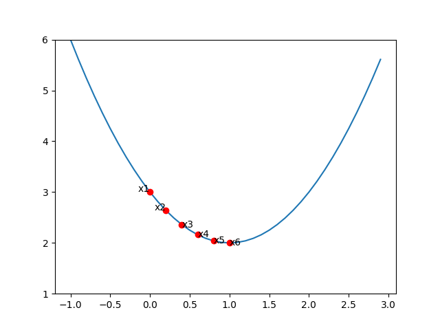
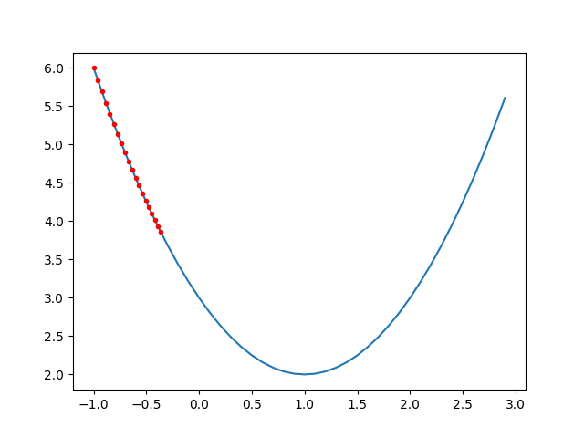

# 梯度下降算法

梯度下降\(Gradient Descent\)是一种求函数最小值\(极小值\)的算法，它广泛用于机器学习算法中，可以说是机器学习的基础之一。

## 数学基础


### **函数的极值**

极值是指一个函数局部的最小值\(或最大值\)。对于一元函数，它的准确数学定义是：假设 $$f(x)$$ 在区间 $$(a,b)$$ 内有定义， $$x_0$$ 是区间内的一个点，如果存在正数 $$\delta>0$$ ，使得对于任意 $$x\in(x_0-\delta,x_0+\delta)$$ ，均有 $$f(x)>f(x_0)$$ \(或 $$f(x)>f(x_0)$$ \)，则称 $$f(x_0)$$ 是 $$f(x)$$ 的极小值\(或极大值\), $$x_0$$ 称为函数的极小值点\(或者极大值点）


图1上面两个图中实心圆点分别是这两个函数点极小值，而下面点两个则不是，对于最后一个函数，我们一般不把区间端点纳入极值点考虑范围内。

### **极值的性质**

对于函数 $$f(x)$$ ，如果 $$x_0$$ 是它的一个极值点，则 $$f(x)$$在 $$x_0$$ 处不可导或者 $$f'(x_0)=0$$ 。如果可导，若 $$f''(x_0)>0$$ 时取得极小值，若 $$f''(x_0)<0$$ 则取得极大值。

对于可导函数，极值点大导数为0是它的必要条件，但不是充分条件，例如图1左下角的函数是 $$f(x)=x^3$$ ，它在0处的导数为0，却不是极值。同样，在不可导的点处也不一定产生极值。

### **凹函数**

在机器学习算法中使用梯度下降求函数最小值的方法就是找到导数为0的点。但是对于可导函数，导数为0，并不意味着这是最小值或者最大值。原因如下：

\(1\)函数可能有多个极值点，例如 $$sin(x)$$ 有多个极小值与极大值

\(2\)导数为0不代表是极值点，例如 $$f(x)=x^3$$ ，在0处导数为0但是不是极值

因此我们在机器学习中求损失函数最小值的时候，都使用的是凹函数，它有且只有一个极小值点。形象的描述一下就是一个碗状开口向上的函数，它的数学定义如下：

对于一个函数 $$f(x)$$ 如果在区间 $$I$$ 上连续，且对于任意的 $$x1,x2$$ ，都有 $$f((x_1+x_2)/2)\leq(f(x_1)+f(x_2))/2$$ ，则称 $$f(x)$$ 在区间 $$I$$ 上是凹函数，如果把小于等于号换成小于号，则称严格凹函数。


后续用梯度下降算法求最小值的时候，默认目标函数都是凹函数。


注意：不同的教材中对凹函数和凸函数的定义可能相反，本文中的凹函数指的是开口向上有极小值的函数。


## 梯度下降算法

梯度下降算法就是利用凹函数的性质来求函数的最小值。需要注意一点的是我们要区分“理论“与“工程“，对于数学理论，我们要有严谨的定义与证明，对于特殊情况都要覆盖。而对于工程问题，要具体问题具体分析，而且工程上不一定需要求出精确值，只需要满足需要的精度即可。

### 基本思想

梯度下降的目的就是找到 $$f'(x)=0$$ 的点，如何找到这个点呢？对于普通的函数，我们一眼可以看出来，例如 $$f(x)=(x-1)^2$$ ，但是实际工程上的函数比这个要复杂的多，没法很容易多看出来。梯度下降算法就是采用“设定随机初值-&gt;验证-&gt;修正-&gt;验证-&gt;修正-&gt;验证......"这种不断迭代的方法来求最小值的。

以函数 $$f(x)=(x-1)^2+2$$ 为例，它的导数是 $$f'(x)=2x-2$$ ，我们随机取一个初值 $$x_1=0$$ ，然后验证导数， $$f'(0)=-2$$ ，说明这不是极值点，而且导数为负，说明在函数曲线是下降的，极值点在右边，那么我们修正一下猜测值，加一个 $$\delta$$ ，继续验证 $$x_1+\delta$$ ，假设此处的 $$\delta=0.2$$ ，那么新的猜测值是0.2， $$f'(0.2)=-0.4$$ ，按此步骤继续验证加修正，最终到了极值点附近。迭代的过程可以看下图。



假设一开始的猜测值在极值点的右侧，比如上述函数，一开始猜测了 $$x_1=2$$ ，因为 $$f'(2)=2$$ ，说明此处的趋势是上升，所以下次的猜测值需要在 $$x_1$$ 基础上减掉一些，具体过程参见下图：


### 学习率

梯度下降的过程很简单，最关键的是每次如何修正猜测值。当导数为负时，在当前猜测值上加一点，当导数为正时，在当前猜测值上减一点，因此新的猜测值与当前的导数有关，梯度下降的的修正方法如下：

$$
x_{new}=x_{old}-\alpha f'(x_{old})
$$

其中， $$\alpha$$ 是一个大于0的可调参数，称为学习率。当导数为负时，在当前值上减一个负数，反之则减一个正数，这样就能使得猜测值逐渐逼近极值点。在接近极值点的时候， $$f'(x)$$ 特别小，每次修正的幅度也会越来越小，只要迭代次数足够多，我们可以得到足够精确的值。

但是，并不是什么情况下都能收敛到最小值的！！！ $$\alpha$$ 的值在这里起着特别重要的作用。以下四幅图分别时使用梯度下降，初值一样， $$\alpha$$ 的值不一样，迭代20次的收敛情况。

$$x_0=-1,\alpha=0.1$$ 时，我们可以看到经过20次迭代已经基本接近最小值了，所以对此目标函数学习率0.1比较合适。


$$x_0=-1,\alpha=0.01$$ 时，经过20次迭代，离极值点还很远。这样就需要更多的迭代次数，但是最终会收敛到极值点。



$$x_0=-1,\alpha=0.8$$ 时，前几次修正猜测值是直接跨过了极值点，不过整个趋势是螺旋下降的，最终也能收敛。


 $$x_0=-1,\alpha=1.5$$ 时，出现了螺旋上升的情况，步子太大无法收敛。 


  
事实上，当我们选取 $$x_0=-1, \alpha=1$$ 时，猜测值会在-1和3之间来回跳。所以 $$\alpha$$值的选择特别重要，选的太小则收敛慢，选的太大可能不收敛，实际应用中通常选一个0－1之间的小数，并且观察迭代结果不断调整。


上述梯度下降是最简单的梯度下降，有不少优化的梯度下降，可以自适应的调节参数，后面会有介绍。


###  python实现

梯度下降用python实现的代码如下所示，比较简单。其中f和df是参数只有一个的函数，在python中函数是可以作为参数传递的。



```python
#求函数f的最小值
#f是目标函数，df是目标函数的导数,alpha是学习率,iteration是迭代次数
def gradient_descent(f, df, alpha, iteration):
    guess = 0
    for i in range(1, iteration):
        guess = guess - alpha * df(guess)
        print ("迭代次数:%d,x:%.5f,df(x):%.5f,f(x):%.5f"
               %(i, guess, df(guess),f(guess)))

    return guess,f(guess)
```



我们以求函数 $$f(x)=(x-1)^2+2$$ 的最小值为例编写代码：



```python
def f1(x):
    return x**2 - 2*x + 3
def df1(x):
    return x*2 - 2
guess,min = gradient_descent(f1,df1,0.1,20)
```



迭代过程如下：



```text
迭代次数:1,x:0.20000,df(x):-1.60000,f(x):2.64000
迭代次数:2,x:0.36000,df(x):-1.28000,f(x):2.40960
迭代次数:3,x:0.48800,df(x):-1.02400,f(x):2.26214
迭代次数:4,x:0.59040,df(x):-0.81920,f(x):2.16777
迭代次数:5,x:0.67232,df(x):-0.65536,f(x):2.10737
迭代次数:6,x:0.73786,df(x):-0.52429,f(x):2.06872
迭代次数:7,x:0.79028,df(x):-0.41943,f(x):2.04398
迭代次数:8,x:0.83223,df(x):-0.33554,f(x):2.02815
迭代次数:9,x:0.86578,df(x):-0.26844,f(x):2.01801
迭代次数:10,x:0.89263,df(x):-0.21475,f(x):2.01153
迭代次数:11,x:0.91410,df(x):-0.17180,f(x):2.00738
迭代次数:12,x:0.93128,df(x):-0.13744,f(x):2.00472
迭代次数:13,x:0.94502,df(x):-0.10995,f(x):2.00302
迭代次数:14,x:0.95602,df(x):-0.08796,f(x):2.00193
迭代次数:15,x:0.96482,df(x):-0.07037,f(x):2.00124
迭代次数:16,x:0.97185,df(x):-0.05629,f(x):2.00079
迭代次数:17,x:0.97748,df(x):-0.04504,f(x):2.00051
迭代次数:18,x:0.98199,df(x):-0.03603,f(x):2.00032
迭代次数:19,x:0.98559,df(x):-0.02882,f(x):2.00021
```



### 多元函数梯度下降

前边介绍的都是一元函数，对于多元函数，极值与凹函数的理论同样适用。


在多元函数中，我们一般使用偏导数，偏导数就是某个多元函数对某一个变量求导，把其它变量都当成常常数。例如 $$z=x^2+y^2+2xy+1$$ ,

$$z$$ 相对于 $$x$$ 的偏导数为 $$\frac{\partial z}{\partial x} = 2x+2y$$ , $$z$$ 相对于 $$y$$ 的偏导数为 $$\frac{\partial z}{\partial y} = 2x+2y$$ 。 $$z$$的最小值点为\(0,0\)，此时 $$\frac{\partial z}{\partial x} =0,\frac{\partial z}{\partial y} =0$$ ，对于多变量的梯度下降，也是先猜测一个初值，然后求每个变量在这个点的偏导数，并根据学习率和偏导数修正猜测值。

具体算法可以看下面的python代码实现。在代码实现中，我们使用了numpy包中的array。在机器学习中，全是对向量和矩阵的运算，numpy中的数据类型把基本的运算都做了重载，例如用普通的数组没法使用加号，使用numpy的array就可以，避免了使用循环。

```python
>>> import numpy as np
>>> a=[1,2,3]
>>> b=[1,2,3]
>>> a-b
Traceback (most recent call last):
  File "<stdin>", line 1, in <module>
TypeError: unsupported operand type(s) for -: 'list' and 'list'
>>> x=np.array(a)
>>> y=np.array(b)
>>> x-y
array([0, 0, 0])
```

另外，numpy做矩阵运算时可以并行，效率远高于循环，所以在机器学习中尽量不用循环。



```python
#使用np.array存储(x1,x2,...,xn)
import numpy as np

#f和df的输入参数都是np.array，variable_count表示变量个数
def gradient_descent_multivariable(f,  df, variable_count, alpha, iteration):
    #guess=(x0,x1,...,xn)
    guess = np.random.rand(variable_count) #随机初始化一个初值
    for i in range(1,iteration+1):
        #此处相当于
        #x0 = x0 - a * df/dx0
        #x1 = x1 - a * df/dx1
        #...
        #xn = xn - a * df/dxn
        guess = guess - alpha*df(guess)
        
        print("迭代次数:%d"%(i))
        print("x:", guess)
        print("df(x):", df(guess))
        print("f(x):", f(guess))
        print("")

    return guess, f(guess)


#f(x) = x0^2 + x1^2 + 2*x0*x1 + 1
def f2(x):
    return x[0]**2 + x[1]**2 + 2*x[0]*x[1]+ 1

#分别求x0和x1的偏导，并放入np.array中返回
def df2(x):
    dfx0 = 2*x[0] + 2*x[1]
    dfx1 = 2*x[0] + 2*x[1]
    return np.array([dfx0, dfx1])


guess, min = gradient_descent_multivariable(f2, df2, 2, 0.1, 10)

```



执行过程如下，可以看到精度随着迭代次数增多精度越来越高

```text
迭代次数:1
x: [0.32519739 0.55494553]
df(x): [1.76028583 1.76028583]
f(x): 1.7746515494901518

迭代次数:2
x: [0.1491688  0.37891694]
df(x): [1.0561715 1.0561715]
f(x): 1.2788745578164546

迭代次数:3
x: [0.04355165 0.27329979]
df(x): [0.6337029 0.6337029]
f(x): 1.1003948408139237

迭代次数:4
x: [-0.01981864  0.2099295 ]
df(x): [0.38022174 0.38022174]
f(x): 1.0361421426930126

迭代次数:5
x: [-0.05784081  0.17190733]
df(x): [0.22813304 0.22813304]
f(x): 1.0130111713694845

迭代次数:6
x: [-0.08065411  0.14909403]
df(x): [0.13687983 0.13687983]
f(x): 1.0046840216930144

迭代次数:7
x: [-0.0943421   0.13540604]
df(x): [0.0821279 0.0821279]
f(x): 1.0016862478094852

迭代次数:8
x: [-0.10255489  0.12719325]
df(x): [0.04927674 0.04927674]
f(x): 1.0006070492114147

迭代次数:9
x: [-0.10748256  0.12226558]
df(x): [0.02956604 0.02956604]
f(x): 1.0002185377161092

迭代次数:10
x: [-0.11043916  0.11930898]
df(x): [0.01773963 0.01773963]
f(x): 1.0000786735777993
```

## 总结

本章主要介绍梯度下降的基本思想，实际应用中有许多对梯度下降的优化算法，而且像TensorFlow等框架都实现了这些算法，可以在使用等时候自行设置，后续在实际做机器学习训练时会介绍。

