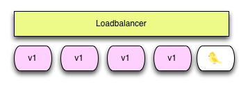

# 灰度系统设计

## 灰度的概念

首先我们要明确一下灰度的概念。

与灰度相关的常见的两个名次是灰度发布和A/B test。这两个词有很强的关联，也有区别。灰度发布更偏向运维一些，主要是为了控制运维风险，而A/B test更偏向于产品，主要是为了对比产品不同的版本对客户的影响，用来优化产品。虽然灰度发布和A/B test出发点不一样，但是在实现上是相通的，都需要根据线上观察到的效果确定要不要扩大影响范围。

### 灰度发布

一般灰度发布又叫“金丝雀发布“，灰度发布是在原有版本可用的情况下，同时部署一个新版本应用作为“金丝雀”（金丝雀对瓦斯极敏感，矿井工人携带金丝雀，以便及时发发现危险），测试新版本的性能和表现，以保障整体系统稳定的情况下，尽早发现、调整问题。



既然要灰度就是不希望所有人都看到，就是为了控制影响范围，之所以要做这种限制就说明发布的人心里对这个发布的版本就是不确定的，害怕影响范围太大风险不可控。也就是说这个风险因素在开发和测试环境都没有办法控制，只能在生产环境来观察，那究竟是怎样的因素会导致必须要上线观察而不是在开发测试环节来解决呢？主要有从开发运维和产品两大方面的考量因素。

1.从运维的角度讲，任何一次上线都是有风险的，或者有一些步骤的遗漏，流程的不规范，或者有一些隐藏的代码 bug都会导致线上的不稳定。控制风险的办法就是小批量上线，验证之后在全部更新。此外一些稳定性和性能的问题在开发测试环境很难复现，因此这一类的修复和功能只能到生产环境来验证，同样由于效果的未知也不可能全量更新。再有一些大的重构，比如编程语言的变化，框架的变化，基础库的更新，操作系统的更新都会有未知的影响，而这些影响也需要生产的检验。

2.从产品的角度讲，有一些产品设计，交互，界面展现形式都不是坐在办公室里拍桌子就可以定出最佳实践的。产品经理的视角和用户的视角是不同的，即使是产品经理之间的风格，偏好也是不一致的。小到按钮的顺序，弹框展示的位置，大到页面整体的布局，广告位的展示策略，究竟用哪种设计更好并没有理论上的最佳实践。而这种情况就需要大家分别作出自己的方案，去线上收集真实的用户数据作对比。也就是硅谷里常说的 A/B testing，也可以归到灰度发布的范畴。本质上就是基于数据驱动来作抉择，在用户的投票中选择哪种方案，而不是传统的看谁嗓门大会拍桌子，看谁官大来做决策。

要实现一个灰度发布，需要能做到以下几个方面：

#### 精确的流量分发控制

这是一切的核心，从运维风险控制的角度，需要把受影响的流量控制在一个精确的范围内，在上线前就知道哪部分用户会有问题，而不是真出问题谁受到影响都不知道。一个常见场景是新版本只让公司内部的员工能访问到，再一个市，一个省的一点点推上去。从产品角度看要做 A/B test，就需要控制测试样本，哪些用户是 A 版本，哪些用户是 B 版本，在发布后应该就是固定的，而不是一个用户一会儿访问 A，一会儿访问 B。而传统的负载均衡器策略只能做到粗犷的比例分配，并没有细粒度的流量规则控制。而一个理想的灰度发布系统应该有很细粒度的流量规则，比如匹配 android 用户，匹配某个地区的用户，甚至能组合多种条件匹配到特定的人群。

#### 监控系统的支撑

流量精确分配只是第一步，接下来更重要的是获得多个版本的关键指标。对运维来说可能是看错误率，吞吐量，延迟，cpu 内存消耗这些系统层面指标。对于产品来说可能是要看点击率，pv，uv 等业务指标的变化。这些都需要能把数据收集并作展示，来方便后续决策：全量推还是回滚？使用方案 A 还是 B？不然的话灰度发布带来不了更多业务方面的促进，也不能帮你更好的了解业务的状态和用户行为。

#### 灵活的发布系统

从上面的介绍可以看出灰度发布并不是个短暂的过程，可能会持续很久。例如某个重大的框架或者系统更新可能会持续很久，有可能整个服务在几个月内都是新旧并存，甚至有可能需要两个版本分别各自迭代。而从产品的角度来看可能就会更灵活，很有可能线上有五六个方案都在收集数据，每天有了一些新想法都要上一些小版本看效果，每个版本上线后可能都要再各自做优化调整观察效果。这种情况可能线上就永远不会有一个统一的版本灰度反而是个常态来应对不断变化的需求和挑战。而发布系统也需要做相应的调整，不在把每个服务看成一个单一版本的运行体，只在更新的短时间内出现多版本共存，只允许全量推和回滚这种粗粒度策略。而是应该将多版本共存看成常态，允许每个版本各自迭代，版本之间又能区分对应的监控日志信息，这样灵活的发布系统才能配合灵活的灰度策略。

说了这么写灰度系统要做的事情其实就是流量控制和数据收集，来控制风险并帮助产品做决策。


### 扩展的灰度概念

灰度发布把重点放在了应用的发布流程中，而A/B test并不一定发生在发布流程，可能一个产品经理通过产品的管理台，就能灵活的调节灰度的发布策略。所以灰度的层级不一定是服务级或者应用级的，还有可能在业务流程中，比如大于60岁的人看到的页面是新的，小于的是旧的，然后运营人员可以调整年龄，最终全部放开。而这个策略在实现的时候可能并不是服务级的，而是应用里的一段if-else代码。

所以我们的灰度不仅在发布阶段，在任意阶段都存在，而且可能是长期存在，这个时候我们需要一个复杂的灰度系统，而不是仅仅灰度发布系统。


### 需要探讨的问题：灰度与个性化

灰度系统的存在是为了试验新功能，这样在灰度期间就会存在不同的客户的客户体验不一样。而个性化系统也有类似的作用，例如对于理财功能，让不同的客户看到不同的理财产品。

那么问题来了，如果要实现一个功能，不同的客户能看到不同的理财产品，而且是千人千面的，而不是部分人先看到新产品，剩余的人后来也会看到新产品。我们是要用灰度系统实现，还是用个性化系统实现呢？

很明显这个问题更适合个性化系统而不是灰度系统。在我们的手机银行里就有这样的场景，有一个理财白名单，格式如下：

| 客户号 | 理财ID |
| :--- | :--- |
| 0000108358 | FSA293913 |
| 0000082934 | FSA393913 |
| ..... | ...... |

这些数据都是根据数据分析部分或者理财经理等根据需要生成的，属于紧密跟业务逻辑相关的东西。虽然里面涉及了“白名单“，但是并不是所有的白名单都跟灰度相关。

我们再举一个例子，有些新的试用功能，例如智能投顾，通过白名单菜单来实现精准的流量控制，只有在白名单里的客户才能看到智能投顾，这个场景使用的白名单结构跟理财白名单类似，但是这个场景就应该是灰度系统的场景。

| 客户号 | 菜单ID |
| :--- | :--- |
| 0000131030 | Menu00012 |
| 0000130301 | Menu00012 |
| ...... | ...... |


所以我们在做灰度系统时，要明确它的界限，哪些是灰度哪些不是灰度。就像手机银行在设计开关表的时候，本来是用来做开关的，结果越来越复杂，甚至连一些业务参数也放了进去。


## 灰度的层级

### 客户端级

部分客户能使用新版的客户端，而且能够精准的定向给指定客户。这个在实际操作过程中比较麻烦，因为客户的App可以通过各种渠道获取。

对于那些无法控制的用户，我们很难实现客户端级的灰度，但是对于可控的用户，我们可以做到。例如测试团队所有人使用新客户端，进而可以扩展到整个公司，通过可控的组织就比较容易实现客户端的灰度，目前民生的准生产客户端其实就属于客户端级的灰度。

### 客户端菜单级

对于不可控的用户，我们可以控制客户能看到的菜单，因为菜单不是固定的，是动态下发的。

| IP地区 | 菜单ID |
| :--- | :--- |
| 北京 | Menu00012 |

### 服务端应用级

应用级的灰度主要是针对单体架构的应用，就是把某些客户的流量全部转发到某些应用上，这些应用的形式一般是一个应用服务器。这时候路由规则的目标地址就是不同的地址，可以是IP或者域名。例如一个简单的例子：

| IP地区 | 转发地址 |
| :--- | :--- |
| 北京 | gray.app.com |
| 上海 | gray.app.com |
| 其它 | app.com |

### 服务端服务级

在微服务架构下，我们的灰度主要是针对服务级的，不用关心地址。例如有一个客户的请求以url区分，针对不同的IP地区转发到不同的服务上。

| url | ip地区 | 服务名 |
| :--- | :--- | :--- |
| /login.do | 北京 | Login\_v2 |
| /login.do | 其它 | Login\_v1 |

### 服务端代码级

我们在代码里经常写一些开关，这些开关有一个Key，还有一个对应的Value，例如前面所述大于60岁走一个分支，小于60岁走另一个分支。

```java
ThresholdAge = getValue()
if(age > ThresholdAge) {
    return 1;
} else {
    return 2;
}
```


### 数据库级

灰度系统里一个比较麻烦的地方就是数据的灰度。比如新功能要在一个表上增加两个字段，但是增加了两个字段后导致老功能不能正常使用，所以没法实现灰度，因为新老不能并存，这是因为数据往往只有一份。

在手机银行中，准生产专门有一个数据库，通过隔离做到了数据库级的灰度，但是相应的应用也都隔离了。


## 灰度系统的设计

上面在讲灰度发布的时候说过，精准的流量分发控制是灰度发布的核心，也是灰度系统的核心。所以此处设计的灰度系统主要实现这一点，暂时不考虑监控系统和发布系统，也就是在设计的时候假定新老服务都已经并存了，不考虑部署的时候出现的切换问题。

以上多个层级，客户端级不好实现，应用级的路由需要在网络转发层\(例如apache或nginx\)实现，而且目前我们要转向微服务，所以应用级的灰度也不用再考虑。因此我们的灰度系统主要实现三方面：

* 客户端菜单级灰度
* 服务端服务级灰度
* 服务端代码级灰度

这几种灰度的路由“目的地址“是不一样的，例如客户端的是菜单ID，服务级的是服务名和版本。但是规则是一样的，我们可以设计一个统一的规则表，如下：

| 路由规则 | 路由类型 | 路由ID | 路由地址 |
| :--- | :--- | :--- | :--- |
| Rule | ClientMenu | ClientMenu | MenuID |
| Rule | ServerService | Url | ServiceId |
| Rule | ServerCode | Key | Value |

其中规则都是一样的，就是传入一个Map，输出是否符合规则，例如规则为custId % 10 == 1，就是客户号尾号为1的, custId in Menu1023\_WhiteList，就是客户号在Menu1023的白名单里的，这里的Menu1023\_WhiteList是一个redis里的key。

路由类型就是三种，ClientMenu, ServerService, ServerCode，分别代表客户端菜单级，服务端服务级，服务端代码级。

路由ID对于ClientMenu来说都是一样的，就是ClientMenu。对于ServerService，是一个客户端请求url\(或者是TransactionID\)。对于ServerCode，是一个自定义的key。

路由地址对于菜单来说就是菜单ID，对于服务来说是一个服务ID\(或者是服务名加版本号，因为不同微服务区分服务的方法不一定一样\)。对于服务端代码级，就是一个字符串的Value。


由于灰度路由规则在关键结点上，路由规则全部需要放入内存，与路由相关的数据，例如白名单，必须放入Redis，不能使用数据库。



三个层级的灰度需要在不同的地方实施，但是所有的路由规则是通过zookeeper推送到相应的应用的内存里。

（图）


在使用路由规则的时候，通过规则链找到目标地址。

（图）


下面是一个规则表示例，有一个扩展字段，目前仅适用于菜单。如果匹配了灰度的菜单，可以选择删除公共菜单里的老菜单。

| 路由规则 | 路由类型 | 路由ID | 路由地址 | 扩展 |
| :--- | :--- | :--- | :--- | :--- |
| custId % 10 == 1 | ClientMenu | ClientMenu | Menu123 | Menu12 |
| custId % 10 == 2 | ClientMenu | ClientMenu | Menu345 | Menu34 |
| branchId == 01 | ClientMenu | ClientMenu | Menu789 |  |
| branchId == 02 | ClientMenu | ClientMenu | Menu789 |  |
| branchId == 01 | ServerService | login.do | Login\_v2 |  |
| branchId == 02 | ServerService | login.do | Login\_v3 |  |
| custId in Transfer\_v5\_WhiteList | ServerService | transfer.do | Transfer\_v5 |  |
| custId in newFinance\_list | ServerCode | newFinanceSwitch | 1 |  |


每个层级实现灰度的逻辑不一样，但是规则都用一套。


对于客户端菜单级，实现时拿到的就是一个规则的List。

```java
List<String> menuListCommon = getCommonMenu(); //获取公共菜单
List<String> menuGray = new ArrayList<String>();

Map<String,String> param = getClientParam(requestParam);
List<Rule> RuleChain = getRuleChain(); //仅获取类型为ClientMenu的Rule

for(Rule in RuleChain) {
   if(Rule.match(param)) {
       menuGray.add(Rule.getDestiny());
       if(Rule.getExtra()) {
         menuListCommon.remove(Rule.getExtra());
       }
   }
 }
 return menuListCommon.addAll(menuGray);
```

调用规则链之前需要提前把参数都放进去，如果没有参数的话，就默认不匹配。以客户端启动为例，在实际实现的时候要考虑性能的问题。

首先客户端只能传加密客户号，所以需要先通过加密客户号拿到真正的客户号，目前这个数据是放在数据库的，最好放到Redis里。同样，如果要使用分行号，需要通过客户号查询分行号，所以这个映射关系也需要放到Redis。所以上述的getClientParam，实现大致是下面这样的。

```java
Map<String, String> getClientParam(Map requestParam) {
    String encodedCustId = requestParam.get("encodedCustId");
    String custId = redis.hget("CUSTID_MAP", encodedCustId);
    if(custId != null) {
       String branchId = custId = redis.hget("BRANCHID_MAP", custId);
    } 
    //其它参数
    
    requestParam.put("custId",custId);
    requestParam.put("branchId", branchId);
    return requestParam;
 }
 
```


对于网关，示例代码如下

```java
String serviceId = getDefaultServiceId(transactionId); //默认的服务ID
Map<String, String> param = getClientParam(requestParam);
List<Rule> RuleChain = getRuleChain(); //仅获取类型为ServerService的Rule

for(Rule in RuleChain) {
   if(Rule.getId() == transactionId && Rule.match(param)) {
      serviceId = Rule.getDestiny();
      break;
   }
}

```


对于服务端代码级，这种代码不是公共的，会散落在各个地方，所以一定要简单。我们把Rule以ID为Key放到Map里，里面再是一个List。

```java
Map<String, List> ruleChainMap = getRuleChainMap();
List<Rule> = ruleChainMap.get(ruleId);
String switchValue = defaultValue;
for(Rule in RuleChain) {
   if(Rule.getId() == transactionId && Rule.match(param)) {
      switchValue = Rule.getDestiny();
      break;
   }
}
```


 


