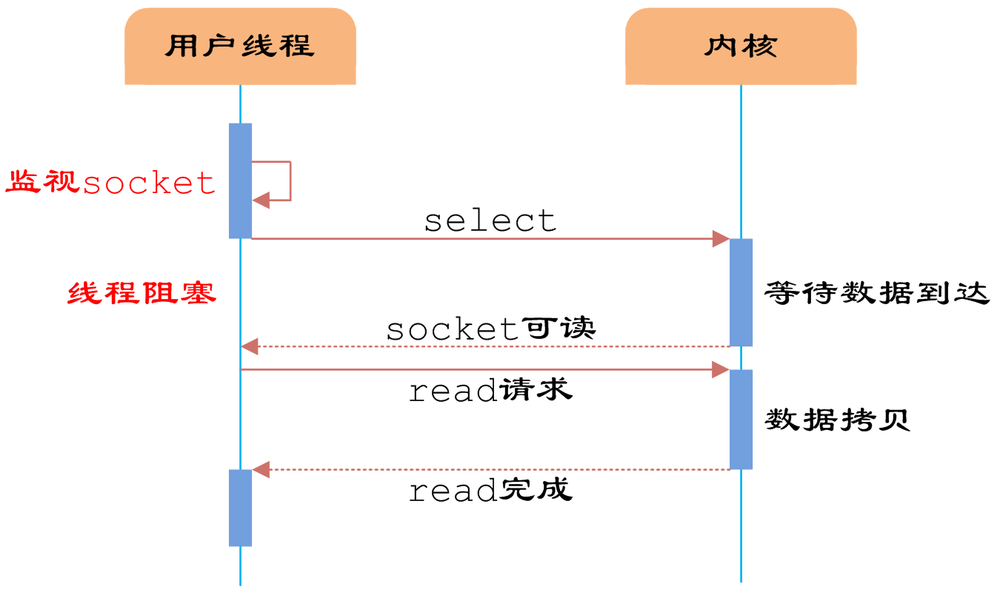

# 循序渐进Java NIO\(1\)

## 网络IO模型

网络IO模型是一个经常被提到的问题，不同的书或者博客说法可能都不一样，所以没必要死抠字眼，关键在于理解。

以下是一个典型的应用服务器上的连接情况。客户的各种设备通过Http协议与Tomcat进程交互，Tomcat需要访问Redis服务器，它与Redis服务器也建了好几个连接。虽然客户端与Tomcat建的是短连接，很快就会断开，Tomcat与Redis是长连接，但是它们本质上都是一样的。

（图）

建立一个Socket后，就是"本地IP+port与远端IP+port"的一个配对，这个Socket由应用进程调用操作系统的系统调用创建，在内核空间会有一个与之对应的结构体，而应用程序拿到的是一个文件描述符\(File Describer\)，就跟打开一个普通的文件一样，可以读写。不同的进程有自己的文件描述符空间，比如进程1中有个socket的fd为100，进程2中也有一个socket的fd为100，它们对应的socket是不一样的（当然也有可能一样，因为socket也可以共享\)。

（图）

Socket是全双工的，可以同时读和写。

对于不同的应用场景，选用的网络IO模型以及其它方面的选项都不一样。

例如针对客户端的http 请求，我们一般使用短连接，因为客户太多，同时使用App的客户可能很多，但是同一时刻发送请求的客户端远少于正在使用的客户数，如果都建立长连接，内存肯定不够用，所以会用短连接，当然会有http的keep-alive策略，让一次tcp连接多交互几次http数据，这样能减少建链。而对于系统内部的应用，例如Tomcat访问Redis，访问的机器数有限，如果每次都用短连接，会有太多的损耗用在建链上，所以用长连接，可以大大提高效率。

以上说的是长连接和短连接，一般在讨论IO模型时不考虑这个，而是考虑的同步异步，阻塞非阻塞等。而要确定哪种IO模型，也得看场景，对于CPU密集型的应用，例如一次请求需要两个核不停的100％跑1分钟，然后返回结果，这种应用使用哪种IO模型都差不多，因为瓶颈在CPU。所以一般是IO密集型的的应用才考虑如何调整IO模型以获取最大的效率，最典型的就是Web应用，还有像Redis这种应用。

### 同步异步、阻塞非阻塞的概念

同步与异步：描述的是用户线程与内核的交互方式，同步指用户线程发起IO请求后需要等待或者轮询内核IO操作完成后才能继续执行；而异步是指用户线程发起IO请求后仍然继续执行，当内核IO操作完成后会通知用户线程，或者调用用户线程注册的回调函数。

阻塞与非阻塞：描述是用户线程调用内核IO操作的方式，阻塞是指IO操作需要彻底完成后才返回到用户空间；而非阻塞是指IO操作被调用后立即返回给用户一个状态值，无需等到IO操作彻底完成。

以read函数调用来说明不同的IO模式。从对端读取数据分为两个阶段

\(1\)数据从设备到内核空间

\(2\)数据从内核空间到用户空间

以下阻塞IO，非阻塞IO，IO多路复用，都是同步IO，最后是异步IO。

### 阻塞IO

阻塞IO是指调用了read后，必须等待数据到达，并且复制到了用户空间，才能返回，否则整个线程一直在等待。


### 非阻塞IO

非阻塞IO在调用read后，可以立刻返回，然后问操作系统，数据有没有在内核空间准备好，如果准备好了，就可以read出来了。因为不知道什么时候准备好，要保证实时性，就得不断的轮询。


### IO多路复用

非阻塞IO一个线程一般只能轮询一个socket，如果能有一个专门的线程去轮询所有的socket，如果数据准备好，就找一个线程处理，这就是IO多路复用。当然轮询的线程也可以不用找其他线程处理，自己处理就行，例如redis就是这样的。



我们把select轮询抽出来放在一个线程里, 用户线程向其注册相关socket或IO请求，等到数据到达时通知用户线程，则可以提高用户线程的CPU利用率.这样, 便实现了异步方式


这其中用了Reactor设计模式。


### 异步IO

真正的异步IO需要操作系统更强的支持。 IO多路复用模型中，数据到达内核后通知用户线程，用户线程负责从内核空间拷贝数据; 而在异步IO模型中，当用户线程收到通知时，数据已经被操作系统从内核拷贝到用户指定的缓冲区内，用户线程直接使用即可。


异步IO用了Proactor设计模式。


接下来通过一个简单的java版redis说明各种IO模型。

## 实现一个简单Redis

接下来我会编写一个简单的java版的Redis，它只有get和set功能，并且只支持字符串，只是为了演示各种IO模型，其中一些异常处理之类的做的不到位。

### 阻塞IO+单线程+短连接

这种做法只用于写HelloWorld程序，在这里主要为了调试以及把一些公共的类提出来。

首先写一个Redis接口

```java
package org.ifool.niodemo.redis;

public interface RedisClient {
    public String get(String key);
    public void set(String key,String value);
    public void close();
}

```

另外，有个工具类，用于拿到请求数据后，处理请求，并返回结果

输入是get\|key或者set\|key\|value，输出为0\|value或者1\|null或者2\|bad command。



```java
package org.ifool.niodemo.redis;

import java.util.Map;

public class Util {

    //把一个String前边加上一个byte，表示长度
    public static byte[] addLength(String str) {
        byte len = (byte)str.length();
        byte[] ret = new byte[len+1];
        ret[0] = len;
        for(int i = 0; i < len; i++) {
            ret[i+1] = (byte)str.charAt(i);
        }
        return ret;
    }

    //根据input返回一个output，操作缓存
    //input:
    //->get|key
    //->set|key|value

    //output:
    //->errorcode|response
    //  ->0|response set成功或者get有值
    //  ->1|response get的为null
    //  ->2|bad command
    public static byte[] processRequest(Map<String,String> cache, byte[] request, int length) {
        if(request == null) {
            return "2|bad command".getBytes();
        }
        String req = new String(request,0,length);
        System.out.println("command:"+req);
        String[] params = req.split("\\|");

        if( params.length < 2 || params.length > 3 || !(params[0].equals("get") || params[0].equals("set"))) {
            return "2|bad command".getBytes();
        }
        if(params[0].equals("get")) {
            String value = cache.get(params[1]);
            if(value == null) {
                return "1|null".getBytes();
            } else {
                return ("0|"+value).getBytes();
            }
        }

        if(params[0].equals("set") && params.length >= 3) {
            cache.put(params[1],params[2]);
            return ("0|success").getBytes();
        } else {
            return "2|bad command".getBytes();
        }

    }

    public static int LOG_LEVEL = 1; //0 info 1 debug
    public static void log_debug(String str) {
        if(LOG_LEVEL >= 1) {
            System.out.println(str);
        }
    }
    public static void log_info(String str) {
        if(LOG_LEVEL >= 0) {
            System.out.println(str);
        }
    }
}
```



服务端代码如下，在创建服务端ServerSocket的时候，传入端口8888， backlog的作用是客户端建立连接时服务端没法立即处理，能够等待的队列长度。



```java
package org.ifool.niodemo.redis.redis1;

import org.ifool.niodemo.redis.Util;

import java.io.IOException;
import java.io.InputStream;
import java.io.OutputStream;
import java.net.InetSocketAddress;
import java.net.ServerSocket;
import java.net.Socket;
import java.util.Map;
import java.util.concurrent.ConcurrentHashMap;


public class RedisServer1 {

    //全局缓存
    public static Map<String,String> cache = new ConcurrentHashMap<String,String>();

    public static void main(String[] args) throws IOException {

        ServerSocket serverSocket =  new ServerSocket(8888,10);

        byte[] buffer = new byte[512];
        while(true) {

            //接受客户端连接请求
            Socket clientSocket = null;
            clientSocket = serverSocket.accept();
            System.out.println("client address:" + clientSocket.getRemoteSocketAddress().toString());

            //读取数据并且操作缓存,然后写回数据
            try {
                //读数据
                InputStream in = clientSocket.getInputStream();
                int bytesRead = in.read(buffer,0,512);
                int totalBytesRead = 0;

                while(bytesRead != -1) {
                    totalBytesRead += bytesRead;
                    bytesRead = in.read(buffer,totalBytesRead,512-totalBytesRead);
                }

                //操作缓存
                byte[] response = Util.processRequest(cache,buffer,totalBytesRead);
                Util.log_debug("response:"+new String(response));

                //写回数据
                OutputStream os = clientSocket.getOutputStream();
                os.write(response);
                os.flush();
                clientSocket.shutdownOutput();

            } catch (IOException e) {
                System.out.println("read or write data exception");
            } finally {
                try {
                    clientSocket.close();
                } catch (IOException ex) {
                    ex.printStackTrace();
                }
            }

        }
    }

}
```



客户端代码如下：



```java
package org.ifool.niodemo.redis.redis1;

import org.ifool.niodemo.redis.RedisClient;

import java.io.IOException;
import java.io.InputStream;
import java.io.OutputStream;
import java.net.Socket;

public class RedisClient1 implements RedisClient {

    public static void main(String[] args) {
        RedisClient redis = new RedisClient1("127.0.0.1",8888);
        redis.set("123","456");
        String value = redis.get("123");
        System.out.print(value);
    }

    private String ip;
    private int port;
    public RedisClient1(String ip, int port) {
        this.ip = ip;
        this.port = port;
    }

    public String get(String key) {
        Socket socket = null;
        try {
            socket = new Socket(ip, port);
        } catch(IOException e) {
            throw new RuntimeException("connect to " + ip + ":" + port + " failed");
        }

        try {
            //写数据
            OutputStream os = socket.getOutputStream();
            os.write(("get|"+key).getBytes());
            socket.shutdownOutput(); //不shutdown的话对端会等待read

            //读数据
            InputStream in = socket.getInputStream();
            byte[] buffer = new byte[512];
            int offset = 0;
            int bytesRead = in.read(buffer);
            while(bytesRead != -1) {
                offset += bytesRead;
                bytesRead = in.read(buffer, offset, 512-offset);
            }

            String[] response = (new String(buffer,0,offset)).split("\\|");
            if(response[0].equals("2")) {
                throw new RuntimeException("bad command");
            } else if(response[0].equals("1")) {
                return null;
            } else {
                return response[1];
            }

        } catch(IOException e) {
            throw new RuntimeException("network error");
        } finally {
            try {
                socket.close();
            } catch (IOException e) {
                e.printStackTrace();
            }
        }
    }

    public void set(String key, String value) {
        Socket socket = null;
        try {
            socket = new Socket(ip, port);
        } catch(IOException e) {
            throw new RuntimeException("connect to " + ip + ":" + port + " failed");
        }
        try {
            OutputStream os = socket.getOutputStream();
            os.write(("set|"+key+"|"+value).getBytes());
            os.flush();
            socket.shutdownOutput();

            InputStream in = socket.getInputStream();
            byte[] buffer = new byte[512];
            int offset = 0;
            int bytesRead = in.read(buffer);
            while(bytesRead != -1) {
                offset += bytesRead;
                bytesRead = in.read(buffer, offset, 512-offset);
            }
            String bufString = new String(buffer,0,offset);

            String[] response = bufString.split("\\|");
            if(response[0].equals("2")) {
                throw new RuntimeException("bad command");
            }

        } catch(IOException e) {
            throw new RuntimeException("network error");
        } finally {
            try {
                socket.close();
            } catch (IOException e) {
                e.printStackTrace();
            }
        }
    }

    public void close() {

    }
}

```




### 阻塞IO+多线程+短连接

一般应用服务器用的都是这种模型，主线程一直阻塞accept，来了一个连接就交给一个线程，继续等待连接，然后这个处理线程读写完后负责关闭连接。

服务端代码

```java
package org.ifool.niodemo.redis.redis2;

import org.ifool.niodemo.redis.Util;

import java.io.IOException;
import java.io.InputStream;
import java.io.OutputStream;
import java.net.ServerSocket;
import java.net.Socket;
import java.util.Map;
import java.util.concurrent.*;

public class RedisServer2 {

    //全局缓存
    public static Map<String,String> cache = new ConcurrentHashMap<String,String>();

    public static void main(String[] args) throws IOException {

        //用于处理请求的线程池
        ThreadPoolExecutor threadPool = new ThreadPoolExecutor(20, 100, 30, 
                        TimeUnit.SECONDS, new ArrayBlockingQueue<Runnable>(1000));
        ServerSocket serverSocket = new ServerSocket(8888,500);

        while(true) {
            //接受客户端连接请求
            Socket clientSocket = serverSocket.accept();
            System.out.println("client address:" + clientSocket.getRemoteSocketAddress().toString());

            //让线程池处理这个请求
            threadPool.execute(new RequestHandler(clientSocket));
        }
    }

}

class RequestHandler implements  Runnable{

    private Socket clientSocket;
    public RequestHandler(Socket socket) {
        clientSocket = socket;
    }
    public void run() {
        byte[] buffer = new byte[512];
        //读取数据并且操作缓存,然后写回数据
        try {
            //读数据
            InputStream in = clientSocket.getInputStream();
            int bytesRead = in.read(buffer,0,512);
            int totalBytesRead = 0;
            while(bytesRead != -1) {
                totalBytesRead += bytesRead;
                bytesRead = in.read(buffer,totalBytesRead,512-totalBytesRead);
            }
            //操作缓存
            byte[] response = Util.processRequest(RedisServer2.cache,buffer,totalBytesRead);
            Util.log_debug("response:"+new String(response));

            //写回数据
            OutputStream os = clientSocket.getOutputStream();
            os.write(response);
            os.flush();
            clientSocket.shutdownOutput();

        } catch (IOException e) {
            System.out.println("read or write data exception");
        } finally {
            try {
                clientSocket.close();
            } catch (IOException ex) {
                ex.printStackTrace();
            }
        }
    }
}
```

客户端代码，代码跟前边的没啥变化，只是这次我加了一个多线程的读写，10个线程每个线程读写10000次。

```java
package org.ifool.niodemo.redis.redis2;

import org.ifool.niodemo.redis.RedisClient;
import org.ifool.niodemo.redis.redis1.RedisClient1;

import java.io.IOException;
import java.io.InputStream;
import java.io.OutputStream;
import java.net.Socket;
import java.sql.Timestamp;
import java.util.Random;

public class RedisClient2 implements RedisClient {

    public static void main(String[] args) {
        final RedisClient redis = new RedisClient1("127.0.0.1",8888);
        redis.set("123","456");
        String value = redis.get("123");
        System.out.print(value);
        redis.close();

        System.out.println(new Timestamp(System.currentTimeMillis()));
        testMultiThread();
        System.out.println(new Timestamp(System.currentTimeMillis()));
        testMultiThread();

    }
    public static void testMultiThread() {
        Thread[] threads = new Thread[10];
        for(int i = 0; i < 10; i++) {
            threads[i] = new Thread(new Runnable() {
                public void run() {
                    RedisClient redis = new RedisClient2("127.0.0.1",8888);
                    for(int j=0; j < 10000; j++) {
                        Random rand = new Random();
                        String key = String.valueOf(rand.nextInt(1000));
                        String value = String.valueOf(rand.nextInt(1000));
                        redis.set(key,value);
                        String value1 = redis.get(key);
                    }
                }
            });
            threads[i].start();
        }
        for(int i = 0; i < 10; i++) {
            try {
                threads[i].join();
            } catch (InterruptedException e) {
                e.printStackTrace();
            }
        }

    }

    private String ip;
    private int port;
    public RedisClient2(String ip, int port) {
        this.ip = ip;
        this.port = port;
    }

    public String get(String key) {
        Socket socket = null;
        try {
            socket = new Socket(ip, port);
        } catch(IOException e) {
            throw new RuntimeException("connect to " + ip + ":" + port + " failed");
        }

        try {
            //写数据
            OutputStream os = socket.getOutputStream();
            os.write(("get|"+key).getBytes());
            socket.shutdownOutput(); //不shutdown的话对端会等待read

            //读数据
            InputStream in = socket.getInputStream();
            byte[] buffer = new byte[512];
            int offset = 0;
            int bytesRead = in.read(buffer);
            while(bytesRead != -1) {
                offset += bytesRead;
                bytesRead = in.read(buffer, offset, 512-offset);
            }

            String[] response = (new String(buffer,0,offset)).split("\\|");
            if(response[0].equals("2")) {
                throw new RuntimeException("bad command");
            } else if(response[0].equals("1")) {
                return null;
            } else {
                return response[1];
            }

        } catch(IOException e) {
            throw new RuntimeException("network error");
        } finally {
            try {
                socket.close();
            } catch (IOException e) {
                e.printStackTrace();
            }
        }

    }

    public void set(String key, String value) {
        Socket socket = null;
        try {
            socket = new Socket(ip, port);
        } catch(IOException e) {
            throw new RuntimeException("connect to " + ip + ":" + port + " failed");
        }
        try {
            OutputStream os = socket.getOutputStream();
            os.write(("set|"+key+"|"+value).getBytes());
            os.flush();
            socket.shutdownOutput();

            InputStream in = socket.getInputStream();
            byte[] buffer = new byte[512];
            int offset = 0;
            int bytesRead = in.read(buffer);
            while(bytesRead != -1) {
                offset += bytesRead;
                bytesRead = in.read(buffer, offset, 512-offset);
            }
            String bufString = new String(buffer,0,offset);

            String[] response = bufString.split("\\|");
            if(response[0].equals("2")) {
                throw new RuntimeException("bad command");
            }

        } catch(IOException e) {
            throw new RuntimeException("network error");
        } finally {
            try {
                socket.close();
            } catch (IOException e) {
                e.printStackTrace();
            }
        }
    }

    public void close() {

    }
}

```


用这种方式，在10个并发不停读写的情况下，写10000次，出现了一些没法连接的异常，如下：

```text
java.net.NoRouteToHostException: Can't assign requested address
```

查了下跟系统参数配置，mac上不知道怎么调就没调，改成读写300次的时候没报错，大约用1s钟。

### 阻塞IO+多线程+长连接

用短连接的时候，我们可以用inputstream.read\(\) == -1来判断读取结束，但是用长连接时，数据是源源不断的，有可能有粘包或者半包问题，我们需要能从流中找到一次请求的开始和结束。有多种方式，例如使用固定长度、固定分隔符、在前面加长度等方法。此处使用前边加长度的方法，在前面放一个byte，表示一次请求的长度，byte最大是127，所以请求长度不应大于127个字节。


由于我们客户端访问的方式是写完请求后，等待服务端返回数据，等待期间该socket不会被其它人写，所以不存在粘包的问题，只存在半包的问题。有些请求方式可能是写完后在未等待服务端返回就允许其它线程写，那样就可能有半包。


一般客户端用长连接的时候，都是建一个连接池，用的时候上锁获取连接，我们在这个地方直接让一个线程持有一个连接一个读写，这样对服务端的压力更大。

客户端代码

```java
package org.ifool.niodemo.redis.redis3;

import org.ifool.niodemo.redis.RedisClient;
import org.ifool.niodemo.redis.Util;

import java.io.IOException;
import java.io.InputStream;
import java.io.OutputStream;
import java.net.Socket;
import java.sql.Timestamp;
import java.util.Random;

public class RedisClient3 implements RedisClient {

    public static void main(String[] args) {
        RedisClient redis = new RedisClient3("127.0.0.1",8888);
        redis.set("123","456");
        String value = redis.get("123");
        System.out.print(value);
        redis.close();

        System.out.println(new Timestamp(System.currentTimeMillis()));
        testMultiThread();
        System.out.println(new Timestamp(System.currentTimeMillis()));
        testMultiThread();
    }

    public static void testMultiThread() {
        Thread[] threads = new Thread[10];
        for(int i = 0; i < 10; i++) {
            threads[i] = new Thread(new Runnable() {
                public void run() {
                    RedisClient redis = new RedisClient3("127.0.0.1",8888);
                    for(int j=0; j < 10000; j++) {
                        Random rand = new Random();
                        String key = String.valueOf(rand.nextInt(1000));
                        String value = String.valueOf(rand.nextInt(1000));
                        redis.set(key,value);
                        String value1 = redis.get(key);
                    }
                }
            });
            threads[i].start();
        }
        for(int i = 0; i < 10; i++) {
            try {
                threads[i].join();
            } catch (InterruptedException e) {
                e.printStackTrace();
            }
        }

    }

    private String ip;
    private int port;
    private Socket socket;
    public RedisClient3(String ip, int port) {
        this.ip = ip;
        this.port = port;
        try {
            socket = new Socket(ip, port);
        } catch(IOException e) {
            throw new RuntimeException("connect to " + ip + ":" + port + " failed");
        }
    }

    public String get(String key) {

        try {
            //写数据,前边用一个byte存储长度
            OutputStream os = socket.getOutputStream();
            String cmd = "get|"+key;
            byte length = (byte)cmd.length();
            byte[] data = new byte[cmd.length()+1];
            data[0] = length;
            for(int i = 0; i < cmd.length(); i++) {
                data[i+1] = (byte)cmd.charAt(i);
            }
            os.write(data);
            os.flush();

            //读数据，第一个字节是长度
            InputStream in = socket.getInputStream();
            int len = in.read();
            if(len == -1) {
                throw new RuntimeException("network error");
            }
            byte[] buffer = new byte[len];
            int offset = 0;
            int bytesRead = in.read(buffer,0,len);
            while(offset < len) {
                offset += bytesRead;
                bytesRead = in.read(buffer, offset, len-offset);
            }

            String[] response = (new String(buffer,0,offset)).split("\\|");
            if(response[0].equals("2")) {
                throw new RuntimeException("bad command");
            } else if(response[0].equals("1")) {
                return null;
            } else {
                return response[1];
            }

        } catch(IOException e) {
            throw new RuntimeException("network error");
        } finally {

        }

    }

    public void set(String key, String value) {
        try {
            //写数据,前边用一个byte存储长度
            OutputStream os = socket.getOutputStream();
            String cmd = "set|"+key + "|" + value;
            byte length = (byte)cmd.length();

            byte[] data = new byte[cmd.length()+1];
            data[0] = length;
            for(int i = 0; i < cmd.length(); i++) {
                data[i+1] = (byte)cmd.charAt(i);
            }
            os.write(data);
            os.flush();

            InputStream in = socket.getInputStream();
            int len = in.read();

            if(len == -1) {
                throw new RuntimeException("network error");
            }
            byte[] buffer = new byte[len];
            int offset = 0;
            int bytesRead = in.read(buffer,0,len);
            while(offset < len) {
                offset += bytesRead;
                bytesRead = in.read(buffer, offset, len-offset);
            }
            String bufString = new String(buffer,0,offset);
            Util.log_debug(bufString);
            String[] response = bufString.split("\\|");
            if(response[0].equals("2")) {
                throw new RuntimeException("bad command");
            }

        } catch(IOException e) {
            throw new RuntimeException("network error");
        } finally {

        }
    }

    public void close() {
        try {
            socket.close();
        } catch(IOException ex) {
            ex.printStackTrace();
        }
    }
}

```

服务端建立一个连接，就由一个线程一直处理这个连接，有数据就处理，没数据就不处理。这样的话，每个连接一个线程，如果连接数较大，就会有问题。

```java
package org.ifool.niodemo.redis.redis3;

import org.ifool.niodemo.redis.Util;

import java.io.IOException;
import java.io.InputStream;
import java.io.OutputStream;
import java.net.InetSocketAddress;
import java.net.ServerSocket;
import java.net.Socket;
import java.util.Map;
import java.util.concurrent.ArrayBlockingQueue;
import java.util.concurrent.ConcurrentHashMap;
import java.util.concurrent.ThreadPoolExecutor;
import java.util.concurrent.TimeUnit;

public class RedisServer3 {

    //全局缓存
    public static Map<String,String> cache = new ConcurrentHashMap<String,String>();


    public static void main(String[] args) throws IOException {

        //用于处理请求的线程池
        ThreadPoolExecutor threadPool = new ThreadPoolExecutor(20, 1000, 30, TimeUnit.SECONDS, new ArrayBlockingQueue<Runnable>(5));

        ServerSocket serverSocket = new ServerSocket(8888, 10);

        byte[] buffer = new byte[512];
        while (true) {

            //接受客户端连接请求
            Socket clientSocket = null;
            try {
                clientSocket = serverSocket.accept();
                Util.log_debug(clientSocket.getRemoteSocketAddress().toString());
            } catch (IOException e) {
                e.printStackTrace();
            }

            //让线程池处理这个请求
            threadPool.execute(new RequestHandler(clientSocket));

        }
    }
}

class RequestHandler implements  Runnable{

    private Socket clientSocket;
    public RequestHandler(Socket socket) {
        clientSocket = socket;
    }
    public void run() {

        byte[] buffer = new byte[512];
        //读取数据并且操作缓存,然后写回数据
        try {
            while(true) {
                //读数据
                InputStream in = clientSocket.getInputStream();
                int len = in.read(); //读取长度
                if(len == -1) {
                    throw new IOException("socket closed by client");
                }

                int bytesRead = in.read(buffer, 0, len);

                int totalBytesRead = 0;
                while (totalBytesRead < len) {
                    totalBytesRead += bytesRead;
                    bytesRead = in.read(buffer, totalBytesRead, len - totalBytesRead);
                }
                //操作缓存
                byte[] response = Util.processRequest(RedisServer3.cache,buffer, totalBytesRead,true);
                Util.log_debug("response:" + new String(response));

                //写回数据
                OutputStream os = clientSocket.getOutputStream();
                os.write(response);
                os.flush();

            }
        } catch (IOException e) {
            System.out.println("read or write data exception");
        } finally {
            try {
                clientSocket.close();
                Util.log_debug("socket closed");
            } catch (IOException ex) {
                ex.printStackTrace();
            }
        }
    }
}

```

使用这个方式，10个线程连续读写10000次，也就是累计访问20000万次只需要3s。

### 阻塞IO+单线程轮询+多线程处理+长连接\(不可行\)

多线程和长连接大大提高了效率，但是如果连接数太多，那么需要太多的线程，这样肯定不可行。这样大部分线程即使没数据也不能干其它的，就耗在这个连接上了。

我们可不可以让一个线程去负责等待这些socket，有数据了就告诉工作线程池。

代码如下，加了一个线程遍历已经连接的socket，然后如果socket.getInputStream\(\).available\(\) &gt; 0就通知线程池。


这个程序有些情况下能正常工作，但是实际是有问题的，关键就在于上面的available函数是阻塞的。在java里没法对socket单独设置非阻塞，必须从NIO才行，如果用C语言是可行的，但是这里不行。


```java
package org.ifool.niodemo.redis.redis4;

import org.ifool.niodemo.redis.Util;

import java.io.IOException;
import java.io.InputStream;
import java.io.OutputStream;
import java.net.InetSocketAddress;
import java.net.ServerSocket;
import java.net.Socket;
import java.util.HashSet;
import java.util.Iterator;
import java.util.Map;
import java.util.Set;
import java.util.concurrent.ArrayBlockingQueue;
import java.util.concurrent.ConcurrentHashMap;
import java.util.concurrent.ThreadPoolExecutor;
import java.util.concurrent.TimeUnit;

public class RedisServer4 {

    //全局缓存
    public static Map<String,String> cache = new ConcurrentHashMap<String,String>();

    //当前的socket
    final public static Set<Socket> socketSet = new HashSet<Socket>(10);

    public static void main(String[] args) throws IOException {

        //用于处理请求的线程池
        final ThreadPoolExecutor threadPool = new ThreadPoolExecutor(20, 1000, 30, TimeUnit.SECONDS, new ArrayBlockingQueue<Runnable>(1000));

        ServerSocket serverSocket  = new ServerSocket(8888,100);

        //启动一个线程用于一直扫描可以读取数据的socket，并且去掉已经关闭的连接
        Thread thread = new Thread(new Runnable() {

            public void run() {
                //找到可以读取的socket，处理
                while (true) {
                    synchronized (socketSet) {
                        Iterator<Socket> it = socketSet.iterator();
                        while(it.hasNext()) {
                            Socket socket = it.next();
                            if (socket.isConnected()) {
                                try {
                                    if (!socket.isInputShutdown() && socket.getInputStream().available() > 0) {
                                        it.remove();
                                        threadPool.execute(new RequestHandler(socket));
                                    }
                                } catch (IOException ex) {
                                    System.out.println("socket already closed1");
                                    socketSet.remove(socket);
                                    try {
                                        socket.close();
                                    } catch (IOException e) {
                                        System.out.println("socket already closed2");
                                    }
                                }
                            } else {
                                socketSet.remove(socket);
                                try {
                                    socket.close();
                                } catch (IOException e) {
                                    e.printStackTrace();
                                }
                            }
                        }
                    }

                }
            }
        });
        thread.start();

        while(true) {
            //接受客户端连接请求,把新建的socket加入socketset
            Socket clientSocket = null;
            try {
                clientSocket = serverSocket.accept();

                Util.log_debug("client address:" + clientSocket.getRemoteSocketAddress().toString());
                synchronized (socketSet) {
                    socketSet.add(clientSocket);
                }
            } catch (IOException e) {
                e.printStackTrace();
            }
        }
    }

}

class RequestHandler implements  Runnable{

    private Socket clientSocket;
    public RequestHandler(Socket socket) {
        clientSocket = socket;
    }
    public void run() {

        byte[] buffer = new byte[512];
        //读取数据并且操作缓存,然后写回数据
        try {

                //读数据
                InputStream in = clientSocket.getInputStream();
                int len = in.read(); //读取长度
                if(len == -1) {
                    throw new IOException("socket closed by client");
                }

                int bytesRead = in.read(buffer, 0, len);

                int totalBytesRead = 0;
                while (totalBytesRead < len) {
                    totalBytesRead += bytesRead;
                    bytesRead = in.read(buffer, totalBytesRead, len - totalBytesRead);
                }
                //操作缓存
                byte[] response = Util.processRequest(RedisServer.cache,buffer, totalBytesRead,true);
                Util.log_debug("response:" + new String(response));

                //写回数据
                OutputStream os = clientSocket.getOutputStream();
                os.write(response);
                os.flush();
                
                synchronized (RedisServer4.socketSet) {
                    RedisServer4.socketSet.add(clientSocket);
                }
        } catch (IOException e) {
            e.printStackTrace();
            System.out.println("read or write data exception");
        } finally {

        }
    }
}
```


### 非阻塞IO\(IO多路复用\)+单线程轮询+多线程处理+长连接

在上述例子中我们试图用普通socket实现类似select的功能，在Java里是不可行的，必须用NIO。我们只需要一个select函数就能轮询所有的连接是否准备好数据，准备好了就能调用线程池里的线程处理。

要使用NIO，需要了解ByteBuffer, Channel等内容，比如ByteBuffer设计的就比较麻烦，此处不再展开。

客户端代码暂时不用NIO，还是用原来的，服务端代码如下：

```java
package org.ifool.niodemo.redis.redis5;

import org.ifool.niodemo.redis.Util;

import java.io.IOException;
import java.io.InputStream;
import java.io.OutputStream;
import java.io.SyncFailedException;
import java.net.InetSocketAddress;
import java.net.ServerSocket;
import java.net.Socket;
import java.nio.ByteBuffer;
import java.nio.channels.SelectionKey;
import java.nio.channels.Selector;
import java.nio.channels.ServerSocketChannel;
import java.nio.channels.SocketChannel;
import java.util.*;
import java.util.concurrent.ArrayBlockingQueue;
import java.util.concurrent.ConcurrentHashMap;
import java.util.concurrent.ThreadPoolExecutor;
import java.util.concurrent.TimeUnit;

public class RedisServer5 {

    //全局缓存
    public static Map<String,String> cache = new ConcurrentHashMap<String,String>();

    public static void main(String[] args) throws IOException {

        //用于处理请求的线程池
        final ThreadPoolExecutor threadPool = new ThreadPoolExecutor(20, 1000, 30, TimeUnit.SECONDS, new ArrayBlockingQueue<Runnable>(1000));

        ServerSocketChannel ssc = ServerSocketChannel.open();
        ssc.socket().bind(new InetSocketAddress(8888),1000);

        Selector selector = Selector.open();

        ssc.configureBlocking(false); //必须设置成非阻塞
        ssc.register(selector, SelectionKey.OP_ACCEPT); //serverSocket只关心accept

        while(true) {

            int num = selector.select();
            if(num == 0) {
                continue;
            }
            Set<SelectionKey> selectionKeys = selector.selectedKeys();
            Iterator<SelectionKey> it = selectionKeys.iterator();

            while(it.hasNext()) {
                SelectionKey key = it.next();
                it.remove();
                if(key.isAcceptable()) {
                    SocketChannel sc = ssc.accept();
                    sc.configureBlocking(false); //设置成非阻塞才能监听
                    sc.register(key.selector(), SelectionKey.OP_READ, ByteBuffer.allocate(512) );
                    System.out.println("new connection");
                }
                if(key.isReadable()) {
                    SocketChannel clientSocketChannel = (SocketChannel)key.channel();
                    //System.out.println("socket readable");
                    if(!clientSocketChannel.isConnected()) {
                        clientSocketChannel.finishConnect();
                        key.cancel();
                        clientSocketChannel.close();
                        System.out.println("socket closed2");
                        continue;
                    }
                    ByteBuffer buffer = (ByteBuffer)key.attachment();
                    int len = clientSocketChannel.read(buffer);
                    Socket socket = clientSocketChannel.socket();

                    if(len == -1) {
                        clientSocketChannel.finishConnect();
                        key.cancel();
                        clientSocketChannel.close();
                        System.out.println("socket closed1");
                    } else {
                        threadPool.execute(new RequestHandler(clientSocketChannel, buffer));
                    }
                }
            }
        }
    }

}

class RequestHandler implements  Runnable{

    private SocketChannel channel;
    private ByteBuffer buffer;
    public RequestHandler(SocketChannel channel, Object buffer) {
        this.channel = channel;
        this.buffer = (ByteBuffer)buffer;
    }
    public void run() {

        //读取数据并且操作缓存,然后写回数据
        try {
                int position = buffer.position();
                //切换成读模式，以便把第一个字节到长度读出来
                buffer.flip();
                int len = buffer.get(); //读取长度
                if(len > position + 1) {
                    buffer.position(position);
                    buffer.limit(buffer.capacity());
                    return;
                }
                byte[] data = new byte[len];
                buffer.get(data,0,len);

                //操作缓存
                byte[] response = Util.processRequest(RedisServer5.cache,data, len,true);
                Util.log_debug("response:" + new String(response));

                buffer.clear();

                buffer.put(response);
                buffer.flip();
                channel.write(buffer);
                buffer.clear();

        } catch (IOException e) {
            System.out.println("read or write data exception");
        } finally {

        }
    }
}

```

自己写NIO程序有很多坑，上面的代码有时候会出问题，有些异常没处理好。但是10个线程不停写10000次也是3s多。

### 使用Netty

使用java的原生NIO写程序很容易出问题，因为API比较复杂，而且有很多异常要处理，比如连接的关闭，粘包半包等，使用Netty这种成熟的框架会比较好写。

Netty常用的线程模型如下图所示，mainReactor负责监听server socket，accept新连接，并将建立的socket分派给subReactor。subReactor负责多路分离已连接的socket，读写网络数据，对业务处理功能，其扔给worker线程池完成。通常，subReactor个数上可与CPU个数等同。


客户端代码如下所示。其中的两个NioEventLoop就是上面的mainReactor和subReactor。第一个参数为0，是使用默认线程数的意思，这样mainReactor一般是1个，subReactor一般与CPU核相通。

我们这里只有boss\(mainReactor\)和worker\(subReactor\)，一般情况下，还有一个线程池，用于处理真正的业务逻辑，因为worker是用来读取和解码数据的，如果在这个worker里处理业务逻辑，比如访问数据库，是不合适的。只是我们这个场景就类似于Redis，所以没有用另一个线程池。

```java
package org.ifool.niodemo.redis.redis6;

import io.netty.bootstrap.ServerBootstrap;
import io.netty.buffer.ByteBuf;
import io.netty.buffer.Unpooled;
import io.netty.channel.*;
import io.netty.channel.nio.NioEventLoopGroup;
import io.netty.channel.socket.SocketChannel;
import io.netty.channel.socket.nio.NioServerSocketChannel;
import io.netty.handler.codec.LengthFieldBasedFrameDecoder;
import org.ifool.niodemo.redis.Util;

import java.io.IOException;
import java.nio.ByteBuffer;
import java.util.Map;
import java.util.concurrent.*;
import java.util.concurrent.atomic.AtomicInteger;

public class RedisServer6 {

    //全局缓存
    public static Map<String,String> cache = new ConcurrentHashMap<String,String>();

    public static void main(String[] args) throws IOException, InterruptedException {

        //用于处理accept事件的线程池
        EventLoopGroup bossGroup = new NioEventLoopGroup(0, new ThreadFactory() {
            AtomicInteger index = new AtomicInteger(0);
            public Thread newThread(Runnable r) {
                return new Thread(r,"netty-boss-"+index.getAndIncrement());
            }
        });
        //用于处理读事件的线程池
        EventLoopGroup workerGroup = new NioEventLoopGroup(0, new ThreadFactory() {
            AtomicInteger index = new AtomicInteger(0);
            public Thread newThread(Runnable r) {
                return new Thread(r,"netty-worker-"+index.getAndIncrement());
            }
        });

        ServerBootstrap bootstrap = new ServerBootstrap();
        bootstrap.group(bossGroup,workerGroup)
                .channel(NioServerSocketChannel.class)
                .option(ChannelOption.SO_BACKLOG,50)
                .childHandler(new ChildChannelHandler());
        ChannelFuture future = bootstrap.bind(8888).sync();

        future.channel().closeFuture().sync();

        bossGroup.shutdownGracefully();
        workerGroup.shutdownGracefully();

    }
}

/**这个类就是供netty-worker调用的**/
class ChildChannelHandler extends ChannelInitializer<SocketChannel> {

    protected void initChannel(SocketChannel socketChannel) throws Exception {
        //先通过一个LengthFieldBasedFrameDecoder分包，再传给RequestHandler
        socketChannel.pipeline()
                .addLast(new RedisDecoder(127,0,1))
                .addLast(new RequestHandler());
    }
}


class RequestHandler extends ChannelInboundHandlerAdapter {
    @Override
    public void channelRead(ChannelHandlerContext ctx, Object msg) throws Exception {
        ByteBuf buf = (ByteBuf)msg;
        int len = buf.readableBytes() - 1;
        int lenField = buf.readByte();
        if(len != lenField) {
            ByteBuf resp = Unpooled.copiedBuffer("2|bad cmd".getBytes());
            ctx.write(resp);
        }
        byte[] req = new byte[len];
        buf.readBytes(req,0,len);
        byte[] response = Util.processRequest(RedisServer6.cache,req,len,true);
        ByteBuf resp = Unpooled.copiedBuffer(response);
        ctx.write(resp);
    }
    @Override
    public void channelReadComplete(ChannelHandlerContext ctx) throws Exception {
        ctx.flush();
    }
    @Override
    public void exceptionCaught(ChannelHandlerContext ctx, Throwable cause) {
        ctx.close();
    }
}
class RedisDecoder extends LengthFieldBasedFrameDecoder {

    public RedisDecoder(int maxFrameLength, int lengthFieldOffset, int lengthFieldLength) {
        super(maxFrameLength, lengthFieldOffset, lengthFieldLength);
    }
}


```

可以看到，运行后产生了一个boss线程和10个worker线程。


用10个线程不停的读写10000次，也是3s多，相比于之前一个线程一直处理一个socket的模式，使用了NIO可以大大提高性能，也不用考虑连接数了。


